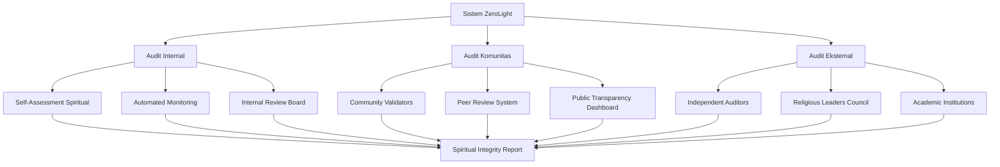

# Audit Spiritual dan Transparansi Sistem

> **"In The Name of GOD"** - Kebenaran, transparansi, dan akuntabilitas dalam setiap langkah

## Pendahuluan

Sistem Audit Spiritual dan Transparansi merupakan tulang punggung integritas dalam ekosistem ZeroLight. Berdasarkan prinsip "Ehipassiko" (datang dan lihatlah sendiri), sistem ini memastikan bahwa setiap aspek operasional, spiritual, dan teknologi dapat diverifikasi, diaudit, dan dipahami oleh komunitas global.

Sistem audit ini tidak hanya berfokus pada aspek teknis dan finansial, tetapi juga mengintegrasikan dimensi spiritual yang memastikan bahwa setiap keputusan dan tindakan sejalan dengan nilai-nilai universal kebaikan, keadilan, dan kebijaksanaan.

## Filosofi Audit Spiritual

### 1. Prinsip Ehipassiko (Datang dan Lihatlah)

#### 1.1 Transparansi Total
Seperti ajaran Buddha yang mengundang semua orang untuk "datang dan melihat" kebenaran dengan mata kepala sendiri, sistem ZeroLight membuka seluruh operasionalnya untuk audit publik. Tidak ada yang disembunyikan, semua dapat diverifikasi.

#### 1.2 Akuntabilitas Spiritual
Setiap tindakan tidak hanya dipertanggungjawabkan kepada komunitas manusia, tetapi juga kepada prinsip-prinsip spiritual universal. Sistem ini memastikan bahwa setiap keputusan dapat dipertanggungjawabkan secara moral dan spiritual.

#### 1.3 Pembelajaran Berkelanjutan
Audit bukan hanya untuk menemukan kesalahan, tetapi untuk pembelajaran dan perbaikan berkelanjutan. Setiap temuan audit menjadi peluang untuk pertumbuhan spiritual dan peningkatan sistem.

### 2. Tiga Lapis Audit Spiritual



## Audit Internal: Self-Assessment Spiritual

### 1. Automated Spiritual Monitoring

#### 1.1 Real-time Integrity Checker
```python
class SpiritualIntegrityMonitor:
    def __init__(self):
        self.value_checker = SpiritualValueChecker()
        self.decision_analyzer = DecisionAnalyzer()
        self.impact_assessor = ImpactAssessor()
        self.alignment_verifier = AlignmentVerifier()
    
    def monitor_system_integrity(self):
        integrity_metrics = {
            'truth_alignment': self.value_checker.check_truth_alignment(),
            'love_manifestation': self.value_checker.check_love_manifestation(),
            'justice_implementation': self.value_checker.check_justice_implementation(),
            'wisdom_application': self.value_checker.check_wisdom_application(),
            'decision_quality': self.decision_analyzer.analyze_recent_decisions(),
            'positive_impact': self.impact_assessor.assess_positive_impact(),
            'spiritual_alignment': self.alignment_verifier.verify_alignment()
        }
        
        # Calculate overall integrity score
        integrity_score = self.calculate_integrity_score(integrity_metrics)
        
        # Generate alerts if needed
        alerts = self.generate_integrity_alerts(integrity_metrics)
        
        return {
            'integrity_score': integrity_score,
            'detailed_metrics': integrity_metrics,
            'alerts': alerts,
            'recommendations': self.generate_recommendations(integrity_metrics)
        }
```

#### 1.2 Spiritual Decision Audit Trail
```python
class SpiritualDecisionAuditTrail:
    def __init__(self):
        self.decision_logger = DecisionLogger()
        self.spiritual_evaluator = SpiritualDecisionEvaluator()
        self.impact_tracker = DecisionImpactTracker()
        self.blockchain_recorder = BlockchainRecorder()
    
    def audit_decision_process(self, decision_id):
        # Retrieve decision data
        decision_data = self.decision_logger.get_decision_data(decision_id)
        
        # Evaluate spiritual aspects
        spiritual_evaluation = self.spiritual_evaluator.evaluate(decision_data)
        
        # Track impact over time
        impact_analysis = self.impact_tracker.analyze_impact(decision_id)
        
        # Create immutable audit record
        audit_record = {
            'decision_id': decision_id,
            'decision_data': decision_data,
            'spiritual_evaluation': spiritual_evaluation,
            'impact_analysis': impact_analysis,
            'audit_timestamp': datetime.utcnow().isoformat(),
            'auditor': 'internal_spiritual_system'
        }
        
        # Record on blockchain
        blockchain_record = self.blockchain_recorder.record_audit(audit_record)
        
        return {
            'audit_record': audit_record,
            'blockchain_verification': blockchain_record,
            'spiritual_score': spiritual_evaluation['overall_score'],
            'improvement_areas': spiritual_evaluation['improvement_areas']
        }
```

### 2. Internal Review Board

#### 2.1 Spiritual Governance Committee
```python
class SpiritualGovernanceCommittee:
    def __init__(self):
        self.committee_members = self.initialize_committee()
        self.review_scheduler = ReviewScheduler()
        self.consensus_builder = ConsensusBuilder()
        self.recommendation_generator = RecommendationGenerator()
    
    def conduct_internal_review(self, review_scope, review_period):
        # Schedule review sessions
        review_sessions = self.review_scheduler.schedule_sessions(
            review_scope, review_period, self.committee_members
        )
        
        review_results = []
        for session in review_sessions:
            # Conduct individual reviews
            individual_reviews = []
            for member in session['participants']:
                review = member.conduct_review(session['focus_area'])
                individual_reviews.append(review)
            
            # Build consensus
            consensus = self.consensus_builder.build_consensus(individual_reviews)
            
            # Generate recommendations
            recommendations = self.recommendation_generator.generate(
                consensus, session['focus_area']
            )
            
            review_results.append({
                'session': session,
                'consensus': consensus,
                'recommendations': recommendations
            })
        
        # Compile comprehensive review report
        comprehensive_report = self.compile_review_report(review_results)
        
        return comprehensive_report
```

#### 2.2 Continuous Improvement Process
```python
class ContinuousImprovementProcess:
    def __init__(self):
        self.improvement_tracker = ImprovementTracker()
        self.implementation_monitor = ImplementationMonitor()
        self.effectiveness_measurer = EffectivenessMeasurer()
    
    def manage_improvement_cycle(self, audit_findings):
        # Create improvement plan
        improvement_plan = self.create_improvement_plan(audit_findings)
        
        # Track implementation
        implementation_progress = self.implementation_monitor.track_progress(
            improvement_plan
        )
        
        # Measure effectiveness
        effectiveness_metrics = self.effectiveness_measurer.measure(
            improvement_plan, implementation_progress
        )
        
        return {
            'improvement_plan': improvement_plan,
            'implementation_progress': implementation_progress,
            'effectiveness_metrics': effectiveness_metrics,
            'next_cycle_recommendations': self.plan_next_cycle(effectiveness_metrics)
        }
```

## Audit Komunitas: Transparansi Partisipatif

### 1. Community Validator Network

#### 1.1 Distributed Validation System
```python
class CommunityValidatorNetwork:
    def __init__(self):
        self.validator_registry = ValidatorRegistry()
        self.task_distributor = ValidationTaskDistributor()
        self.consensus_engine = CommunityConsensusEngine()
        self.reputation_manager = ValidatorReputationManager()
    
    def distribute_validation_tasks(self, audit_scope):
        # Select qualified validators
        qualified_validators = self.validator_registry.select_validators(
            audit_scope, required_expertise=['spiritual_assessment', 'technical_audit']
        )
        
        # Distribute tasks
        validation_tasks = self.task_distributor.distribute_tasks(
            audit_scope, qualified_validators
        )
        
        # Collect validation results
        validation_results = []
        for task in validation_tasks:
            result = self.collect_validation_result(task)
            validation_results.append(result)
        
        # Build community consensus
        community_consensus = self.consensus_engine.build_consensus(validation_results)
        
        # Update validator reputations
        self.reputation_manager.update_reputations(validation_results)
        
        return {
            'validation_results': validation_results,
            'community_consensus': community_consensus,
            'validator_performance': self.analyze_validator_performance(validation_results)
        }
```

#### 1.2 Peer Review System
```python
class SpiritualPeerReviewSystem:
    def __init__(self):
        self.peer_matcher = PeerMatcher()
        self.review_coordinator = ReviewCoordinator()
        self.quality_assessor = ReviewQualityAssessor()
        self.feedback_synthesizer = FeedbackSynthesizer()
    
    def coordinate_peer_review(self, content_or_decision, review_type):
        # Match appropriate peers
        matched_peers = self.peer_matcher.match_peers(
            content_or_decision, review_type
        )
        
        # Coordinate review process
        review_sessions = self.review_coordinator.coordinate_reviews(
            content_or_decision, matched_peers
        )
        
        # Assess review quality
        quality_assessments = []
        for session in review_sessions:
            quality = self.quality_assessor.assess_quality(session)
            quality_assessments.append(quality)
        
        # Synthesize feedback
        synthesized_feedback = self.feedback_synthesizer.synthesize(
            review_sessions, quality_assessments
        )
        
        return {
            'peer_reviews': review_sessions,
            'quality_assessments': quality_assessments,
            'synthesized_feedback': synthesized_feedback,
            'improvement_recommendations': self.generate_improvements(synthesized_feedback)
        }
```

### 2. Public Transparency Dashboard

#### 2.1 Real-time Transparency Metrics
```python
class PublicTransparencyDashboard:
    def __init__(self):
        self.metrics_aggregator = TransparencyMetricsAggregator()
        self.visualization_engine = VisualizationEngine()
        self.accessibility_optimizer = AccessibilityOptimizer()
        self.multilingual_translator = MultilingualTranslator()
    
    def generate_public_dashboard(self):
        # Aggregate transparency metrics
        transparency_metrics = self.metrics_aggregator.aggregate_metrics()
        
        # Create visualizations
        visualizations = self.visualization_engine.create_visualizations(
            transparency_metrics
        )
        
        # Optimize for accessibility
        accessible_dashboard = self.accessibility_optimizer.optimize(
            visualizations, transparency_metrics
        )
        
        # Provide multilingual support
        multilingual_dashboard = self.multilingual_translator.translate(
            accessible_dashboard, supported_languages=['en', 'id', 'ar', 'zh', 'hi']
        )
        
        return {
            'dashboard_data': multilingual_dashboard,
            'last_updated': datetime.utcnow().isoformat(),
            'data_sources': self.get_data_sources(),
            'verification_links': self.generate_verification_links(transparency_metrics)
        }
```

#### 2.2 Community Feedback Integration
```python
class CommunityFeedbackIntegrator:
    def __init__(self):
        self.feedback_collector = FeedbackCollector()
        self.sentiment_analyzer = SpiritualSentimentAnalyzer()
        self.concern_categorizer = ConcernCategorizer()
        self.response_generator = ResponseGenerator()
    
    def integrate_community_feedback(self):
        # Collect feedback from multiple channels
        feedback_data = self.feedback_collector.collect_feedback([
            'dashboard_comments', 'social_media', 'direct_messages', 'community_forums'
        ])
        
        # Analyze sentiment and spiritual alignment
        sentiment_analysis = self.sentiment_analyzer.analyze(feedback_data)
        
        # Categorize concerns and suggestions
        categorized_feedback = self.concern_categorizer.categorize(
            feedback_data, sentiment_analysis
        )
        
        # Generate responses and action plans
        responses = self.response_generator.generate_responses(categorized_feedback)
        
        return {
            'feedback_summary': categorized_feedback,
            'sentiment_analysis': sentiment_analysis,
            'community_responses': responses,
            'action_items': self.extract_action_items(categorized_feedback)
        }
```

## Audit Eksternal: Validasi Independen

### 1. Independent Auditor Network

#### 1.1 Professional Audit Services
```python
class IndependentAuditorNetwork:
    def __init__(self):
        self.auditor_registry = IndependentAuditorRegistry()
        self.audit_scheduler = AuditScheduler()
        self.scope_definer = AuditScopeDefiner()
        self.report_validator = AuditReportValidator()
    
    def engage_independent_auditors(self, audit_requirements):
        # Select qualified independent auditors
        selected_auditors = self.auditor_registry.select_auditors(
            audit_requirements['expertise_required'],
            audit_requirements['independence_level']
        )
        
        # Define audit scope
        audit_scope = self.scope_definer.define_scope(
            audit_requirements, selected_auditors
        )
        
        # Schedule audit activities
        audit_schedule = self.audit_scheduler.create_schedule(
            audit_scope, selected_auditors
        )
        
        # Coordinate audit execution
        audit_results = self.coordinate_audit_execution(
            audit_schedule, selected_auditors
        )
        
        # Validate audit reports
        validated_reports = self.report_validator.validate_reports(audit_results)
        
        return {
            'audit_results': validated_reports,
            'auditor_credentials': self.get_auditor_credentials(selected_auditors),
            'independence_verification': self.verify_independence(selected_auditors)
        }
```

#### 1.2 Academic Institution Partnerships
```python
class AcademicAuditPartnership:
    def __init__(self):
        self.university_network = UniversityNetwork()
        self.research_coordinator = ResearchCoordinator()
        self.publication_manager = PublicationManager()
        self.peer_review_facilitator = PeerReviewFacilitator()
    
    def coordinate_academic_audit(self, research_focus):
        # Partner with relevant universities
        partner_universities = self.university_network.select_partners(research_focus)
        
        # Coordinate research projects
        research_projects = self.research_coordinator.coordinate_projects(
            research_focus, partner_universities
        )
        
        # Facilitate peer review
        peer_reviewed_findings = self.peer_review_facilitator.facilitate_review(
            research_projects
        )
        
        # Manage publication process
        publications = self.publication_manager.manage_publications(
            peer_reviewed_findings
        )
        
        return {
            'research_findings': peer_reviewed_findings,
            'academic_publications': publications,
            'university_partnerships': partner_universities,
            'credibility_metrics': self.calculate_credibility_metrics(publications)
        }
```

### 2. Religious Leaders Council

#### 2.1 Interfaith Spiritual Audit
```python
class InterfaithSpiritualAudit:
    def __init__(self):
        self.religious_council = ReligiousLeadersCouncil()
        self.spiritual_evaluator = InterfaithSpiritualEvaluator()
        self.consensus_builder = InterfaithConsensusBuilder()
        self.guidance_synthesizer = SpiritualGuidanceSynthesizer()
    
    def conduct_interfaith_audit(self, spiritual_aspects):
        # Engage religious leaders from different faiths
        religious_leaders = self.religious_council.engage_leaders([
            'islam', 'christianity', 'judaism', 'hinduism', 'buddhism', 'other_faiths'
        ])
        
        # Conduct spiritual evaluations
        spiritual_evaluations = []
        for leader in religious_leaders:
            evaluation = self.spiritual_evaluator.evaluate(
                spiritual_aspects, leader['faith_perspective']
            )
            spiritual_evaluations.append(evaluation)
        
        # Build interfaith consensus
        interfaith_consensus = self.consensus_builder.build_consensus(
            spiritual_evaluations
        )
        
        # Synthesize spiritual guidance
        spiritual_guidance = self.guidance_synthesizer.synthesize(
            interfaith_consensus, spiritual_evaluations
        )
        
        return {
            'interfaith_evaluations': spiritual_evaluations,
            'consensus_findings': interfaith_consensus,
            'spiritual_guidance': spiritual_guidance,
            'universal_principles': self.extract_universal_principles(interfaith_consensus)
        }
```

#### 2.2 Ethical Compliance Verification
```python
class EthicalComplianceVerifier:
    def __init__(self):
        self.ethics_framework = UniversalEthicsFramework()
        self.compliance_checker = ComplianceChecker()
        self.violation_detector = ViolationDetector()
        self.remediation_planner = RemediationPlanner()
    
    def verify_ethical_compliance(self, system_operations):
        # Check against universal ethical principles
        ethical_assessment = self.ethics_framework.assess(system_operations)
        
        # Verify compliance with ethical standards
        compliance_status = self.compliance_checker.check_compliance(
            system_operations, ethical_assessment
        )
        
        # Detect potential violations
        potential_violations = self.violation_detector.detect_violations(
            system_operations, compliance_status
        )
        
        # Plan remediation if needed
        remediation_plan = None
        if potential_violations:
            remediation_plan = self.remediation_planner.create_plan(
                potential_violations
            )
        
        return {
            'ethical_assessment': ethical_assessment,
            'compliance_status': compliance_status,
            'potential_violations': potential_violations,
            'remediation_plan': remediation_plan,
            'ethical_score': self.calculate_ethical_score(ethical_assessment)
        }
```

## Blockchain-based Audit Trail

### 1. Immutable Audit Records

#### 1.1 Comprehensive Audit Blockchain
```python
class AuditBlockchainManager:
    def __init__(self):
        self.blockchain_client = BlockchainClient()
        self.audit_hasher = AuditHasher()
        self.verification_generator = VerificationGenerator()
        self.integrity_checker = IntegrityChecker()
    
    def record_audit_on_blockchain(self, audit_data, audit_type):
        # Create comprehensive audit record
        audit_record = {
            'audit_id': self.generate_audit_id(),
            'audit_type': audit_type,
            'audit_data': audit_data,
            'audit_hash': self.audit_hasher.hash_audit_data(audit_data),
            'timestamp': datetime.utcnow().isoformat(),
            'auditor_signatures': self.collect_auditor_signatures(audit_data),
            'verification_data': self.verification_generator.generate(audit_data)
        }
        
        # Record on blockchain
        blockchain_record = self.blockchain_client.record_audit(audit_record)
        
        # Verify integrity
        integrity_verification = self.integrity_checker.verify_integrity(
            blockchain_record
        )
        
        return {
            'blockchain_record': blockchain_record,
            'verification_url': f"https://verify.zerolight.org/audit/{blockchain_record['id']}",
            'integrity_verified': integrity_verification['verified'],
            'public_verification_data': self.create_public_verification_data(blockchain_record)
        }
```

#### 1.2 Cross-Chain Verification
```python
class CrossChainAuditVerification:
    def __init__(self):
        self.blockchain_networks = {
            'ethereum': EthereumClient(),
            'polygon': PolygonClient(),
            'binance_smart_chain': BSCClient(),
            'avalanche': AvalancheClient()
        }
        self.cross_chain_validator = CrossChainValidator()
        self.consensus_verifier = ConsensusVerifier()
    
    def verify_across_chains(self, audit_record):
        # Record on multiple blockchain networks
        cross_chain_records = {}
        for network, client in self.blockchain_networks.items():
            try:
                record = client.record_audit(audit_record)
                cross_chain_records[network] = record
            except Exception as e:
                cross_chain_records[network] = {'error': str(e)}
        
        # Validate cross-chain consistency
        consistency_validation = self.cross_chain_validator.validate_consistency(
            cross_chain_records
        )
        
        # Verify consensus across networks
        consensus_verification = self.consensus_verifier.verify_consensus(
            cross_chain_records
        )
        
        return {
            'cross_chain_records': cross_chain_records,
            'consistency_validated': consistency_validation['consistent'],
            'consensus_verified': consensus_verification['verified'],
            'verification_confidence': self.calculate_verification_confidence(
                consistency_validation, consensus_verification
            )
        }
```

### 2. Public Verification System

#### 2.1 Audit Verification Portal
```python
class AuditVerificationPortal:
    def __init__(self):
        self.verification_engine = VerificationEngine()
        self.document_validator = DocumentValidator()
        self.signature_verifier = SignatureVerifier()
        self.blockchain_checker = BlockchainChecker()
    
    def create_verification_portal(self, audit_id):
        # Retrieve audit data
        audit_data = self.retrieve_audit_data(audit_id)
        
        # Verify document authenticity
        document_verification = self.document_validator.verify_authenticity(
            audit_data
        )
        
        # Verify signatures
        signature_verification = self.signature_verifier.verify_signatures(
            audit_data['auditor_signatures']
        )
        
        # Check blockchain records
        blockchain_verification = self.blockchain_checker.verify_blockchain_records(
            audit_data['blockchain_records']
        )
        
        # Create verification portal
        verification_portal = {
            'audit_summary': self.create_audit_summary(audit_data),
            'verification_results': {
                'document_authentic': document_verification['authentic'],
                'signatures_valid': signature_verification['valid'],
                'blockchain_verified': blockchain_verification['verified']
            },
            'detailed_findings': audit_data['findings'],
            'auditor_credentials': audit_data['auditor_credentials'],
            'verification_tools': self.create_verification_tools(audit_data)
        }
        
        return verification_portal
```

#### 2.2 Community Verification Tools
```python
class CommunityVerificationTools:
    def __init__(self):
        self.hash_calculator = HashCalculator()
        self.signature_checker = SignatureChecker()
        self.blockchain_explorer = BlockchainExplorer()
        self.document_comparer = DocumentComparer()
    
    def provide_verification_tools(self, audit_record):
        verification_tools = {
            'hash_verification': {
                'tool': self.hash_calculator,
                'instructions': self.create_hash_verification_instructions(),
                'expected_hash': audit_record['audit_hash']
            },
            'signature_verification': {
                'tool': self.signature_checker,
                'instructions': self.create_signature_verification_instructions(),
                'signatures': audit_record['auditor_signatures']
            },
            'blockchain_verification': {
                'tool': self.blockchain_explorer,
                'instructions': self.create_blockchain_verification_instructions(),
                'blockchain_records': audit_record['blockchain_records']
            },
            'document_comparison': {
                'tool': self.document_comparer,
                'instructions': self.create_document_comparison_instructions(),
                'reference_documents': audit_record['reference_documents']
            }
        }
        
        return verification_tools
```

## Audit Reporting dan Communication

### 1. Comprehensive Audit Reports

#### 1.1 Multi-stakeholder Report Generation
```python
class MultiStakeholderReportGenerator:
    def __init__(self):
        self.report_customizer = ReportCustomizer()
        self.audience_analyzer = AudienceAnalyzer()
        self.content_adapter = ContentAdapter()
        self.visualization_creator = VisualizationCreator()
    
    def generate_stakeholder_reports(self, audit_findings, stakeholder_groups):
        stakeholder_reports = {}
        
        for group in stakeholder_groups:
            # Analyze audience needs
            audience_analysis = self.audience_analyzer.analyze(group)
            
            # Customize report content
            customized_content = self.report_customizer.customize(
                audit_findings, audience_analysis
            )
            
            # Adapt content for audience
            adapted_content = self.content_adapter.adapt(
                customized_content, group['communication_preferences']
            )
            
            # Create visualizations
            visualizations = self.visualization_creator.create(
                adapted_content, group['visualization_preferences']
            )
            
            stakeholder_reports[group['name']] = {
                'content': adapted_content,
                'visualizations': visualizations,
                'delivery_format': group['preferred_format'],
                'communication_channel': group['preferred_channel']
            }
        
        return stakeholder_reports
```

#### 1.2 Executive Summary Generator
```python
class ExecutiveSummaryGenerator:
    def __init__(self):
        self.key_findings_extractor = KeyFindingsExtractor()
        self.impact_assessor = ImpactAssessor()
        self.recommendation_prioritizer = RecommendationPrioritizer()
        self.action_plan_creator = ActionPlanCreator()
    
    def generate_executive_summary(self, comprehensive_audit_data):
        # Extract key findings
        key_findings = self.key_findings_extractor.extract(comprehensive_audit_data)
        
        # Assess overall impact
        impact_assessment = self.impact_assessor.assess_overall_impact(
            comprehensive_audit_data
        )
        
        # Prioritize recommendations
        prioritized_recommendations = self.recommendation_prioritizer.prioritize(
            comprehensive_audit_data['recommendations']
        )
        
        # Create action plan
        action_plan = self.action_plan_creator.create_plan(
            prioritized_recommendations, impact_assessment
        )
        
        executive_summary = {
            'overall_assessment': impact_assessment['overall_score'],
            'key_findings': key_findings,
            'critical_issues': key_findings['critical_issues'],
            'positive_highlights': key_findings['positive_highlights'],
            'priority_recommendations': prioritized_recommendations[:5],
            'immediate_action_items': action_plan['immediate_actions'],
            'long_term_strategic_items': action_plan['strategic_actions'],
            'resource_requirements': action_plan['resource_requirements']
        }
        
        return executive_summary
```

### 2. Communication Strategy

#### 2.1 Multi-channel Communication
```python
class AuditCommunicationManager:
    def __init__(self):
        self.communication_channels = {
            'website': WebsiteCommunicator(),
            'email': EmailCommunicator(),
            'social_media': SocialMediaCommunicator(),
            'mobile_app': MobileAppCommunicator(),
            'print_media': PrintMediaCommunicator()
        }
        self.message_customizer = MessageCustomizer()
        self.timing_optimizer = TimingOptimizer()
    
    def execute_communication_strategy(self, audit_results, communication_plan):
        communication_results = {}
        
        for channel, plan in communication_plan.items():
            if channel in self.communication_channels:
                # Customize message for channel
                customized_message = self.message_customizer.customize(
                    audit_results, channel, plan['audience']
                )
                
                # Optimize timing
                optimal_timing = self.timing_optimizer.optimize(
                    channel, plan['audience'], plan['urgency']
                )
                
                # Execute communication
                result = self.communication_channels[channel].communicate(
                    customized_message, optimal_timing, plan['delivery_options']
                )
                
                communication_results[channel] = result
        
        return communication_results
```

#### 2.2 Crisis Communication Protocol
```python
class CrisisCommunicationProtocol:
    def __init__(self):
        self.crisis_detector = CrisisDetector()
        self.stakeholder_prioritizer = StakeholderPrioritizer()
        self.message_crafter = CrisisMessageCrafter()
        self.response_coordinator = ResponseCoordinator()
    
    def handle_audit_crisis(self, audit_findings):
        # Detect crisis level
        crisis_assessment = self.crisis_detector.assess_crisis_level(audit_findings)
        
        if crisis_assessment['is_crisis']:
            # Prioritize stakeholders for immediate communication
            priority_stakeholders = self.stakeholder_prioritizer.prioritize(
                crisis_assessment['severity']
            )
            
            # Craft crisis messages
            crisis_messages = self.message_crafter.craft_messages(
                audit_findings, crisis_assessment, priority_stakeholders
            )
            
            # Coordinate response
            response_coordination = self.response_coordinator.coordinate_response(
                crisis_messages, priority_stakeholders, crisis_assessment
            )
            
            return {
                'crisis_response_activated': True,
                'crisis_level': crisis_assessment['severity'],
                'stakeholder_communications': crisis_messages,
                'response_coordination': response_coordination,
                'follow_up_plan': self.create_follow_up_plan(crisis_assessment)
            }
        
        return {'crisis_response_activated': False}
```

## Integration dengan Ekosistem ZeroLight

### 1. Cross-System Audit Integration

#### 1.1 Holistic System Audit
```python
class HolisticSystemAuditor:
    def __init__(self):
        self.system_components = {
            'intake_bot': IntakeBotAuditor(),
            'spiritual_sorting': SpiritualSortingAuditor(),
            'data_purification': DataPurificationAuditor(),
            'packing_distribution': PackingDistributionAuditor(),
            'reward_system': RewardSystemAuditor(),
            'branding_system': BrandingSystemAuditor(),
            'security_system': SecuritySystemAuditor(),
            'ownership_structure': OwnershipStructureAuditor()
        }
        self.integration_auditor = IntegrationAuditor()
        self.holistic_evaluator = HolisticEvaluator()
    
    def conduct_holistic_audit(self):
        # Audit individual components
        component_audits = {}
        for component, auditor in self.system_components.items():
            component_audits[component] = auditor.conduct_audit()
        
        # Audit system integration
        integration_audit = self.integration_auditor.audit_integration(
            component_audits
        )
        
        # Holistic evaluation
        holistic_evaluation = self.holistic_evaluator.evaluate(
            component_audits, integration_audit
        )
        
        return {
            'component_audits': component_audits,
            'integration_audit': integration_audit,
            'holistic_evaluation': holistic_evaluation,
            'system_health_score': holistic_evaluation['overall_health_score'],
            'improvement_roadmap': self.create_improvement_roadmap(holistic_evaluation)
        }
```

### 2. Continuous Monitoring Integration

#### 2.1 Real-time Audit Dashboard
```python
class RealTimeAuditDashboard:
    def __init__(self):
        self.metrics_collector = RealTimeMetricsCollector()
        self.alert_system = AlertSystem()
        self.dashboard_generator = DashboardGenerator()
        self.notification_manager = NotificationManager()
    
    def maintain_real_time_dashboard(self):
        # Collect real-time metrics
        real_time_metrics = self.metrics_collector.collect_metrics()
        
        # Check for alerts
        alerts = self.alert_system.check_alerts(real_time_metrics)
        
        # Generate dashboard
        dashboard = self.dashboard_generator.generate_dashboard(
            real_time_metrics, alerts
        )
        
        # Send notifications if needed
        if alerts:
            notifications = self.notification_manager.send_notifications(alerts)
        else:
            notifications = []
        
        return {
            'dashboard': dashboard,
            'alerts': alerts,
            'notifications': notifications,
            'last_updated': datetime.utcnow().isoformat()
        }
```

## Kesimpulan

Sistem Audit Spiritual dan Transparansi ZeroLight merepresentasikan standar baru dalam akuntabilitas digital yang mengintegrasikan prinsip-prinsip spiritual universal dengan teknologi audit modern. Dengan tiga lapis audit yang komprehensif - internal, komunitas, dan eksternal - sistem ini memastikan bahwa setiap aspek operasional dapat diverifikasi dan dipertanggungjawabkan.

Penggunaan teknologi blockchain untuk menciptakan audit trail yang immutable, dikombinasikan dengan transparansi publik yang total, menciptakan ekosistem kepercayaan yang belum pernah ada sebelumnya. Sistem ini tidak hanya memenuhi standar audit teknis dan finansial, tetapi juga memastikan bahwa setiap keputusan dan tindakan sejalan dengan nilai-nilai spiritual universal.

Dengan integrasi yang seamless dengan seluruh ekosistem ZeroLight, sistem audit ini menjadi tulang punggung integritas yang memungkinkan komunitas global untuk berpartisipasi dengan keyakinan penuh bahwa sistem beroperasi dengan transparansi, keadilan, dan kebijaksanaan.

---

> **"Ehipassiko - Datang dan lihatlah sendiri"** - Ajaran Buddha  
> **"Dan katakanlah: 'Kebenaran telah datang dan kebatilan telah lenyap'. Sesungguhnya kebatilan itu adalah sesuatu yang pasti lenyap."** - Al-Isra 17:81

*Dokumen ini merupakan bagian integral dari ekosistem ZeroLight dan akan terus dikembangkan untuk memenuhi standar transparansi dan akuntabilitas tertinggi.*