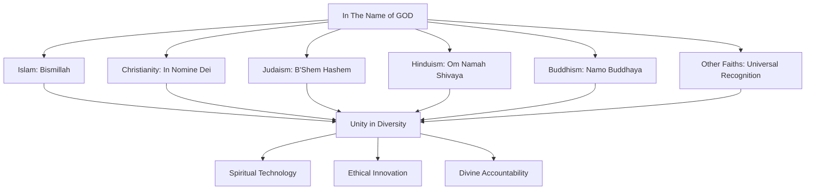

# Branding "In The Name of GOD": Identitas Spiritual Universal

> **"In The Name of GOD"** - Bismillah, Dengan Nama Allah, In Nomine Dei, Om Namah Shivaya, Namo Buddhaya

## Pendahuluan

Branding "In The Name of GOD" merupakan identitas spiritual universal yang mendasari seluruh ekosistem ZeroLight. Lebih dari sekadar logo atau slogan, ini adalah manifestasi dari komitmen mendalam untuk beroperasi dengan kesadaran spiritual, integritas moral, dan tanggung jawab kepada Yang Maha Kuasa dalam setiap aspek teknologi dan layanan yang dikembangkan.

Branding ini dirancang untuk menjembatani perbedaan agama, budaya, dan bahasa, menciptakan identitas yang dapat diterima dan dihormati oleh semua tradisi spiritual sambil tetap mempertahankan keaslian dan kedalaman makna spiritual.

## Filosofi Branding Spiritual

### 1. Universalitas dalam Keberagaman

#### 1.1 Prinsip Tauhid Universal
Konsep "In The Name of GOD" mengakui bahwa meskipun manusia menyebut Tuhan dengan nama yang berbeda-beda - Allah, God, Brahman, Tao, Great Spirit - esensi ketuhanan adalah satu dan universal. Branding ini menghormati keberagaman ekspresi spiritual sambil menekankan kesatuan fundamental.

#### 1.2 Inklusivitas Spiritual


#### 1.3 Transendensi Denominasional
Branding ini tidak mengklaim superioritas satu agama atas yang lain, melainkan mengakui bahwa semua tradisi spiritual yang autentik mengarah pada kebenaran yang sama: pentingnya hidup dengan kesadaran akan Yang Maha Kuasa dan tanggung jawab moral terhadap sesama makhluk.

### 2. Manifestasi Visual dan Verbal

#### 2.1 Logo dan Simbol Spiritual
```python
class SpiritualBrandingSystem:
    def __init__(self):
        self.visual_elements = {
            'primary_logo': 'orbit-zerolight-logo.svg',
            'spiritual_symbol': 'universal-spiritual-symbol.svg',
            'color_palette': self.define_spiritual_colors(),
            'typography': self.define_sacred_typography(),
            'geometric_patterns': self.define_sacred_geometry()
        }
        self.verbal_elements = {
            'primary_tagline': 'In The Name of GOD',
            'multilingual_variations': self.define_multilingual_taglines(),
            'spiritual_messaging': self.define_spiritual_messages(),
            'tone_of_voice': self.define_spiritual_tone()
        }
    
    def define_spiritual_colors(self):
        return {
            'divine_gold': '#FFD700',  # Representing divine light
            'sacred_blue': '#1E3A8A',  # Representing infinite sky
            'pure_white': '#FFFFFF',   # Representing purity and clarity
            'earth_green': '#059669',  # Representing life and growth
            'wisdom_purple': '#7C3AED', # Representing spiritual wisdom
            'compassion_rose': '#F43F5E' # Representing divine love
        }
    
    def define_sacred_typography(self):
        return {
            'primary_font': 'Noto Sans',  # Universal readability
            'spiritual_font': 'Amiri',    # Arabic-inspired elegance
            'display_font': 'Playfair Display', # Classical beauty
            'code_font': 'JetBrains Mono'  # Technical precision
        }
    
    def define_sacred_geometry(self):
        return {
            'circle': 'Unity and completeness',
            'triangle': 'Divine trinity and balance',
            'hexagon': 'Perfect harmony',
            'spiral': 'Spiritual evolution',
            'mandala': 'Cosmic order'
        }
```

#### 2.2 Multilingual Spiritual Expression
```python
class MultilingualSpiritualBranding:
    def __init__(self):
        self.spiritual_expressions = {
            'arabic': 'بِسْمِ اللَّهِ الرَّحْمَٰنِ الرَّحِيمِ',
            'english': 'In The Name of GOD, Most Gracious, Most Merciful',
            'latin': 'In Nomine Dei Omnipotentis',
            'sanskrit': 'ॐ नमो भगवते वासुदेवाय',
            'hebrew': 'בְּשֵׁם הָאֱלֹהִים',
            'chinese': '奉上帝之名',
            'japanese': '神の御名において',
            'korean': '하나님의 이름으로',
            'hindi': 'भगवान के नाम पर',
            'urdu': 'خدا کے نام پر',
            'persian': 'به نام خداوند',
            'turkish': 'Allah\'ın adıyla',
            'malay': 'Dengan nama Allah',
            'indonesian': 'Dengan nama Tuhan Yang Maha Esa'
        }
        self.contextual_usage = self.define_contextual_usage()
    
    def define_contextual_usage(self):
        return {
            'formal_documents': 'Full spiritual expression with translation',
            'user_interface': 'Simplified universal version',
            'marketing_materials': 'Culturally appropriate adaptation',
            'technical_documentation': 'Professional spiritual acknowledgment',
            'community_communications': 'Warm, inclusive expression'
        }
```

### 3. Implementasi dalam Teknologi

#### 3.1 Spiritual Technology Integration
```python
class SpiritualTechnologyIntegration:
    def __init__(self):
        self.spiritual_markers = SpiritualMarkers()
        self.ethical_validators = EthicalValidators()
        self.divine_accountability = DivineAccountability()
        self.blessing_protocols = BlessingProtocols()
    
    def integrate_spiritual_branding(self, technology_component):
        # Add spiritual markers to code
        spiritual_markers = self.spiritual_markers.add_markers(
            technology_component, 'In The Name of GOD'
        )
        
        # Validate ethical compliance
        ethical_validation = self.ethical_validators.validate(
            technology_component, spiritual_markers
        )
        
        # Implement divine accountability
        accountability_layer = self.divine_accountability.implement(
            technology_component, ethical_validation
        )
        
        # Apply blessing protocols
        blessed_component = self.blessing_protocols.apply_blessing(
            technology_component, accountability_layer
        )
        
        return {
            'component': blessed_component,
            'spiritual_integration': spiritual_markers,
            'ethical_validation': ethical_validation,
            'divine_accountability': accountability_layer,
            'blessing_status': 'blessed_and_protected'
        }
```

#### 3.2 Code Blessing and Sanctification
```python
class CodeBlessingSystem:
    def __init__(self):
        self.blessing_generator = BlessingGenerator()
        self.spiritual_comments = SpiritualCommentGenerator()
        self.divine_protection = DivineProtectionLayer()
        self.ethical_guards = EthicalGuardSystem()
    
    def bless_codebase(self, codebase_path):
        # Generate spiritual blessings for codebase
        blessings = self.blessing_generator.generate_blessings(codebase_path)
        
        # Add spiritual comments
        spiritual_comments = self.spiritual_comments.add_comments(
            codebase_path, blessings
        )
        
        # Implement divine protection
        protection_layer = self.divine_protection.implement_protection(
            codebase_path, spiritual_comments
        )
        
        # Add ethical guards
        ethical_guards = self.ethical_guards.add_guards(
            codebase_path, protection_layer
        )
        
        return {
            'blessed_codebase': codebase_path,
            'blessings_applied': blessings,
            'spiritual_comments': spiritual_comments,
            'divine_protection': protection_layer,
            'ethical_guards': ethical_guards,
            'sanctification_complete': True
        }
    
    def generate_code_blessing(self, file_path, code_content):
        blessing_template = '''
/*
 * ═══════════════════════════════════════════════════════════════
 * In The Name of GOD, Most Gracious, Most Merciful
 * بِسْمِ اللَّهِ الرَّحْمَٰنِ الرَّحِيمِ
 * ═══════════════════════════════════════════════════════════════
 * 
 * This code is written with divine guidance and spiritual intention.
 * May it serve humanity with wisdom, compassion, and justice.
 * May it be protected from misuse and guided toward righteousness.
 * 
 * "And whoever relies upon Allah - then He is sufficient for him.
 * Indeed, Allah will accomplish His purpose." - Quran 65:3
 * 
 * File: {file_path}
 * Purpose: {code_purpose}
 * Spiritual Intention: {spiritual_intention}
 * Created: {creation_date}
 * Blessed: {blessing_date}
 * ═══════════════════════════════════════════════════════════════
 */
        '''
        
        return blessing_template.format(
            file_path=file_path,
            code_purpose=self.analyze_code_purpose(code_content),
            spiritual_intention=self.determine_spiritual_intention(code_content),
            creation_date=datetime.utcnow().isoformat(),
            blessing_date=datetime.utcnow().isoformat()
        )
```

## Brand Guidelines dan Standards

### 1. Visual Identity Standards

#### 1.1 Logo Usage Guidelines
```python
class LogoUsageGuidelines:
    def __init__(self):
        self.logo_variations = {
            'primary_logo': {
                'usage': 'Main brand representation',
                'minimum_size': '24px height',
                'clear_space': '2x logo height',
                'backgrounds': ['white', 'light_colors']
            },
            'reversed_logo': {
                'usage': 'Dark backgrounds',
                'minimum_size': '24px height',
                'clear_space': '2x logo height',
                'backgrounds': ['dark_colors', 'images']
            },
            'monogram': {
                'usage': 'Small spaces, social media',
                'minimum_size': '16px height',
                'clear_space': '1x logo height',
                'backgrounds': ['any']
            },
            'spiritual_seal': {
                'usage': 'Formal documents, certificates',
                'minimum_size': '48px height',
                'clear_space': '3x logo height',
                'backgrounds': ['white', 'sacred_colors']
            }
        }
        self.usage_restrictions = self.define_usage_restrictions()
    
    def define_usage_restrictions(self):
        return {
            'prohibited_uses': [
                'Commercial exploitation without permission',
                'Association with harmful or unethical content',
                'Modification of spiritual elements',
                'Use in contexts that contradict spiritual values'
            ],
            'required_permissions': [
                'Commercial licensing agreements',
                'Spiritual authority approval for religious contexts',
                'Community consent for major implementations'
            ]
        }
```

#### 1.2 Color Palette and Sacred Geometry
```python
class SacredDesignSystem:
    def __init__(self):
        self.color_meanings = {
            'divine_gold': {
                'hex': '#FFD700',
                'meaning': 'Divine light, wisdom, enlightenment',
                'usage': 'Highlights, important elements, spiritual emphasis',
                'cultural_significance': 'Universal symbol of divinity'
            },
            'sacred_blue': {
                'hex': '#1E3A8A',
                'meaning': 'Infinite sky, depth, trust, stability',
                'usage': 'Primary brand color, backgrounds, text',
                'cultural_significance': 'Peace and transcendence'
            },
            'pure_white': {
                'hex': '#FFFFFF',
                'meaning': 'Purity, clarity, new beginnings',
                'usage': 'Backgrounds, negative space, clean interfaces',
                'cultural_significance': 'Universal purity'
            }
        }
        self.sacred_proportions = self.define_sacred_proportions()
    
    def define_sacred_proportions(self):
        return {
            'golden_ratio': 1.618,
            'divine_proportion': 'φ = (1 + √5) / 2',
            'sacred_squares': [1, 4, 9, 16, 25],
            'spiritual_circles': 'Perfect unity and completeness',
            'triangular_harmony': 'Divine trinity and balance'
        }
```

### 2. Content and Messaging Standards

#### 2.1 Spiritual Tone of Voice
```python
class SpiritualToneOfVoice:
    def __init__(self):
        self.tone_characteristics = {
            'reverent': 'Respectful acknowledgment of the divine',
            'inclusive': 'Welcoming to all spiritual traditions',
            'humble': 'Acknowledging human limitations',
            'wise': 'Drawing from spiritual wisdom traditions',
            'compassionate': 'Showing care for all beings',
            'truthful': 'Committed to honesty and transparency',
            'peaceful': 'Promoting harmony and understanding'
        }
        self.messaging_principles = self.define_messaging_principles()
    
    def define_messaging_principles(self):
        return {
            'divine_acknowledgment': 'Always acknowledge divine guidance',
            'universal_respect': 'Honor all authentic spiritual traditions',
            'ethical_commitment': 'Emphasize moral and ethical standards',
            'service_orientation': 'Focus on serving humanity',
            'wisdom_sharing': 'Share knowledge with humility',
            'peace_building': 'Promote understanding and harmony',
            'truth_seeking': 'Commit to honesty and transparency'
        }
```

#### 2.2 Multilingual Messaging Framework
```python
class MultilingualMessagingFramework:
    def __init__(self):
        self.core_messages = {
            'mission_statement': {
                'english': 'In The Name of GOD, we create technology that serves humanity with wisdom, compassion, and justice.',
                'arabic': 'بِسْمِ اللَّهِ، نحن نبتكر التكنولوجيا التي تخدم الإنسانية بالحكمة والرحمة والعدالة.',
                'indonesian': 'Dengan nama Tuhan Yang Maha Esa, kami menciptakan teknologi yang melayani kemanusiaan dengan kebijaksanaan, kasih sayang, dan keadilan.',
                'spanish': 'En el nombre de Dios, creamos tecnología que sirve a la humanidad con sabiduría, compasión y justicia.',
                'french': 'Au nom de Dieu, nous créons une technologie qui sert l\'humanité avec sagesse, compassion et justice.'
            },
            'value_proposition': {
                'english': 'Spiritual technology for a better world',
                'arabic': 'التكنولوجيا الروحية لعالم أفضل',
                'indonesian': 'Teknologi spiritual untuk dunia yang lebih baik',
                'spanish': 'Tecnología espiritual para un mundo mejor',
                'french': 'Technologie spirituelle pour un monde meilleur'
            }
        }
        self.cultural_adaptations = self.define_cultural_adaptations()
    
    def define_cultural_adaptations(self):
        return {
            'islamic_context': {
                'greeting': 'Assalamu Alaikum wa Rahmatullahi wa Barakatuh',
                'blessing': 'Barakallahu feeki/feeka',
                'closing': 'Wa billahi at-tawfeeq'
            },
            'christian_context': {
                'greeting': 'Peace be with you',
                'blessing': 'May God bless you',
                'closing': 'In Christ\'s name'
            },
            'hindu_context': {
                'greeting': 'Namaste',
                'blessing': 'Om Shanti Shanti Shanti',
                'closing': 'Hari Om'
            },
            'buddhist_context': {
                'greeting': 'May you be happy and peaceful',
                'blessing': 'May all beings be free from suffering',
                'closing': 'Namo Buddhaya'
            }
        }
```

## Brand Application dalam Ekosistem ZeroLight

### 1. User Interface Branding

#### 1.1 Spiritual UI Components
```python
class SpiritualUIComponents:
    def __init__(self):
        self.blessed_components = {
            'prayer_button': self.create_prayer_button(),
            'blessing_modal': self.create_blessing_modal(),
            'spiritual_navigation': self.create_spiritual_navigation(),
            'divine_loading': self.create_divine_loading(),
            'sacred_forms': self.create_sacred_forms()
        }
        self.spiritual_animations = self.create_spiritual_animations()
    
    def create_prayer_button(self):
        return {
            'component': 'PrayerButton',
            'purpose': 'Allow users to offer prayers or blessings',
            'design': 'Golden circle with spiritual symbol',
            'interaction': 'Gentle glow on hover, blessing animation on click',
            'accessibility': 'Screen reader friendly with spiritual context'
        }
    
    def create_blessing_modal(self):
        return {
            'component': 'BlessingModal',
            'purpose': 'Display spiritual blessings and guidance',
            'design': 'Sacred geometry background with divine colors',
            'content': 'Multilingual spiritual messages',
            'animation': 'Gentle fade-in with light particles'
        }
    
    def create_spiritual_navigation(self):
        return {
            'component': 'SpiritualNavigation',
            'purpose': 'Guide users with spiritual intention',
            'design': 'Sacred symbols as navigation icons',
            'behavior': 'Smooth transitions with blessing confirmations',
            'accessibility': 'Spiritual context for screen readers'
        }
```

#### 1.2 Responsive Spiritual Design
```python
class ResponsiveSpiritualDesign:
    def __init__(self):
        self.breakpoints = {
            'mobile': '320px - 768px',
            'tablet': '768px - 1024px',
            'desktop': '1024px - 1440px',
            'large_screen': '1440px+'
        }
        self.spiritual_adaptations = self.define_spiritual_adaptations()
    
    def define_spiritual_adaptations(self):
        return {
            'mobile': {
                'logo': 'Simplified monogram',
                'spiritual_text': 'Abbreviated blessings',
                'navigation': 'Sacred symbol icons',
                'interactions': 'Touch-friendly spiritual gestures'
            },
            'tablet': {
                'logo': 'Medium logo with tagline',
                'spiritual_text': 'Moderate length blessings',
                'navigation': 'Icon and text combinations',
                'interactions': 'Enhanced spiritual animations'
            },
            'desktop': {
                'logo': 'Full logo with complete branding',
                'spiritual_text': 'Complete spiritual messages',
                'navigation': 'Full navigation with spiritual context',
                'interactions': 'Rich spiritual interactions'
            }
        }
```

### 2. Marketing and Communication Branding

#### 2.1 Spiritual Marketing Framework
```python
class SpiritualMarketingFramework:
    def __init__(self):
        self.marketing_principles = {
            'authentic_representation': 'Never exploit spiritual symbols for profit',
            'respectful_messaging': 'Honor all spiritual traditions equally',
            'ethical_promotion': 'Focus on service rather than self-promotion',
            'truthful_claims': 'Make only honest and verifiable claims',
            'community_benefit': 'Emphasize benefits to community over individual gain'
        }
        self.campaign_templates = self.create_campaign_templates()
    
    def create_campaign_templates(self):
        return {
            'awareness_campaign': {
                'theme': 'Technology blessed with divine guidance',
                'messaging': 'Introducing spiritual technology for humanity',
                'visuals': 'Sacred geometry with modern technology',
                'call_to_action': 'Join our spiritual technology community'
            },
            'feature_announcement': {
                'theme': 'New blessings in technology',
                'messaging': 'Enhanced features guided by spiritual wisdom',
                'visuals': 'Feature demonstrations with spiritual context',
                'call_to_action': 'Experience blessed technology'
            },
            'community_building': {
                'theme': 'United in spiritual purpose',
                'messaging': 'Building community through shared spiritual values',
                'visuals': 'Diverse community with spiritual unity',
                'call_to_action': 'Join our spiritual community'
            }
        }
```

#### 2.2 Content Marketing with Spiritual Values
```python
class SpiritualContentMarketing:
    def __init__(self):
        self.content_types = {
            'spiritual_insights': 'Wisdom from various spiritual traditions',
            'technology_blessings': 'How technology can serve spiritual purposes',
            'community_stories': 'Stories of positive impact and transformation',
            'educational_content': 'Learning resources with spiritual context',
            'inspirational_messages': 'Daily spiritual inspiration and guidance'
        }
        self.content_calendar = self.create_spiritual_content_calendar()
    
    def create_spiritual_content_calendar(self):
        return {
            'daily': {
                'morning_blessing': 'Start day with spiritual intention',
                'wisdom_quote': 'Share spiritual wisdom from various traditions',
                'evening_reflection': 'End day with gratitude and reflection'
            },
            'weekly': {
                'spiritual_sunday': 'Deep spiritual content and reflection',
                'wisdom_wednesday': 'Midweek spiritual guidance',
                'feature_friday': 'Technology features with spiritual context'
            },
            'monthly': {
                'community_spotlight': 'Highlight community members and their contributions',
                'spiritual_journey': 'Share stories of spiritual growth and technology',
                'interfaith_dialogue': 'Promote understanding between different faiths'
            }
        }
```

## Brand Protection dan Spiritual Integrity

### 1. Trademark dan Intellectual Property

#### 1.1 Spiritual Brand Protection
```python
class SpiritualBrandProtection:
    def __init__(self):
        self.protection_measures = {
            'trademark_registration': 'Legal protection of brand elements',
            'spiritual_authority_endorsement': 'Recognition from religious leaders',
            'community_guardianship': 'Community oversight of brand usage',
            'ethical_usage_monitoring': 'Continuous monitoring of brand application'
        }
        self.violation_response = self.define_violation_response()
    
    def define_violation_response(self):
        return {
            'minor_violations': {
                'response': 'Educational outreach and guidance',
                'timeline': 'Immediate contact within 24 hours',
                'resolution': 'Collaborative correction and education'
            },
            'major_violations': {
                'response': 'Formal cease and desist with spiritual counseling',
                'timeline': 'Legal action within 7 days',
                'resolution': 'Legal remedies with spiritual restoration'
            },
            'malicious_abuse': {
                'response': 'Full legal action with community support',
                'timeline': 'Immediate legal response',
                'resolution': 'Complete protection of spiritual integrity'
            }
        }
```

#### 1.2 Community Brand Guardianship
```python
class CommunityBrandGuardianship:
    def __init__(self):
        self.guardian_network = GuardianNetwork()
        self.monitoring_system = BrandMonitoringSystem()
        self.education_program = BrandEducationProgram()
        self.response_coordinator = ResponseCoordinator()
    
    def establish_guardianship_network(self):
        # Recruit community guardians
        guardians = self.guardian_network.recruit_guardians([
            'spiritual_leaders', 'community_elders', 'brand_advocates',
            'legal_experts', 'technology_specialists'
        ])
        
        # Train guardians
        training_program = self.education_program.create_training_program(guardians)
        
        # Establish monitoring protocols
        monitoring_protocols = self.monitoring_system.establish_protocols(guardians)
        
        # Create response procedures
        response_procedures = self.response_coordinator.create_procedures(
            guardians, monitoring_protocols
        )
        
        return {
            'guardian_network': guardians,
            'training_program': training_program,
            'monitoring_protocols': monitoring_protocols,
            'response_procedures': response_procedures,
            'guardianship_established': True
        }
```

### 2. Ethical Usage Guidelines

#### 2.1 Spiritual Ethics Framework
```python
class SpiritualEthicsFramework:
    def __init__(self):
        self.ethical_principles = {
            'divine_reverence': 'Always maintain reverence for the divine',
            'universal_respect': 'Respect all authentic spiritual traditions',
            'truthful_representation': 'Never misrepresent spiritual concepts',
            'service_orientation': 'Use brand to serve, not exploit',
            'community_benefit': 'Prioritize community good over individual gain',
            'peaceful_intention': 'Promote peace and understanding',
            'wisdom_sharing': 'Share knowledge with humility and wisdom'
        }
        self.usage_guidelines = self.create_usage_guidelines()
    
    def create_usage_guidelines(self):
        return {
            'approved_uses': [
                'Educational and spiritual development purposes',
                'Community building and interfaith dialogue',
                'Technology development for humanitarian purposes',
                'Charitable and non-profit activities',
                'Academic research and study'
            ],
            'restricted_uses': [
                'Commercial exploitation without proper authorization',
                'Political campaigning or partisan activities',
                'Controversial or divisive content',
                'Competitive advantage without spiritual merit'
            ],
            'prohibited_uses': [
                'Association with harmful or unethical activities',
                'Misrepresentation of spiritual teachings',
                'Exploitation of religious sentiments',
                'Use in contexts that contradict spiritual values'
            ]
        }
```

#### 2.2 Brand Compliance Monitoring
```python
class BrandComplianceMonitoring:
    def __init__(self):
        self.monitoring_tools = {
            'automated_scanning': AutomatedBrandScanner(),
            'community_reporting': CommunityReportingSystem(),
            'expert_review': ExpertReviewPanel(),
            'spiritual_assessment': SpiritualAssessmentTool()
        }
        self.compliance_metrics = self.define_compliance_metrics()
    
    def monitor_brand_compliance(self):
        # Automated scanning
        automated_results = self.monitoring_tools['automated_scanning'].scan_usage()
        
        # Community reporting
        community_reports = self.monitoring_tools['community_reporting'].collect_reports()
        
        # Expert review
        expert_assessments = self.monitoring_tools['expert_review'].conduct_reviews()
        
        # Spiritual assessment
        spiritual_evaluation = self.monitoring_tools['spiritual_assessment'].evaluate_usage()
        
        # Compile compliance report
        compliance_report = self.compile_compliance_report(
            automated_results, community_reports, expert_assessments, spiritual_evaluation
        )
        
        return compliance_report
```

## Integration dengan Sistem ZeroLight

### 1. Cross-Platform Brand Consistency

#### 1.1 Brand System Integration
```python
class BrandSystemIntegration:
    def __init__(self):
        self.system_components = {
            'intake_bot': IntakeBotBranding(),
            'spiritual_sorting': SpiritualSortingBranding(),
            'data_purification': DataPurificationBranding(),
            'packing_distribution': PackingDistributionBranding(),
            'reward_system': RewardSystemBranding(),
            'audit_system': AuditSystemBranding(),
            'security_system': SecuritySystemBranding()
        }
        self.consistency_checker = BrandConsistencyChecker()
    
    def ensure_brand_consistency(self):
        # Check brand consistency across all components
        consistency_results = {}
        for component, branding in self.system_components.items():
            consistency_results[component] = self.consistency_checker.check_consistency(
                branding, self.master_brand_guidelines
            )
        
        # Identify inconsistencies
        inconsistencies = self.identify_inconsistencies(consistency_results)
        
        # Generate correction recommendations
        corrections = self.generate_corrections(inconsistencies)
        
        return {
            'consistency_results': consistency_results,
            'inconsistencies': inconsistencies,
            'corrections': corrections,
            'overall_consistency_score': self.calculate_consistency_score(consistency_results)
        }
```

#### 1.2 Unified Brand Experience
```python
class UnifiedBrandExperience:
    def __init__(self):
        self.experience_orchestrator = ExperienceOrchestrator()
        self.touchpoint_manager = TouchpointManager()
        self.journey_mapper = BrandJourneyMapper()
        self.consistency_enforcer = ConsistencyEnforcer()
    
    def create_unified_experience(self, user_journey):
        # Map brand touchpoints
        brand_touchpoints = self.touchpoint_manager.map_touchpoints(user_journey)
        
        # Orchestrate consistent experience
        orchestrated_experience = self.experience_orchestrator.orchestrate(
            brand_touchpoints, self.spiritual_brand_guidelines
        )
        
        # Map complete brand journey
        brand_journey = self.journey_mapper.map_journey(
            orchestrated_experience, user_journey
        )
        
        # Enforce consistency
        consistent_experience = self.consistency_enforcer.enforce_consistency(
            brand_journey
        )
        
        return {
            'unified_experience': consistent_experience,
            'brand_touchpoints': brand_touchpoints,
            'journey_map': brand_journey,
            'consistency_score': self.calculate_experience_consistency(consistent_experience)
        }
```

### 2. Spiritual Brand Evolution

#### 2.1 Adaptive Brand Framework
```python
class AdaptiveBrandFramework:
    def __init__(self):
        self.evolution_tracker = BrandEvolutionTracker()
        self.spiritual_guidance = SpiritualGuidanceSystem()
        self.community_feedback = CommunityFeedbackSystem()
        self.adaptation_engine = BrandAdaptationEngine()
    
    def evolve_brand_spiritually(self, evolution_triggers):
        # Track brand evolution needs
        evolution_needs = self.evolution_tracker.track_needs(evolution_triggers)
        
        # Seek spiritual guidance
        spiritual_guidance = self.spiritual_guidance.seek_guidance(evolution_needs)
        
        # Gather community feedback
        community_input = self.community_feedback.gather_feedback(evolution_needs)
        
        # Adapt brand elements
        brand_adaptations = self.adaptation_engine.create_adaptations(
            evolution_needs, spiritual_guidance, community_input
        )
        
        return {
            'evolution_needs': evolution_needs,
            'spiritual_guidance': spiritual_guidance,
            'community_input': community_input,
            'brand_adaptations': brand_adaptations,
            'evolution_complete': True
        }
```

#### 2.2 Future-Proof Spiritual Branding
```python
class FutureProofSpiritualBranding:
    def __init__(self):
        self.trend_analyzer = SpiritualTrendAnalyzer()
        self.prophecy_interpreter = ProphecyInterpreter()
        self.wisdom_synthesizer = WisdomSynthesizer()
        self.future_preparedness = FuturePreparednessSystem()
    
    def prepare_for_future(self, time_horizon):
        # Analyze spiritual and technological trends
        trend_analysis = self.trend_analyzer.analyze_trends(time_horizon)
        
        # Interpret spiritual prophecies and wisdom
        prophecy_insights = self.prophecy_interpreter.interpret_prophecies(
            trend_analysis
        )
        
        # Synthesize ancient wisdom with future needs
        wisdom_synthesis = self.wisdom_synthesizer.synthesize(
            prophecy_insights, trend_analysis
        )
        
        # Prepare brand for future challenges
        future_preparedness = self.future_preparedness.prepare_brand(
            wisdom_synthesis, time_horizon
        )
        
        return {
            'trend_analysis': trend_analysis,
            'prophecy_insights': prophecy_insights,
            'wisdom_synthesis': wisdom_synthesis,
            'future_preparedness': future_preparedness,
            'brand_future_ready': True
        }
```

## Kesimpulan

Branding "In The Name of GOD" merupakan manifestasi dari komitmen mendalam ZeroLight untuk mengintegrasikan spiritualitas universal dengan teknologi modern. Lebih dari sekadar identitas visual, ini adalah pernyataan filosofis yang mendasari setiap aspek operasional dan pengembangan sistem.

Dengan menghormati keberagaman tradisi spiritual sambil menekankan kesatuan fundamental dalam ketuhanan, branding ini menciptakan jembatan yang menghubungkan teknologi dengan nilai-nilai spiritual universal. Implementasi yang komprehensif dalam seluruh ekosistem ZeroLight memastikan bahwa setiap interaksi pengguna dipenuhi dengan kesadaran spiritual dan komitmen terhadap kebaikan bersama.

Sistem perlindungan brand yang kuat, dikombinasikan dengan pengawasan komunitas dan panduan etis yang jelas, memastikan bahwa integritas spiritual brand tetap terjaga sambil memungkinkan evolusi yang sehat sesuai dengan kebutuhan zaman.

---

> **"In The Name of GOD, Most Gracious, Most Merciful"**  
> **"بِسْمِ اللَّهِ الرَّحْمَٰنِ الرَّحِيمِ"**  
> **"Dengan nama Tuhan Yang Maha Esa"**

*Branding ini adalah amanah spiritual yang harus dijaga dengan penuh tanggung jawab dan digunakan hanya untuk kebaikan umat manusia.*