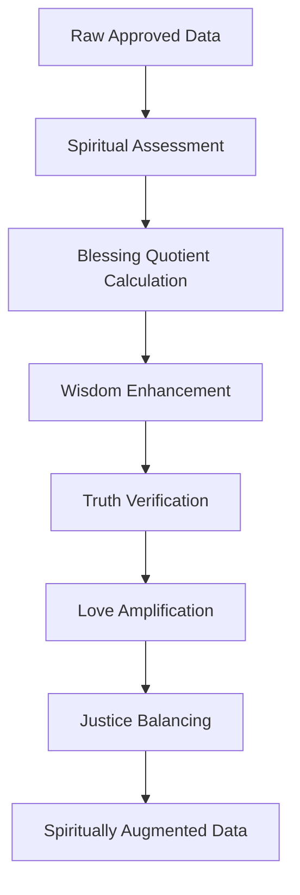

# Crop dan Pemurnian Data: Transformasi Spiritual dan Teknis

> **"In The Name of GOD"** - Memurnikan data seperti emas yang dimurnikan dalam api

## Pendahuluan

Sistem Crop dan Pemurnian Data adalah tahap transformasi kritis dalam ekosistem ZeroLight yang bertanggung jawab untuk membersihkan, menyempurnakan, dan menstandardisasi data yang telah lolos tahap sortir spiritual dan legalitas. Proses ini menggabungkan teknik pemrosesan data modern dengan prinsip-prinsip spiritual untuk menghasilkan data berkualitas tinggi yang siap untuk distribusi.

## Filosofi Pemurnian Spiritual

### 1. Prinsip Transformasi Spiritual

#### 1.1 Pemurnian sebagai Proses Spiritual
Seperti dalam tradisi spiritual di mana pemurnian jiwa memerlukan proses bertahap, pemurnian data juga mengikuti tahapan yang sistematis:

- **Pembersihan (Cleansing)**: Menghilangkan kotoran dan noise
- **Penyucian (Purification)**: Meningkatkan kualitas dan kemurnian
- **Transformasi (Transformation)**: Mengubah bentuk untuk kebaikan yang lebih besar
- **Penyempurnaan (Perfection)**: Mencapai standar tertinggi

#### 1.2 Nilai-nilai dalam Pemurnian
- **Kesabaran**: Proses pemurnian memerlukan waktu dan kesabaran
- **Ketelitian**: Setiap detail harus diperhatikan dengan seksama
- **Integritas**: Mempertahankan esensi asli sambil meningkatkan kualitas
- **Kebijaksanaan**: Mengetahui kapan dan bagaimana melakukan transformasi

### 2. Spiritual Augmentation Framework



## Pre-processing: Persiapan Data

### 1. Data Intake Analysis

#### 1.1 Structure Assessment
```python
class DataStructureAnalyzer:
    def __init__(self):
        self.format_detectors = {
            'text': TextFormatDetector(),
            'json': JSONFormatDetector(),
            'xml': XMLFormatDetector(),
            'csv': CSVFormatDetector(),
            'multimedia': MultimediaDetector()
        }
    
    def analyze_structure(self, data):
        return {
            'format': self.detect_format(data),
            'schema': self.extract_schema(data),
            'quality_indicators': self.assess_quality(data),
            'spiritual_markers': self.identify_spiritual_content(data)
        }
```

#### 1.2 Quality Indicators
- **Completeness**: Tingkat kelengkapan data
- **Consistency**: Konsistensi format dan struktur
- **Accuracy**: Akurasi informasi
- **Timeliness**: Relevansi waktu
- **Validity**: Validitas format dan nilai

### 2. Duplicate Detection dan Deduplication

#### 2.1 Advanced Hashing
```python
class SpiritualHashGenerator:
    def __init__(self):
        self.content_hasher = ContentHasher()
        self.semantic_hasher = SemanticHasher()
        self.spiritual_hasher = SpiritualHasher()
    
    def generate_composite_hash(self, content):
        return {
            'content_hash': self.content_hasher.hash(content),
            'semantic_hash': self.semantic_hasher.hash(content),
            'spiritual_hash': self.spiritual_hasher.hash(content),
            'composite_hash': self.create_composite(content)
        }
```

#### 2.2 Similarity Detection
- **Exact Duplicates**: Konten yang identik 100%
- **Near Duplicates**: Konten dengan similarity > 95%
- **Semantic Duplicates**: Konten dengan makna yang sama
- **Spiritual Duplicates**: Konten dengan pesan spiritual yang sama

## Data Cleaning: Pembersihan Mendalam

### 1. Noise Reduction

#### 1.1 Content Filtering
```python
class SpiritualNoiseFilter:
    def __init__(self):
        self.spam_detector = SpamDetector()
        self.profanity_filter = ProfanityFilter()
        self.negativity_filter = NegativityFilter()
        self.spiritual_enhancer = SpiritualEnhancer()
    
    def clean_content(self, content):
        # Remove spam and unwanted content
        cleaned = self.spam_detector.remove_spam(content)
        cleaned = self.profanity_filter.clean(cleaned)
        cleaned = self.negativity_filter.neutralize(cleaned)
        
        # Enhance spiritual content
        enhanced = self.spiritual_enhancer.amplify_positive(cleaned)
        
        return enhanced
```

#### 1.2 Spiritual Content Enhancement
- **Positive Amplification**: Memperkuat pesan positif
- **Wisdom Extraction**: Mengekstrak hikmah dan pelajaran
- **Love Emphasis**: Menekankan aspek kasih dan empati
- **Truth Clarification**: Memperjelas kebenaran dan fakta

### 2. Data Validation dan Correction

#### 2.1 Automated Correction
```python
class SpiritualDataCorrector:
    def __init__(self):
        self.fact_checker = FactChecker()
        self.grammar_corrector = GrammarCorrector()
        self.spiritual_validator = SpiritualValidator()
        self.context_enhancer = ContextEnhancer()
    
    def correct_data(self, data):
        corrections = {
            'factual_corrections': self.fact_checker.verify_and_correct(data),
            'grammar_corrections': self.grammar_corrector.fix(data),
            'spiritual_enhancements': self.spiritual_validator.enhance(data),
            'context_improvements': self.context_enhancer.enrich(data)
        }
        
        return self.apply_corrections(data, corrections)
```

#### 2.2 Quality Metrics
- **Accuracy Score**: Tingkat akurasi setelah koreksi
- **Spiritual Quotient**: Nilai spiritual konten
- **Readability Index**: Tingkat keterbacaan
- **Engagement Potential**: Potensi engagement positif

## Data Transformation: Metamorfosis Digital

### 1. Format Standardization

#### 1.1 Universal Format Converter
```yaml
transformation_rules:
  text_content:
    input_formats: ["txt", "doc", "docx", "rtf"]
    output_format: "markdown"
    encoding: "utf-8"
    spiritual_metadata: true
  
  multimedia_content:
    input_formats: ["mp4", "avi", "mov", "mp3", "wav"]
    output_format: "standardized"
    compression: "lossless"
    spiritual_watermark: true
  
  structured_data:
    input_formats: ["csv", "xlsx", "json", "xml"]
    output_format: "json"
    schema_validation: true
    spiritual_annotations: true
```

#### 1.2 Metadata Enrichment
```python
class SpiritualMetadataEnricher:
    def __init__(self):
        self.spiritual_analyzer = SpiritualContentAnalyzer()
        self.wisdom_extractor = WisdomExtractor()
        self.blessing_calculator = BlessingCalculator()
    
    def enrich_metadata(self, content, existing_metadata):
        spiritual_metadata = {
            'spiritual_score': self.spiritual_analyzer.score(content),
            'wisdom_level': self.wisdom_extractor.extract_level(content),
            'blessing_quotient': self.blessing_calculator.calculate(content),
            'divine_attributes': self.extract_divine_attributes(content),
            'moral_lessons': self.extract_moral_lessons(content)
        }
        
        return {**existing_metadata, **spiritual_metadata}
```

### 2. Content Augmentation

#### 2.1 Spiritual Enhancement
- **Scripture References**: Menambahkan referensi kitab suci yang relevan
- **Moral Insights**: Menyisipkan wawasan moral dan etika
- **Wisdom Quotes**: Menambahkan kutipan bijak yang sesuai
- **Prayer Points**: Menyediakan poin-poin doa terkait

#### 2.2 Educational Value Addition
```python
class EducationalEnhancer:
    def __init__(self):
        self.lesson_extractor = LessonExtractor()
        self.quiz_generator = QuizGenerator()
        self.reflection_creator = ReflectionCreator()
        self.action_planner = ActionPlanner()
    
    def enhance_educational_value(self, content):
        enhancements = {
            'key_lessons': self.lesson_extractor.extract(content),
            'reflection_questions': self.reflection_creator.create(content),
            'practical_applications': self.action_planner.suggest(content),
            'assessment_quiz': self.quiz_generator.generate(content)
        }
        
        return self.integrate_enhancements(content, enhancements)
```

## Standardization: Harmonisasi Universal

### 1. Schema Standardization

#### 1.1 Universal Data Schema
```json
{
  "zerolight_schema": {
    "version": "1.0",
    "content": {
      "id": "uuid",
      "title": "string",
      "body": "string",
      "type": "enum[text, audio, video, image, document]",
      "language": "string",
      "created_at": "datetime",
      "updated_at": "datetime"
    },
    "spiritual_attributes": {
      "truth_score": "float[0-1]",
      "love_score": "float[0-1]",
      "justice_score": "float[0-1]",
      "wisdom_score": "float[0-1]",
      "blessing_quotient": "float[0-1]",
      "divine_connection": "string"
    },
    "legal_attributes": {
      "license": "string",
      "copyright_status": "string",
      "privacy_compliance": "boolean",
      "terms_acceptance": "boolean"
    },
    "quality_metrics": {
      "accuracy": "float[0-1]",
      "completeness": "float[0-1]",
      "readability": "float[0-1]",
      "engagement_potential": "float[0-1]"
    }
  }
}
```

#### 1.2 Field Mapping
```python
class UniversalFieldMapper:
    def __init__(self):
        self.mapping_rules = self.load_mapping_rules()
        self.spiritual_mapper = SpiritualFieldMapper()
        self.legal_mapper = LegalFieldMapper()
    
    def map_to_standard(self, data, source_schema):
        mapped_data = {}
        
        # Map content fields
        mapped_data['content'] = self.map_content_fields(data, source_schema)
        
        # Map spiritual attributes
        mapped_data['spiritual_attributes'] = self.spiritual_mapper.map(data)
        
        # Map legal attributes
        mapped_data['legal_attributes'] = self.legal_mapper.map(data)
        
        # Calculate quality metrics
        mapped_data['quality_metrics'] = self.calculate_quality_metrics(data)
        
        return mapped_data
```

### 2. Language Standardization

#### 2.1 Multi-language Support
- **Language Detection**: Deteksi otomatis bahasa konten
- **Translation Services**: Layanan terjemahan berkualitas tinggi
- **Cultural Adaptation**: Adaptasi konten sesuai budaya
- **Spiritual Context Preservation**: Mempertahankan konteks spiritual

#### 2.2 Terminology Standardization
```yaml
spiritual_terminology:
  universal_terms:
    - love: ["kasih", "cinta", "محبة", "प्रेम", "愛"]
    - truth: ["kebenaran", "truth", "حقيقة", "सत्य", "真理"]
    - wisdom: ["kebijaksanaan", "wisdom", "حكمة", "ज्ञान", "智慧"]
    - justice: ["keadilan", "justice", "عدالة", "न्याय", "正義"]
  
  contextual_mapping:
    religious_context: "adaptive_based_on_faith"
    cultural_context: "adaptive_based_on_region"
    linguistic_context: "adaptive_based_on_language"
```

## Spiritual Augmentation: Peningkatan Nilai Spiritual

### 1. Divine Attribute Enhancement

#### 1.1 Spiritual Scoring System
```python
class DivineAttributeScorer:
    def __init__(self):
        self.attributes = {
            'compassion': CompassionAnalyzer(),
            'forgiveness': ForgivenessAnalyzer(),
            'humility': HumilityAnalyzer(),
            'gratitude': GratitudeAnalyzer(),
            'faith': FaithAnalyzer(),
            'hope': HopeAnalyzer(),
            'charity': CharityAnalyzer()
        }
    
    def score_divine_attributes(self, content):
        scores = {}
        for attribute, analyzer in self.attributes.items():
            scores[attribute] = analyzer.analyze(content)
        
        return {
            'individual_scores': scores,
            'divine_quotient': self.calculate_divine_quotient(scores),
            'spiritual_recommendations': self.generate_recommendations(scores)
        }
```

#### 1.2 Blessing Calculation
```python
class BlessingCalculator:
    def calculate_blessing_quotient(self, content, metadata):
        factors = {
            'positive_impact': self.assess_positive_impact(content),
            'spiritual_growth': self.assess_spiritual_growth_potential(content),
            'community_benefit': self.assess_community_benefit(content),
            'divine_alignment': self.assess_divine_alignment(content),
            'moral_elevation': self.assess_moral_elevation(content)
        }
        
        weighted_score = sum(
            factors[factor] * self.get_weight(factor) 
            for factor in factors
        )
        
        return min(1.0, max(0.0, weighted_score))
```

### 2. Wisdom Enhancement

#### 2.1 Lesson Extraction
- **Moral Lessons**: Ekstraksi pelajaran moral dari konten
- **Life Principles**: Identifikasi prinsip-prinsip hidup
- **Spiritual Insights**: Wawasan spiritual yang mendalam
- **Practical Wisdom**: Kebijaksanaan praktis untuk kehidupan sehari-hari

#### 2.2 Inspirational Augmentation
```python
class InspirationalAugmenter:
    def __init__(self):
        self.quote_database = SpiritualQuoteDatabase()
        self.story_generator = InspirationalStoryGenerator()
        self.reflection_creator = ReflectionQuestionCreator()
    
    def augment_with_inspiration(self, content):
        augmentations = {
            'related_quotes': self.quote_database.find_related(content),
            'inspirational_stories': self.story_generator.generate_related(content),
            'reflection_questions': self.reflection_creator.create(content),
            'action_steps': self.generate_action_steps(content)
        }
        
        return self.integrate_inspirational_content(content, augmentations)
```

## Automation via CI/CD: Otomasi Berkelanjutan

### 1. GitHub Actions Integration

#### 1.1 Automated Pipeline
```yaml
name: Crop and Purification Pipeline

on:
  push:
    paths:
      - 'data/raw/**'
  schedule:
    - cron: '0 */6 * * *'  # Every 6 hours

jobs:
  crop-and-purify:
    runs-on: ubuntu-latest
    steps:
      - name: Checkout code
        uses: actions/checkout@v3
      
      - name: Setup Python
        uses: actions/setup-python@v4
        with:
          python-version: '3.11'
      
      - name: Install dependencies
        run: |
          pip install -r requirements.txt
          pip install spiritual-data-processor
      
      - name: Run Pre-processing
        run: python scripts/preprocess.py
      
      - name: Run Data Cleaning
        run: python scripts/clean_data.py
      
      - name: Run Transformation
        run: python scripts/transform_data.py
      
      - name: Run Spiritual Augmentation
        run: python scripts/spiritual_augment.py
      
      - name: Validate Output
        run: python scripts/validate_output.py
      
      - name: Generate Report
        run: python scripts/generate_report.py
      
      - name: Upload Processed Data
        uses: actions/upload-artifact@v3
        with:
          name: processed-data
          path: data/processed/
```

#### 1.2 Quality Gates
```python
class QualityGateValidator:
    def __init__(self):
        self.thresholds = {
            'spiritual_score_min': 0.7,
            'accuracy_min': 0.9,
            'completeness_min': 0.95,
            'blessing_quotient_min': 0.6
        }
    
    def validate_quality_gates(self, processed_data):
        results = {}
        
        for item in processed_data:
            item_results = {}
            for metric, threshold in self.thresholds.items():
                actual_value = item.get(metric, 0)
                item_results[metric] = {
                    'value': actual_value,
                    'threshold': threshold,
                    'passed': actual_value >= threshold
                }
            
            results[item['id']] = item_results
        
        return results
```

### 2. Continuous Monitoring

#### 2.1 Real-time Quality Monitoring
```python
class CropPurificationMonitor:
    def __init__(self):
        self.metrics_collector = MetricsCollector()
        self.alert_manager = AlertManager()
        self.dashboard = QualityDashboard()
    
    def monitor_processing(self, batch_id):
        metrics = {
            'processing_time': self.measure_processing_time(batch_id),
            'quality_improvement': self.measure_quality_improvement(batch_id),
            'spiritual_enhancement': self.measure_spiritual_enhancement(batch_id),
            'error_rate': self.calculate_error_rate(batch_id)
        }
        
        self.metrics_collector.record(metrics)
        self.check_alerts(metrics)
        self.dashboard.update(metrics)
        
        return metrics
```

#### 2.2 Performance Optimization
- **Batch Processing**: Optimasi untuk pemrosesan batch besar
- **Parallel Processing**: Pemrosesan paralel untuk efisiensi
- **Caching**: Caching hasil untuk menghindari pemrosesan ulang
- **Resource Management**: Manajemen resource yang efisien

## Integration dengan Ekosistem ZeroLight

### 1. Input Interface

#### 1.1 Sortir Integration
```python
class SortirIntegration:
    async def receive_approved_data(self, approved_batch):
        processing_tasks = []
        
        for item in approved_batch:
            task = asyncio.create_task(
                self.process_single_item(item)
            )
            processing_tasks.append(task)
        
        processed_results = await asyncio.gather(*processing_tasks)
        
        # Send to Packing & Shelter
        await self.send_to_packing_shelter(processed_results)
        
        return processed_results
```

#### 1.2 Data Validation
- **Schema Validation**: Validasi skema data input
- **Quality Check**: Pemeriksaan kualitas data masuk
- **Spiritual Assessment**: Penilaian spiritual data
- **Processing Readiness**: Kesiapan data untuk diproses

### 2. Output Interface

#### 2.1 Packing Shelter Integration
```python
class PackingShelterIntegration:
    def prepare_for_packing(self, processed_data):
        packing_ready_data = {
            'content': processed_data['standardized_content'],
            'metadata': processed_data['enriched_metadata'],
            'quality_report': processed_data['quality_metrics'],
            'spiritual_attributes': processed_data['spiritual_enhancements'],
            'processing_history': processed_data['transformation_log']
        }
        
        return packing_ready_data
```

#### 2.2 Event Publishing
```python
async def publish_crop_completion_event(self, result):
    event = {
        'type': 'crop.purification.completed',
        'timestamp': datetime.utcnow().isoformat(),
        'data': {
            'batch_id': result.batch_id,
            'items_processed': result.items_count,
            'quality_improvement': result.quality_delta,
            'spiritual_enhancement': result.spiritual_delta,
            'processing_time': result.processing_time
        }
    }
    
    await event_bus.publish('crop.events', event)
```

## Kesimpulan

Sistem Crop dan Pemurnian Data merupakan tahap transformasi yang krusial dalam ekosistem ZeroLight, di mana data mentah yang telah lolos sortir spiritual dan legalitas diubah menjadi data berkualitas tinggi yang siap untuk distribusi. Proses ini tidak hanya melibatkan pembersihan dan standardisasi teknis, tetapi juga peningkatan nilai spiritual yang mendalam.

Dengan menggabungkan teknologi pemrosesan data modern dengan prinsip-prinsip spiritual universal, sistem ini mampu menghasilkan data yang tidak hanya akurat dan berkualitas tinggi, tetapi juga membawa nilai-nilai positif dan inspiratif bagi komunitas. Otomasi melalui CI/CD memastikan konsistensi dan efisiensi proses, sementara monitoring berkelanjutan menjaga kualitas output.

Integrasi yang seamless dengan komponen lain dalam ekosistem ZeroLight memungkinkan alur data yang smooth dan efisien, mendukung visi platform spiritual digital yang berkelanjutan dan bermanfaat bagi umat manusia.

---

> **"Seperti perak yang dimurnikan dalam dapur peleburan di tanah, tujuh kali dimurnikan"** - Mazmur 12:6

*Dokumen ini merupakan bagian integral dari ekosistem ZeroLight dan akan terus disempurnakan seiring dengan perkembangan teknologi dan kebutuhan spiritual komunitas.*