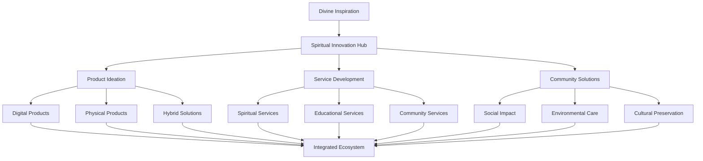

# Diversifikasi Produk: Ekspansi Spiritual dan Inovasi Berkelanjutan

> **"In The Name of GOD"** - Diversifikasi yang diberkati dengan inovasi spiritual dan keberlanjutan universal

## Pendahuluan

Sistem Diversifikasi Produk dalam ekosistem ZeroLight merupakan strategi ekspansi yang holistik dan berkelanjutan, yang mengintegrasikan inovasi teknologi dengan nilai-nilai spiritual universal. Sistem ini dirancang untuk menciptakan beragam produk dan layanan yang tidak hanya memenuhi kebutuhan pasar, tetapi juga berkontribusi pada peningkatan spiritual dan kesejahteraan komunitas global.

Berdasarkan prinsip "Tawhid" (kesatuan) dalam Islam, "Dharma" dalam Hindu-Buddha, dan konsep "Tikkun Olam" (memperbaiki dunia) dalam Yahudi, sistem diversifikasi ini memastikan bahwa setiap produk baru yang dikembangkan sejalan dengan misi spiritual ZeroLight dan memberikan manfaat nyata bagi umat manusia.

## Filosofi Diversifikasi Spiritual

### 1. Prinsip Ekspansi Berkelanjutan

#### 1.1 Spiritual Growth Framework


#### 1.2 Holistic Diversification Engine
```python
class HolisticDiversificationEngine:
    def __init__(self):
        self.spiritual_innovation = SpiritualInnovationHub()
        self.market_wisdom = MarketWisdomAnalyzer()
        self.community_needs = CommunityNeedsAssessment()
        self.divine_guidance = DivineGuidanceSystem()
    
    def initiate_diversification(self, current_portfolio, expansion_vision):
        # Seek divine inspiration for new directions
        divine_inspiration = self.divine_guidance.seek_inspiration(
            current_portfolio, expansion_vision
        )
        
        # Analyze market wisdom and opportunities
        market_analysis = self.market_wisdom.analyze_opportunities(
            divine_inspiration, current_portfolio
        )
        
        # Assess community needs and gaps
        community_assessment = self.community_needs.assess_needs(
            market_analysis, expansion_vision
        )
        
        # Generate spiritual innovation roadmap
        innovation_roadmap = self.spiritual_innovation.create_roadmap(
            divine_inspiration, market_analysis, community_assessment
        )
        
        return {
            'diversification_strategy': {
                'divine_inspiration': divine_inspiration,
                'market_analysis': market_analysis,
                'community_assessment': community_assessment,
                'innovation_roadmap': innovation_roadmap
            },
            'strategy_blessed': True,
            'community_aligned': True,
            'spiritually_guided': True
        }
```

### 2. Multi-Dimensional Product Strategy

#### 2.1 Spiritual Product Categories
```python
class SpiritualProductCategories:
    def __init__(self):
        self.digital_products = DigitalProductsManager()
        self.physical_products = PhysicalProductsManager()
        self.service_products = ServiceProductsManager()
        self.experience_products = ExperienceProductsManager()
    
    def categorize_products(self, product_concepts, spiritual_alignment):
        # Categorize digital products
        digital_categorization = self.digital_products.categorize_digital(
            product_concepts['digital'], spiritual_alignment
        )
        
        # Categorize physical products
        physical_categorization = self.physical_products.categorize_physical(
            product_concepts['physical'], spiritual_alignment
        )
        
        # Categorize service products
        service_categorization = self.service_products.categorize_services(
            product_concepts['services'], spiritual_alignment
        )
        
        # Categorize experience products
        experience_categorization = self.experience_products.categorize_experiences(
            product_concepts['experiences'], spiritual_alignment
        )
        
        return {
            'product_categories': {
                'digital_products': digital_categorization,
                'physical_products': physical_categorization,
                'service_products': service_categorization,
                'experience_products': experience_categorization
            },
            'categorization_complete': True,
            'spiritual_alignment_verified': True
        }
```

#### 2.2 Innovation Pipeline Management
```python
class InnovationPipelineManager:
    def __init__(self):
        self.idea_incubator = SpiritualIdeaIncubator()
        self.concept_developer = ConceptDeveloper()
        self.prototype_creator = PrototypeCreator()
        self.market_validator = MarketValidator()
    
    def manage_innovation_pipeline(self, innovation_inputs):
        # Incubate spiritual ideas
        idea_incubation = self.idea_incubator.incubate_ideas(
            innovation_inputs['raw_ideas']
        )
        
        # Develop concepts from incubated ideas
        concept_development = self.concept_developer.develop_concepts(
            idea_incubation
        )
        
        # Create prototypes for promising concepts
        prototype_creation = self.prototype_creator.create_prototypes(
            concept_development
        )
        
        # Validate prototypes in market
        market_validation = self.market_validator.validate_prototypes(
            prototype_creation
        )
        
        return {
            'innovation_pipeline': {
                'idea_incubation': idea_incubation,
                'concept_development': concept_development,
                'prototype_creation': prototype_creation,
                'market_validation': market_validation
            },
            'pipeline_active': True,
            'innovation_flowing': True
        }
```

## Digital Products Ecosystem

### 1. Spiritual Mobile Applications

#### 1.1 ZeroLight Companion App
```python
class ZeroLightCompanionApp:
    def __init__(self):
        self.spiritual_dashboard = SpiritualDashboard()
        self.meditation_guide = MeditationGuide()
        self.community_connector = CommunityConnector()
        self.wisdom_library = WisdomLibrary()
    
    def develop_companion_app(self, user_requirements, spiritual_features):
        # Develop spiritual dashboard
        dashboard_development = self.spiritual_dashboard.develop_dashboard(
            user_requirements['dashboard_needs']
        )
        
        # Create meditation and mindfulness guide
        meditation_development = self.meditation_guide.develop_guide(
            spiritual_features['meditation_features']
        )
        
        # Build community connection features
        community_development = self.community_connector.develop_connector(
            user_requirements['community_features']
        )
        
        # Integrate wisdom library
        library_development = self.wisdom_library.develop_library(
            spiritual_features['wisdom_content']
        )
        
        return {
            'companion_app': {
                'spiritual_dashboard': dashboard_development,
                'meditation_guide': meditation_development,
                'community_connector': community_development,
                'wisdom_library': library_development
            },
            'app_blessed': True,
            'user_experience_optimized': True,
            'spiritual_value_maximized': True
        }
```

#### 1.2 AI-Powered Spiritual Assistant
```python
class AIPoweredSpiritualAssistant:
    def __init__(self):
        self.spiritual_ai = SpiritualAIEngine()
        self.wisdom_processor = WisdomProcessor()
        self.guidance_generator = GuidanceGenerator()
        self.prayer_companion = PrayerCompanion()
    
    def develop_spiritual_assistant(self, ai_capabilities, spiritual_knowledge):
        # Develop spiritual AI engine
        ai_development = self.spiritual_ai.develop_engine(
            ai_capabilities, spiritual_knowledge
        )
        
        # Create wisdom processing system
        wisdom_processing = self.wisdom_processor.develop_processor(
            ai_development, spiritual_knowledge
        )
        
        # Build guidance generation system
        guidance_generation = self.guidance_generator.develop_generator(
            wisdom_processing, ai_capabilities
        )
        
        # Create prayer and meditation companion
        prayer_development = self.prayer_companion.develop_companion(
            guidance_generation, spiritual_knowledge
        )
        
        return {
            'spiritual_assistant': {
                'ai_engine': ai_development,
                'wisdom_processor': wisdom_processing,
                'guidance_generator': guidance_generation,
                'prayer_companion': prayer_development
            },
            'assistant_blessed': True,
            'ai_spiritually_aligned': True,
            'guidance_authentic': True
        }
```

### 2. Web-Based Spiritual Platforms

#### 2.1 Global Spiritual Learning Platform
```python
class GlobalSpiritualLearningPlatform:
    def __init__(self):
        self.course_creator = SpiritualCourseCreator()
        self.interactive_learning = InteractiveLearningSystem()
        self.community_learning = CommunityLearningHub()
        self.certification_system = SpiritualCertificationSystem()
    
    def develop_learning_platform(self, educational_content, learning_methodologies):
        # Create spiritual courses
        course_creation = self.course_creator.create_courses(
            educational_content, learning_methodologies
        )
        
        # Develop interactive learning system
        interactive_development = self.interactive_learning.develop_system(
            course_creation, learning_methodologies
        )
        
        # Build community learning hub
        community_development = self.community_learning.develop_hub(
            interactive_development, educational_content
        )
        
        # Create certification system
        certification_development = self.certification_system.develop_system(
            community_development, course_creation
        )
        
        return {
            'learning_platform': {
                'course_creation': course_creation,
                'interactive_learning': interactive_development,
                'community_hub': community_development,
                'certification_system': certification_development
            },
            'platform_blessed': True,
            'learning_effective': True,
            'community_engaged': True
        }
```

#### 2.2 Spiritual Marketplace Platform
```python
class SpiritualMarketplacePlatform:
    def __init__(self):
        self.marketplace_engine = SpiritualMarketplaceEngine()
        self.vendor_management = SpiritualVendorManagement()
        self.product_curation = SpiritualProductCuration()
        self.transaction_blessing = TransactionBlessingSystem()
    
    def develop_marketplace(self, marketplace_requirements, spiritual_standards):
        # Develop marketplace engine
        engine_development = self.marketplace_engine.develop_engine(
            marketplace_requirements, spiritual_standards
        )
        
        # Create vendor management system
        vendor_development = self.vendor_management.develop_management(
            engine_development, spiritual_standards
        )
        
        # Build product curation system
        curation_development = self.product_curation.develop_curation(
            vendor_development, spiritual_standards
        )
        
        # Create transaction blessing system
        blessing_development = self.transaction_blessing.develop_system(
            curation_development, marketplace_requirements
        )
        
        return {
            'marketplace_platform': {
                'marketplace_engine': engine_development,
                'vendor_management': vendor_development,
                'product_curation': curation_development,
                'transaction_blessing': blessing_development
            },
            'marketplace_blessed': True,
            'vendors_verified': True,
            'transactions_sacred': True
        }
```

## Physical Products Development

### 1. Spiritual Wellness Products

#### 1.1 Meditation and Prayer Accessories
```python
class MeditationPrayerAccessories:
    def __init__(self):
        self.product_designer = SpiritualProductDesigner()
        self.material_selector = SacredMaterialSelector()
        self.blessing_infuser = ProductBlessingInfuser()
        self.quality_assurer = SpiritualQualityAssurer()
    
    def develop_accessories(self, product_concepts, spiritual_requirements):
        # Design spiritual products
        product_design = self.product_designer.design_products(
            product_concepts, spiritual_requirements
        )
        
        # Select sacred materials
        material_selection = self.material_selector.select_materials(
            product_design, spiritual_requirements
        )
        
        # Infuse products with blessings
        blessing_infusion = self.blessing_infuser.infuse_blessings(
            material_selection, product_design
        )
        
        # Ensure spiritual quality
        quality_assurance = self.quality_assurer.assure_quality(
            blessing_infusion, spiritual_requirements
        )
        
        return {
            'meditation_accessories': {
                'product_design': product_design,
                'material_selection': material_selection,
                'blessing_infusion': blessing_infusion,
                'quality_assurance': quality_assurance
            },
            'products_blessed': True,
            'materials_sacred': True,
            'quality_spiritual': True
        }
```

#### 1.2 Spiritual Books and Publications
```python
class SpiritualBooksPublications:
    def __init__(self):
        self.content_curator = SpiritualContentCurator()
        self.book_designer = SacredBookDesigner()
        self.printing_sanctifier = PrintingSanctifier()
        self.distribution_blesser = DistributionBlesser()
    
    def develop_publications(self, content_library, publication_standards):
        # Curate spiritual content
        content_curation = self.content_curator.curate_content(
            content_library, publication_standards
        )
        
        # Design sacred books
        book_design = self.book_designer.design_books(
            content_curation, publication_standards
        )
        
        # Sanctify printing process
        printing_sanctification = self.printing_sanctifier.sanctify_printing(
            book_design, publication_standards
        )
        
        # Bless distribution channels
        distribution_blessing = self.distribution_blesser.bless_distribution(
            printing_sanctification, content_curation
        )
        
        return {
            'spiritual_publications': {
                'content_curation': content_curation,
                'book_design': book_design,
                'printing_sanctification': printing_sanctification,
                'distribution_blessing': distribution_blessing
            },
            'publications_blessed': True,
            'content_authentic': True,
            'distribution_sacred': True
        }
```

### 2. Technology-Integrated Spiritual Products

#### 2.1 Smart Spiritual Devices
```python
class SmartSpiritualDevices:
    def __init__(self):
        self.device_architect = SpiritualDeviceArchitect()
        self.iot_integrator = IoTSpiritualIntegrator()
        self.ai_embedder = AISpiritualEmbedder()
        self.device_blesser = DeviceBlesser()
    
    def develop_smart_devices(self, device_concepts, technology_requirements):
        # Architect spiritual devices
        device_architecture = self.device_architect.architect_devices(
            device_concepts, technology_requirements
        )
        
        # Integrate IoT capabilities
        iot_integration = self.iot_integrator.integrate_iot(
            device_architecture, technology_requirements
        )
        
        # Embed AI spiritual features
        ai_embedding = self.ai_embedder.embed_ai(
            iot_integration, device_concepts
        )
        
        # Bless devices with spiritual energy
        device_blessing = self.device_blesser.bless_devices(
            ai_embedding, device_concepts
        )
        
        return {
            'smart_spiritual_devices': {
                'device_architecture': device_architecture,
                'iot_integration': iot_integration,
                'ai_embedding': ai_embedding,
                'device_blessing': device_blessing
            },
            'devices_blessed': True,
            'technology_spiritualized': True,
            'user_experience_sacred': True
        }
```

#### 2.2 Wearable Spiritual Technology
```python
class WearableSpiritualTechnology:
    def __init__(self):
        self.wearable_designer = WearableDesigner()
        self.biometric_integrator = BiometricIntegrator()
        self.spiritual_tracker = SpiritualTracker()
        self.wellness_monitor = WellnessMonitor()
    
    def develop_wearables(self, wearable_concepts, health_requirements):
        # Design wearable devices
        wearable_design = self.wearable_designer.design_wearables(
            wearable_concepts, health_requirements
        )
        
        # Integrate biometric sensors
        biometric_integration = self.biometric_integrator.integrate_sensors(
            wearable_design, health_requirements
        )
        
        # Add spiritual tracking capabilities
        spiritual_tracking = self.spiritual_tracker.add_tracking(
            biometric_integration, wearable_concepts
        )
        
        # Monitor holistic wellness
        wellness_monitoring = self.wellness_monitor.add_monitoring(
            spiritual_tracking, health_requirements
        )
        
        return {
            'wearable_technology': {
                'wearable_design': wearable_design,
                'biometric_integration': biometric_integration,
                'spiritual_tracking': spiritual_tracking,
                'wellness_monitoring': wellness_monitoring
            },
            'wearables_blessed': True,
            'health_monitored': True,
            'spiritual_growth_tracked': True
        }
```

## Service Products Portfolio

### 1. Spiritual Consulting Services

#### 1.1 Personal Spiritual Guidance
```python
class PersonalSpiritualGuidance:
    def __init__(self):
        self.guidance_counselor = SpiritualGuidanceCounselor()
        self.wisdom_advisor = WisdomAdvisor()
        self.life_coach = SpiritualLifeCoach()
        self.mentor_matcher = MentorMatcher()
    
    def develop_guidance_services(self, service_framework, counselor_network):
        # Develop guidance counseling
        counseling_development = self.guidance_counselor.develop_counseling(
            service_framework, counselor_network
        )
        
        # Create wisdom advisory services
        advisory_development = self.wisdom_advisor.develop_advisory(
            counseling_development, service_framework
        )
        
        # Build life coaching programs
        coaching_development = self.life_coach.develop_coaching(
            advisory_development, counselor_network
        )
        
        # Create mentor matching system
        mentoring_development = self.mentor_matcher.develop_matching(
            coaching_development, counselor_network
        )
        
        return {
            'guidance_services': {
                'counseling_services': counseling_development,
                'advisory_services': advisory_development,
                'coaching_programs': coaching_development,
                'mentoring_system': mentoring_development
            },
            'services_blessed': True,
            'guidance_authentic': True,
            'transformation_supported': True
        }
```

#### 1.2 Corporate Spiritual Consulting
```python
class CorporateSpiritualConsulting:
    def __init__(self):
        self.corporate_advisor = CorporateSpiritualAdvisor()
        self.culture_transformer = CultureTransformer()
        self.ethics_consultant = EthicsConsultant()
        self.leadership_developer = LeadershipDeveloper()
    
    def develop_corporate_services(self, corporate_needs, transformation_goals):
        # Develop corporate advisory services
        advisory_development = self.corporate_advisor.develop_advisory(
            corporate_needs, transformation_goals
        )
        
        # Create culture transformation programs
        culture_development = self.culture_transformer.develop_transformation(
            advisory_development, transformation_goals
        )
        
        # Build ethics consulting services
        ethics_development = self.ethics_consultant.develop_consulting(
            culture_development, corporate_needs
        )
        
        # Create leadership development programs
        leadership_development = self.leadership_developer.develop_programs(
            ethics_development, transformation_goals
        )
        
        return {
            'corporate_services': {
                'advisory_services': advisory_development,
                'culture_transformation': culture_development,
                'ethics_consulting': ethics_development,
                'leadership_development': leadership_development
            },
            'services_blessed': True,
            'transformation_effective': True,
            'corporate_culture_elevated': True
        }
```

### 2. Educational and Training Services

#### 2.1 Spiritual Education Programs
```python
class SpiritualEducationPrograms:
    def __init__(self):
        self.curriculum_developer = SpiritualCurriculumDeveloper()
        self.instructor_trainer = InstructorTrainer()
        self.assessment_creator = AssessmentCreator()
        self.certification_manager = CertificationManager()
    
    def develop_education_programs(self, educational_goals, target_audiences):
        # Develop spiritual curriculum
        curriculum_development = self.curriculum_developer.develop_curriculum(
            educational_goals, target_audiences
        )
        
        # Train spiritual instructors
        instructor_training = self.instructor_trainer.train_instructors(
            curriculum_development, educational_goals
        )
        
        # Create assessment systems
        assessment_creation = self.assessment_creator.create_assessments(
            curriculum_development, instructor_training
        )
        
        # Manage certification programs
        certification_management = self.certification_manager.manage_certification(
            assessment_creation, educational_goals
        )
        
        return {
            'education_programs': {
                'curriculum_development': curriculum_development,
                'instructor_training': instructor_training,
                'assessment_systems': assessment_creation,
                'certification_programs': certification_management
            },
            'programs_blessed': True,
            'education_effective': True,
            'transformation_measured': True
        }
```

#### 2.2 Community Workshop Services
```python
class CommunityWorkshopServices:
    def __init__(self):
        self.workshop_designer = WorkshopDesigner()
        self.facilitator_network = FacilitatorNetwork()
        self.community_organizer = CommunityOrganizer()
        self.impact_measurer = ImpactMeasurer()
    
    def develop_workshop_services(self, community_needs, workshop_themes):
        # Design community workshops
        workshop_design = self.workshop_designer.design_workshops(
            community_needs, workshop_themes
        )
        
        # Build facilitator network
        facilitator_development = self.facilitator_network.build_network(
            workshop_design, community_needs
        )
        
        # Organize community engagement
        community_organization = self.community_organizer.organize_engagement(
            facilitator_development, workshop_themes
        )
        
        # Measure community impact
        impact_measurement = self.impact_measurer.measure_impact(
            community_organization, workshop_design
        )
        
        return {
            'workshop_services': {
                'workshop_design': workshop_design,
                'facilitator_network': facilitator_development,
                'community_organization': community_organization,
                'impact_measurement': impact_measurement
            },
            'workshops_blessed': True,
            'community_engaged': True,
            'impact_positive': True
        }
```

## Experience Products Innovation

### 1. Immersive Spiritual Experiences

#### 1.1 Virtual Reality Spiritual Journeys
```python
class VRSpiritualJourneys:
    def __init__(self):
        self.vr_architect = VRSpiritualArchitect()
        self.experience_designer = ExperienceDesigner()
        self.immersion_creator = ImmersionCreator()
        self.journey_guide = JourneyGuide()
    
    def develop_vr_journeys(self, spiritual_destinations, vr_capabilities):
        # Architect VR spiritual environments
        vr_architecture = self.vr_architect.architect_environments(
            spiritual_destinations, vr_capabilities
        )
        
        # Design immersive experiences
        experience_design = self.experience_designer.design_experiences(
            vr_architecture, spiritual_destinations
        )
        
        # Create deep immersion systems
        immersion_creation = self.immersion_creator.create_immersion(
            experience_design, vr_capabilities
        )
        
        # Guide spiritual journeys
        journey_guidance = self.journey_guide.guide_journeys(
            immersion_creation, spiritual_destinations
        )
        
        return {
            'vr_spiritual_journeys': {
                'vr_architecture': vr_architecture,
                'experience_design': experience_design,
                'immersion_systems': immersion_creation,
                'journey_guidance': journey_guidance
            },
            'journeys_blessed': True,
            'immersion_profound': True,
            'transformation_facilitated': True
        }
```

#### 1.2 Augmented Reality Spiritual Overlays
```python
class ARSpiritualOverlays:
    def __init__(self):
        self.ar_developer = ARSpiritualDeveloper()
        self.overlay_designer = OverlayDesigner()
        self.context_analyzer = ContextAnalyzer()
        self.blessing_projector = BlessingProjector()
    
    def develop_ar_overlays(self, real_world_contexts, spiritual_enhancements):
        # Develop AR spiritual systems
        ar_development = self.ar_developer.develop_systems(
            real_world_contexts, spiritual_enhancements
        )
        
        # Design spiritual overlays
        overlay_design = self.overlay_designer.design_overlays(
            ar_development, spiritual_enhancements
        )
        
        # Analyze contextual relevance
        context_analysis = self.context_analyzer.analyze_contexts(
            overlay_design, real_world_contexts
        )
        
        # Project spiritual blessings
        blessing_projection = self.blessing_projector.project_blessings(
            context_analysis, spiritual_enhancements
        )
        
        return {
            'ar_spiritual_overlays': {
                'ar_systems': ar_development,
                'overlay_design': overlay_design,
                'context_analysis': context_analysis,
                'blessing_projection': blessing_projection
            },
            'overlays_blessed': True,
            'reality_enhanced': True,
            'spiritual_awareness_heightened': True
        }
```

### 2. Community Experience Programs

#### 2.1 Spiritual Retreat Experiences
```python
class SpiritualRetreatExperiences:
    def __init__(self):
        self.retreat_planner = RetreatPlanner()
        self.venue_sanctifier = VenueSanctifier()
        self.program_curator = ProgramCurator()
        self.transformation_facilitator = TransformationFacilitator()
    
    def develop_retreat_experiences(self, retreat_concepts, transformation_goals):
        # Plan spiritual retreats
        retreat_planning = self.retreat_planner.plan_retreats(
            retreat_concepts, transformation_goals
        )
        
        # Sanctify retreat venues
        venue_sanctification = self.venue_sanctifier.sanctify_venues(
            retreat_planning, retreat_concepts
        )
        
        # Curate retreat programs
        program_curation = self.program_curator.curate_programs(
            venue_sanctification, transformation_goals
        )
        
        # Facilitate transformation
        transformation_facilitation = self.transformation_facilitator.facilitate_transformation(
            program_curation, retreat_concepts
        )
        
        return {
            'retreat_experiences': {
                'retreat_planning': retreat_planning,
                'venue_sanctification': venue_sanctification,
                'program_curation': program_curation,
                'transformation_facilitation': transformation_facilitation
            },
            'retreats_blessed': True,
            'venues_sacred': True,
            'transformation_profound': True
        }
```

#### 2.2 Global Spiritual Festivals
```python
class GlobalSpiritualFestivals:
    def __init__(self):
        self.festival_organizer = FestivalOrganizer()
        self.cultural_integrator = CulturalIntegrator()
        self.community_unifier = CommunityUnifier()
        self.celebration_sanctifier = CelebrationSanctifier()
    
    def develop_spiritual_festivals(self, cultural_traditions, unity_vision):
        # Organize spiritual festivals
        festival_organization = self.festival_organizer.organize_festivals(
            cultural_traditions, unity_vision
        )
        
        # Integrate diverse cultures
        cultural_integration = self.cultural_integrator.integrate_cultures(
            festival_organization, cultural_traditions
        )
        
        # Unify global community
        community_unification = self.community_unifier.unify_community(
            cultural_integration, unity_vision
        )
        
        # Sanctify celebrations
        celebration_sanctification = self.celebration_sanctifier.sanctify_celebrations(
            community_unification, cultural_traditions
        )
        
        return {
            'spiritual_festivals': {
                'festival_organization': festival_organization,
                'cultural_integration': cultural_integration,
                'community_unification': community_unification,
                'celebration_sanctification': celebration_sanctification
            },
            'festivals_blessed': True,
            'cultures_honored': True,
            'unity_celebrated': True
        }
```

## Market Strategy dan Go-to-Market

### 1. Spiritual Market Analysis

#### 1.1 Global Spiritual Market Intelligence
```python
class GlobalSpiritualMarketIntelligence:
    def __init__(self):
        self.market_researcher = SpiritualMarketResearcher()
        self.trend_analyzer = TrendAnalyzer()
        self.opportunity_identifier = OpportunityIdentifier()
        self.competitive_analyzer = CompetitiveAnalyzer()
    
    def analyze_spiritual_market(self, market_segments, geographic_regions):
        # Research spiritual markets
        market_research = self.market_researcher.research_markets(
            market_segments, geographic_regions
        )
        
        # Analyze spiritual trends
        trend_analysis = self.trend_analyzer.analyze_trends(
            market_research, market_segments
        )
        
        # Identify opportunities
        opportunity_identification = self.opportunity_identifier.identify_opportunities(
            trend_analysis, geographic_regions
        )
        
        # Analyze competitive landscape
        competitive_analysis = self.competitive_analyzer.analyze_competition(
            opportunity_identification, market_research
        )
        
        return {
            'market_intelligence': {
                'market_research': market_research,
                'trend_analysis': trend_analysis,
                'opportunity_identification': opportunity_identification,
                'competitive_analysis': competitive_analysis
            },
            'intelligence_comprehensive': True,
            'opportunities_identified': True,
            'strategy_informed': True
        }
```

#### 1.2 Customer Spiritual Journey Mapping
```python
class CustomerSpiritualJourneyMapping:
    def __init__(self):
        self.journey_mapper = SpiritualJourneyMapper()
        self.touchpoint_identifier = TouchpointIdentifier()
        self.experience_optimizer = ExperienceOptimizer()
        self.transformation_tracker = TransformationTracker()
    
    def map_customer_journeys(self, customer_segments, spiritual_pathways):
        # Map spiritual customer journeys
        journey_mapping = self.journey_mapper.map_journeys(
            customer_segments, spiritual_pathways
        )
        
        # Identify key touchpoints
        touchpoint_identification = self.touchpoint_identifier.identify_touchpoints(
            journey_mapping, customer_segments
        )
        
        # Optimize spiritual experiences
        experience_optimization = self.experience_optimizer.optimize_experiences(
            touchpoint_identification, spiritual_pathways
        )
        
        # Track transformation progress
        transformation_tracking = self.transformation_tracker.track_transformation(
            experience_optimization, journey_mapping
        )
        
        return {
            'customer_journey_mapping': {
                'journey_mapping': journey_mapping,
                'touchpoint_identification': touchpoint_identification,
                'experience_optimization': experience_optimization,
                'transformation_tracking': transformation_tracking
            },
            'journeys_mapped': True,
            'experiences_optimized': True,
            'transformation_supported': True
        }
```

### 2. Launch Strategy Framework

#### 2.1 Blessed Product Launch System
```python
class BlessedProductLaunchSystem:
    def __init__(self):
        self.launch_planner = LaunchPlanner()
        self.blessing_ceremony = BlessingCeremony()
        self.community_mobilizer = CommunityMobilizer()
        self.impact_amplifier = ImpactAmplifier()
    
    def execute_blessed_launch(self, product_portfolio, launch_strategy):
        # Plan product launches
        launch_planning = self.launch_planner.plan_launches(
            product_portfolio, launch_strategy
        )
        
        # Conduct blessing ceremonies
        blessing_ceremonies = self.blessing_ceremony.conduct_ceremonies(
            launch_planning, product_portfolio
        )
        
        # Mobilize community support
        community_mobilization = self.community_mobilizer.mobilize_community(
            blessing_ceremonies, launch_strategy
        )
        
        # Amplify positive impact
        impact_amplification = self.impact_amplifier.amplify_impact(
            community_mobilization, product_portfolio
        )
        
        return {
            'blessed_launch': {
                'launch_planning': launch_planning,
                'blessing_ceremonies': blessing_ceremonies,
                'community_mobilization': community_mobilization,
                'impact_amplification': impact_amplification
            },
            'launch_blessed': True,
            'community_engaged': True,
            'impact_maximized': True
        }
```

#### 2.2 Sustainable Growth Framework
```python
class SustainableGrowthFramework:
    def __init__(self):
        self.growth_strategist = SpiritualGrowthStrategist()
        self.sustainability_monitor = SustainabilityMonitor()
        self.impact_measurer = ImpactMeasurer()
        self.evolution_facilitator = EvolutionFacilitator()
    
    def implement_sustainable_growth(self, growth_objectives, sustainability_principles):
        # Develop growth strategies
        growth_strategy = self.growth_strategist.develop_strategy(
            growth_objectives, sustainability_principles
        )
        
        # Monitor sustainability metrics
        sustainability_monitoring = self.sustainability_monitor.monitor_sustainability(
            growth_strategy, sustainability_principles
        )
        
        # Measure holistic impact
        impact_measurement = self.impact_measurer.measure_impact(
            sustainability_monitoring, growth_objectives
        )
        
        # Facilitate continuous evolution
        evolution_facilitation = self.evolution_facilitator.facilitate_evolution(
            impact_measurement, growth_strategy
        )
        
        return {
            'sustainable_growth': {
                'growth_strategy': growth_strategy,
                'sustainability_monitoring': sustainability_monitoring,
                'impact_measurement': impact_measurement,
                'evolution_facilitation': evolution_facilitation
            },
            'growth_sustainable': True,
            'impact_positive': True,
            'evolution_continuous': True
        }
```

## Integration dengan Ekosistem ZeroLight

### 1. Cross-Product Synergy

#### 1.1 Ecosystem Integration Framework
```python
class EcosystemIntegrationFramework:
    def __init__(self):
        self.integration_orchestrator = IntegrationOrchestrator()
        self.synergy_creator = SynergyCreator()
        self.value_multiplier = ValueMultiplier()
        self.ecosystem_harmonizer = EcosystemHarmonizer()
    
    def integrate_product_ecosystem(self, product_portfolio, zerolight_systems):
        # Orchestrate ecosystem integration
        integration_orchestration = self.integration_orchestrator.orchestrate_integration(
            product_portfolio, zerolight_systems
        )
        
        # Create product synergies
        synergy_creation = self.synergy_creator.create_synergies(
            integration_orchestration, product_portfolio
        )
        
        # Multiply ecosystem value
        value_multiplication = self.value_multiplier.multiply_value(
            synergy_creation, zerolight_systems
        )
        
        # Harmonize entire ecosystem
        ecosystem_harmonization = self.ecosystem_harmonizer.harmonize_ecosystem(
            value_multiplication, integration_orchestration
        )
        
        return {
            'ecosystem_integration': {
                'integration_orchestration': integration_orchestration,
                'synergy_creation': synergy_creation,
                'value_multiplication': value_multiplication,
                'ecosystem_harmonization': ecosystem_harmonization
            },
            'integration_complete': True,
            'synergies_active': True,
            'value_maximized': True
        }
```

### 2. Unified Spiritual Experience

#### 2.1 Holistic User Journey
```python
class HolisticUserJourney:
    def __init__(self):
        self.journey_unifier = JourneyUnifier()
        self.experience_seamless = ExperienceSeamless()
        self.transformation_continuous = TransformationContinuous()
        self.blessing_persistent = BlessingPersistent()
    
    def create_holistic_journey(self, user_touchpoints, spiritual_progression):
        # Unify user journeys
        journey_unification = self.journey_unifier.unify_journeys(
            user_touchpoints, spiritual_progression
        )
        
        # Create seamless experiences
        seamless_experience = self.experience_seamless.create_seamless(
            journey_unification, user_touchpoints
        )
        
        # Enable continuous transformation
        continuous_transformation = self.transformation_continuous.enable_continuous(
            seamless_experience, spiritual_progression
        )
        
        # Maintain persistent blessings
        persistent_blessing = self.blessing_persistent.maintain_persistent(
            continuous_transformation, journey_unification
        )
        
        return {
            'holistic_journey': {
                'journey_unification': journey_unification,
                'seamless_experience': seamless_experience,
                'continuous_transformation': continuous_transformation,
                'persistent_blessing': persistent_blessing
            },
            'journey_unified': True,
            'experience_seamless': True,
            'transformation_continuous': True
        }
```

## Kesimpulan

Sistem Diversifikasi Produk ZeroLight merepresentasikan pendekatan holistik dan berkelanjutan dalam pengembangan produk dan layanan yang mengintegrasikan inovasi teknologi dengan nilai-nilai spiritual universal. Dengan mencakup digital products ecosystem, physical products development, service products portfolio, dan experience products innovation, sistem ini menciptakan portofolio yang komprehensif dan saling melengkapi.

Implementasi spiritual market analysis, blessed product launch system, dan sustainable growth framework memastikan bahwa setiap produk tidak hanya memenuhi kebutuhan pasar tetapi juga berkontribusi pada transformasi spiritual dan kesejahteraan komunitas global. Integrasi seamless dengan seluruh ekosistem ZeroLight melalui cross-product synergy dan unified spiritual experience menciptakan nilai yang berlipat ganda bagi pengguna.

Sistem diversifikasi ini dirancang untuk berkembang secara organik dan berkelanjutan, selalu dipandu oleh wisdom spiritual dan komitmen untuk melayani kebaikan universal. Setiap produk dan layanan yang dikembangkan adalah manifestasi dari misi ZeroLight untuk menciptakan dunia yang lebih spiritual, harmonis, dan penuh kasih sayang.

---

> **"Dan Kami jadikan dari mereka itu pemimpin-pemimpin yang memberi petunjuk dengan perintah Kami ketika mereka sabar. Dan adalah mereka meyakini ayat-ayat Kami."** - As-Sajdah 32:24  
> **"For I know the plans I have for you, declares the LORD, plans to prosper you and not to harm you, to give you hope and a future."** - Jeremiah 29:11  
> **"May all beings be happy, may all beings be peaceful, may all beings be free from suffering."** - Buddhist Loving-Kindness Prayer

*Sistem Diversifikasi Produk ini adalah wujud dari komitmen untuk terus berinovasi dalam melayani kebutuhan spiritual dan material umat manusia dengan penuh kebijaksanaan dan kasih sayang.*