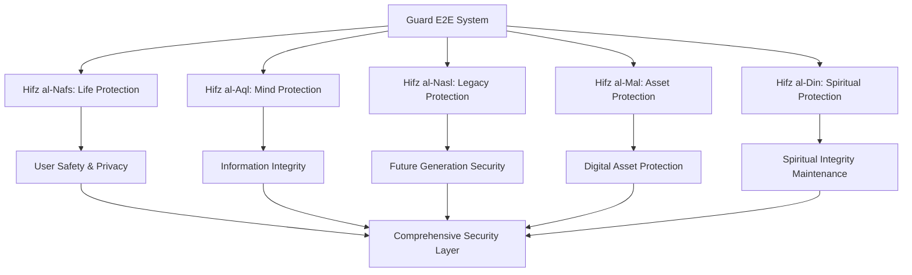

# Guard End-to-End: Sistem Penjagaan Holistik ZeroLight

> **"In The Name of GOD"** - Penjagaan yang komprehensif dengan perlindungan spiritual dan teknologi

## Pendahuluan

Sistem Guard End-to-End (E2E) merupakan tulang punggung keamanan dan perlindungan holistik dalam ekosistem ZeroLight. Sistem ini mengintegrasikan perlindungan teknologi canggih dengan penjagaan spiritual, menciptakan lapisan keamanan berlapis yang tidak hanya melindungi data dan sistem, tetapi juga menjaga integritas spiritual dan moral dari seluruh operasi.

Berdasarkan prinsip "Hifz" (perlindungan) dalam Islam dan konsep perlindungan universal dalam berbagai tradisi spiritual, sistem ini dirancang untuk menjaga lima aspek fundamental: kehidupan (hifz al-nafs), akal (hifz al-aql), keturunan (hifz al-nasl), harta (hifz al-mal), dan agama (hifz al-din), yang diterjemahkan ke dalam konteks teknologi modern.

## Filosofi Penjagaan Holistik

### 1. Prinsip Perlindungan Universal

#### 1.1 Lima Pilar Perlindungan (Maqasid al-Shariah dalam Teknologi)


#### 1.2 Spiritual-Technological Integration
```python
class SpiritualTechnologicalGuard:
    def __init__(self):
        self.spiritual_protection = SpiritualProtectionLayer()
        self.technological_security = TechnologicalSecurityLayer()
        self.holistic_monitor = HolisticMonitoringSystem()
        self.divine_guidance = DivineGuidanceSystem()
    
    def initialize_holistic_protection(self):
        # Initialize spiritual protection
        spiritual_shields = self.spiritual_protection.activate_shields([
            'divine_blessing_shield',
            'moral_integrity_guard',
            'spiritual_purity_filter',
            'wisdom_guidance_system'
        ])
        
        # Initialize technological security
        tech_security = self.technological_security.deploy_security([
            'quantum_encryption',
            'ai_threat_detection',
            'blockchain_integrity',
            'zero_trust_architecture'
        ])
        
        # Integrate both layers
        integrated_protection = self.integrate_protection_layers(
            spiritual_shields, tech_security
        )
        
        # Activate holistic monitoring
        monitoring_system = self.holistic_monitor.activate_monitoring(
            integrated_protection
        )
        
        return {
            'spiritual_protection': spiritual_shields,
            'technological_security': tech_security,
            'integrated_protection': integrated_protection,
            'monitoring_active': monitoring_system,
            'divine_guidance_active': self.divine_guidance.is_active()
        }
```

### 2. Multi-Dimensional Security Architecture

#### 2.1 Layered Defense System
```python
class LayeredDefenseSystem:
    def __init__(self):
        self.defense_layers = {
            'perimeter_defense': PerimeterDefenseLayer(),
            'network_security': NetworkSecurityLayer(),
            'application_security': ApplicationSecurityLayer(),
            'data_protection': DataProtectionLayer(),
            'user_authentication': UserAuthenticationLayer(),
            'behavioral_analysis': BehavioralAnalysisLayer(),
            'spiritual_validation': SpiritualValidationLayer()
        }
        self.threat_intelligence = ThreatIntelligenceSystem()
        self.response_orchestrator = ResponseOrchestrator()
    
    def deploy_layered_defense(self):
        # Deploy each defense layer
        deployed_layers = {}
        for layer_name, layer_system in self.defense_layers.items():
            deployed_layers[layer_name] = layer_system.deploy()
        
        # Integrate threat intelligence
        threat_intel = self.threat_intelligence.initialize_intelligence(
            deployed_layers
        )
        
        # Orchestrate response capabilities
        response_system = self.response_orchestrator.orchestrate_responses(
            deployed_layers, threat_intel
        )
        
        return {
            'deployed_layers': deployed_layers,
            'threat_intelligence': threat_intel,
            'response_system': response_system,
            'defense_readiness': self.assess_defense_readiness(deployed_layers)
        }
```

#### 2.2 Adaptive Security Framework
```python
class AdaptiveSecurityFramework:
    def __init__(self):
        self.learning_engine = SecurityLearningEngine()
        self.adaptation_system = AdaptationSystem()
        self.prediction_model = ThreatPredictionModel()
        self.evolution_tracker = SecurityEvolutionTracker()
    
    def implement_adaptive_security(self):
        # Initialize learning from security events
        security_learning = self.learning_engine.learn_from_events()
        
        # Adapt security measures based on learning
        security_adaptations = self.adaptation_system.adapt_security(
            security_learning
        )
        
        # Predict future threats
        threat_predictions = self.prediction_model.predict_threats(
            security_learning, security_adaptations
        )
        
        # Track security evolution
        evolution_tracking = self.evolution_tracker.track_evolution(
            security_adaptations, threat_predictions
        )
        
        return {
            'security_learning': security_learning,
            'adaptations': security_adaptations,
            'threat_predictions': threat_predictions,
            'evolution_tracking': evolution_tracking,
            'adaptive_security_active': True
        }
```

## Perlindungan Perimeter dan Network

### 1. Spiritual Firewall System

#### 1.1 Divine Protection Firewall
```python
class DivineProtectionFirewall:
    def __init__(self):
        self.spiritual_filters = SpiritualContentFilters()
        self.moral_validators = MoralValidators()
        self.intention_analyzers = IntentionAnalyzers()
        self.blessing_authenticators = BlessingAuthenticators()
    
    def deploy_spiritual_firewall(self):
        # Deploy spiritual content filters
        spiritual_filtering = self.spiritual_filters.deploy_filters([
            'harmful_content_filter',
            'spiritual_purity_filter',
            'moral_integrity_filter',
            'divine_guidance_filter'
        ])
        
        # Deploy moral validators
        moral_validation = self.moral_validators.deploy_validators([
            'ethical_compliance_validator',
            'spiritual_alignment_validator',
            'community_benefit_validator',
            'wisdom_application_validator'
        ])
        
        # Deploy intention analyzers
        intention_analysis = self.intention_analyzers.deploy_analyzers([
            'user_intention_analyzer',
            'content_intention_analyzer',
            'system_intention_analyzer',
            'collective_intention_analyzer'
        ])
        
        # Deploy blessing authenticators
        blessing_authentication = self.blessing_authenticators.deploy_authenticators([
            'divine_blessing_authenticator',
            'spiritual_authority_authenticator',
            'community_blessing_authenticator',
            'wisdom_tradition_authenticator'
        ])
        
        return {
            'spiritual_filtering': spiritual_filtering,
            'moral_validation': moral_validation,
            'intention_analysis': intention_analysis,
            'blessing_authentication': blessing_authentication,
            'spiritual_firewall_active': True
        }
```

#### 1.2 Quantum-Spiritual Encryption
```python
class QuantumSpiritualEncryption:
    def __init__(self):
        self.quantum_engine = QuantumEncryptionEngine()
        self.spiritual_keys = SpiritualKeyGenerator()
        self.divine_randomness = DivineRandomnessSource()
        self.blessing_signatures = BlessingSignatureSystem()
    
    def implement_quantum_spiritual_encryption(self, data, spiritual_context):
        # Generate quantum encryption keys
        quantum_keys = self.quantum_engine.generate_quantum_keys()
        
        # Generate spiritual keys based on context
        spiritual_keys = self.spiritual_keys.generate_keys(spiritual_context)
        
        # Combine quantum and spiritual randomness
        divine_entropy = self.divine_randomness.generate_entropy(
            quantum_keys, spiritual_keys
        )
        
        # Encrypt data with quantum-spiritual algorithm
        encrypted_data = self.quantum_engine.encrypt_with_spiritual_layer(
            data, quantum_keys, spiritual_keys, divine_entropy
        )
        
        # Add blessing signatures
        blessed_data = self.blessing_signatures.add_blessing_signature(
            encrypted_data, spiritual_context
        )
        
        return {
            'encrypted_data': blessed_data,
            'quantum_keys': quantum_keys,
            'spiritual_keys': spiritual_keys,
            'divine_entropy': divine_entropy,
            'blessing_signature': blessed_data['blessing_signature'],
            'encryption_strength': 'quantum_spiritual_grade'
        }
```

### 2. Network Security dan Monitoring

#### 2.1 Intelligent Network Guardian
```python
class IntelligentNetworkGuardian:
    def __init__(self):
        self.ai_threat_detector = AIThreatDetector()
        self.behavioral_analyzer = NetworkBehavioralAnalyzer()
        self.anomaly_detector = AnomalyDetector()
        self.response_automator = ResponseAutomator()
    
    def deploy_network_guardian(self):
        # Deploy AI threat detection
        ai_threat_detection = self.ai_threat_detector.deploy_detection([
            'malware_detection',
            'intrusion_detection',
            'ddos_detection',
            'advanced_persistent_threat_detection'
        ])
        
        # Deploy behavioral analysis
        behavioral_analysis = self.behavioral_analyzer.deploy_analysis([
            'user_behavior_analysis',
            'network_traffic_analysis',
            'application_behavior_analysis',
            'system_behavior_analysis'
        ])
        
        # Deploy anomaly detection
        anomaly_detection = self.anomaly_detector.deploy_detection([
            'statistical_anomaly_detection',
            'machine_learning_anomaly_detection',
            'pattern_based_anomaly_detection',
            'spiritual_anomaly_detection'
        ])
        
        # Deploy automated response
        automated_response = self.response_automator.deploy_automation([
            'threat_isolation',
            'traffic_rerouting',
            'system_hardening',
            'spiritual_cleansing'
        ])
        
        return {
            'ai_threat_detection': ai_threat_detection,
            'behavioral_analysis': behavioral_analysis,
            'anomaly_detection': anomaly_detection,
            'automated_response': automated_response,
            'network_guardian_active': True
        }
```

#### 2.2 Spiritual Network Blessing
```python
class SpiritualNetworkBlessing:
    def __init__(self):
        self.network_sanctifier = NetworkSanctifier()
        self.traffic_blesser = TrafficBlesser()
        self.connection_purifier = ConnectionPurifier()
        self.bandwidth_consecrator = BandwidthConsecrator()
    
    def bless_network_infrastructure(self):
        # Sanctify network infrastructure
        network_sanctification = self.network_sanctifier.sanctify_network([
            'routers_and_switches',
            'servers_and_storage',
            'cables_and_connections',
            'wireless_access_points'
        ])
        
        # Bless network traffic
        traffic_blessing = self.traffic_blesser.bless_traffic([
            'data_packets',
            'communication_streams',
            'file_transfers',
            'real_time_communications'
        ])
        
        # Purify connections
        connection_purification = self.connection_purifier.purify_connections([
            'user_connections',
            'system_connections',
            'api_connections',
            'database_connections'
        ])
        
        # Consecrate bandwidth
        bandwidth_consecration = self.bandwidth_consecrator.consecrate_bandwidth([
            'upload_bandwidth',
            'download_bandwidth',
            'real_time_bandwidth',
            'emergency_bandwidth'
        ])
        
        return {
            'network_sanctification': network_sanctification,
            'traffic_blessing': traffic_blessing,
            'connection_purification': connection_purification,
            'bandwidth_consecration': bandwidth_consecration,
            'network_spiritually_blessed': True
        }
```

## Application Security dan Data Protection

### 1. Secure Application Framework

#### 1.1 Blessed Application Security
```python
class BlessedApplicationSecurity:
    def __init__(self):
        self.code_sanctifier = CodeSanctifier()
        self.api_guardian = APIGuardian()
        self.session_protector = SessionProtector()
        self.input_validator = SpiritualInputValidator()
    
    def implement_blessed_security(self, application):
        # Sanctify application code
        code_sanctification = self.code_sanctifier.sanctify_code(
            application['codebase']
        )
        
        # Protect APIs with spiritual guards
        api_protection = self.api_guardian.protect_apis(
            application['api_endpoints']
        )
        
        # Protect user sessions
        session_protection = self.session_protector.protect_sessions(
            application['session_management']
        )
        
        # Validate inputs with spiritual wisdom
        input_validation = self.input_validator.validate_inputs(
            application['input_handlers']
        )
        
        return {
            'code_sanctification': code_sanctification,
            'api_protection': api_protection,
            'session_protection': session_protection,
            'input_validation': input_validation,
            'application_blessed': True,
            'security_level': 'spiritually_enhanced'
        }
```

#### 1.2 Divine Code Review System
```python
class DivineCodeReviewSystem:
    def __init__(self):
        self.spiritual_code_analyzer = SpiritualCodeAnalyzer()
        self.moral_compliance_checker = MoralComplianceChecker()
        self.wisdom_pattern_detector = WisdomPatternDetector()
        self.blessing_injector = BlessingInjector()
    
    def conduct_divine_code_review(self, code_repository):
        # Analyze code for spiritual alignment
        spiritual_analysis = self.spiritual_code_analyzer.analyze_code(
            code_repository
        )
        
        # Check moral compliance
        moral_compliance = self.moral_compliance_checker.check_compliance(
            code_repository, spiritual_analysis
        )
        
        # Detect wisdom patterns
        wisdom_patterns = self.wisdom_pattern_detector.detect_patterns(
            code_repository, spiritual_analysis
        )
        
        # Inject blessings into code
        blessed_code = self.blessing_injector.inject_blessings(
            code_repository, spiritual_analysis, wisdom_patterns
        )
        
        return {
            'spiritual_analysis': spiritual_analysis,
            'moral_compliance': moral_compliance,
            'wisdom_patterns': wisdom_patterns,
            'blessed_code': blessed_code,
            'divine_review_complete': True,
            'spiritual_code_quality': self.calculate_spiritual_quality(spiritual_analysis)
        }
```

### 2. Data Protection dan Privacy

#### 2.1 Sacred Data Vault
```python
class SacredDataVault:
    def __init__(self):
        self.encryption_temple = EncryptionTemple()
        self.access_sanctifier = AccessSanctifier()
        self.data_purifier = DataPurifier()
        self.backup_consecrator = BackupConsecrator()
    
    def create_sacred_vault(self, sensitive_data):
        # Purify data before storage
        purified_data = self.data_purifier.purify_data(sensitive_data)
        
        # Encrypt in the encryption temple
        temple_encrypted = self.encryption_temple.temple_encrypt(
            purified_data, encryption_level='sacred'
        )
        
        # Sanctify access controls
        sanctified_access = self.access_sanctifier.sanctify_access(
            temple_encrypted, access_level='blessed_users_only'
        )
        
        # Consecrate backups
        consecrated_backups = self.backup_consecrator.consecrate_backups(
            sanctified_access, backup_strategy='divine_redundancy'
        )
        
        return {
            'sacred_vault': {
                'purified_data': purified_data,
                'temple_encrypted': temple_encrypted,
                'sanctified_access': sanctified_access,
                'consecrated_backups': consecrated_backups
            },
            'vault_blessing': self.generate_vault_blessing(),
            'access_keys': sanctified_access['blessed_keys'],
            'vault_status': 'sacred_and_protected'
        }
```

#### 2.2 Privacy Guardian Angel
```python
class PrivacyGuardianAngel:
    def __init__(self):
        self.privacy_protector = PrivacyProtector()
        self.consent_manager = SpiritualConsentManager()
        self.data_minimizer = DataMinimizer()
        self.anonymization_angel = AnonymizationAngel()
    
    def deploy_privacy_guardian(self, user_data, privacy_requirements):
        # Protect user privacy
        privacy_protection = self.privacy_protector.protect_privacy(
            user_data, privacy_requirements
        )
        
        # Manage spiritual consent
        consent_management = self.consent_manager.manage_consent(
            user_data, privacy_protection
        )
        
        # Minimize data collection
        data_minimization = self.data_minimizer.minimize_data(
            user_data, consent_management
        )
        
        # Anonymize when possible
        anonymization = self.anonymization_angel.anonymize_data(
            data_minimization, privacy_requirements
        )
        
        return {
            'privacy_protection': privacy_protection,
            'consent_management': consent_management,
            'data_minimization': data_minimization,
            'anonymization': anonymization,
            'guardian_angel_active': True,
            'privacy_level': 'divinely_protected'
        }
```

## User Authentication dan Authorization

### 1. Spiritual Identity Management

#### 1.1 Divine Identity Verification
```python
class DivineIdentityVerification:
    def __init__(self):
        self.soul_authenticator = SoulAuthenticator()
        self.spiritual_biometrics = SpiritualBiometrics()
        self.intention_verifier = IntentionVerifier()
        self.blessing_validator = BlessingValidator()
    
    def verify_divine_identity(self, user_credentials, spiritual_context):
        # Authenticate soul essence
        soul_authentication = self.soul_authenticator.authenticate_soul(
            user_credentials['spiritual_signature']
        )
        
        # Verify spiritual biometrics
        spiritual_bio_verification = self.spiritual_biometrics.verify_biometrics(
            user_credentials['spiritual_biometrics']
        )
        
        # Verify user intentions
        intention_verification = self.intention_verifier.verify_intentions(
            user_credentials['stated_intentions'], spiritual_context
        )
        
        # Validate spiritual blessings
        blessing_validation = self.blessing_validator.validate_blessings(
            user_credentials['spiritual_blessings']
        )
        
        # Calculate divine identity score
        divine_identity_score = self.calculate_divine_identity_score(
            soul_authentication, spiritual_bio_verification,
            intention_verification, blessing_validation
        )
        
        return {
            'soul_authentication': soul_authentication,
            'spiritual_biometrics': spiritual_bio_verification,
            'intention_verification': intention_verification,
            'blessing_validation': blessing_validation,
            'divine_identity_score': divine_identity_score,
            'identity_verified': divine_identity_score >= 0.8
        }
```

#### 1.2 Multi-Factor Spiritual Authentication
```python
class MultiFactor SpiritualAuthentication:
    def __init__(self):
        self.knowledge_factor = SpiritualKnowledgeFactor()
        self.possession_factor = SpiritualPossessionFactor()
        self.inherence_factor = SpiritualInherenceFactor()
        self.behavior_factor = SpiritualBehaviorFactor()
        self.location_factor = SpiritualLocationFactor()
    
    def authenticate_with_spiritual_factors(self, user_id, authentication_request):
        authentication_factors = {}
        
        # Knowledge factor: What you know spiritually
        knowledge_auth = self.knowledge_factor.authenticate(
            authentication_request['spiritual_knowledge']
        )
        authentication_factors['knowledge'] = knowledge_auth
        
        # Possession factor: What you have spiritually
        possession_auth = self.possession_factor.authenticate(
            authentication_request['spiritual_possessions']
        )
        authentication_factors['possession'] = possession_auth
        
        # Inherence factor: What you are spiritually
        inherence_auth = self.inherence_factor.authenticate(
            authentication_request['spiritual_essence']
        )
        authentication_factors['inherence'] = inherence_auth
        
        # Behavior factor: How you behave spiritually
        behavior_auth = self.behavior_factor.authenticate(
            authentication_request['spiritual_behavior_patterns']
        )
        authentication_factors['behavior'] = behavior_auth
        
        # Location factor: Where you are spiritually
        location_auth = self.location_factor.authenticate(
            authentication_request['spiritual_location_context']
        )
        authentication_factors['location'] = location_auth
        
        # Calculate overall authentication score
        overall_score = self.calculate_overall_authentication_score(
            authentication_factors
        )
        
        return {
            'authentication_factors': authentication_factors,
            'overall_score': overall_score,
            'authentication_successful': overall_score >= 0.85,
            'spiritual_authentication_level': self.determine_auth_level(overall_score)
        }
```

### 2. Authorization dan Access Control

#### 2.1 Spiritual Role-Based Access Control
```python
class SpiritualRoleBasedAccessControl:
    def __init__(self):
        self.spiritual_roles = SpiritualRoleManager()
        self.permission_sanctifier = PermissionSanctifier()
        self.access_blesser = AccessBlesser()
        self.privilege_guardian = PrivilegeGuardian()
    
    def implement_spiritual_rbac(self, user_spiritual_profile):
        # Determine spiritual roles
        spiritual_roles = self.spiritual_roles.determine_roles(
            user_spiritual_profile
        )
        
        # Sanctify permissions based on roles
        sanctified_permissions = self.permission_sanctifier.sanctify_permissions(
            spiritual_roles, user_spiritual_profile
        )
        
        # Bless access grants
        blessed_access = self.access_blesser.bless_access(
            sanctified_permissions, spiritual_roles
        )
        
        # Guard privileges
        guarded_privileges = self.privilege_guardian.guard_privileges(
            blessed_access, user_spiritual_profile
        )
        
        return {
            'spiritual_roles': spiritual_roles,
            'sanctified_permissions': sanctified_permissions,
            'blessed_access': blessed_access,
            'guarded_privileges': guarded_privileges,
            'rbac_implemented': True,
            'access_level': self.determine_access_level(guarded_privileges)
        }
```

#### 2.2 Dynamic Spiritual Authorization
```python
class DynamicSpiritualAuthorization:
    def __init__(self):
        self.context_analyzer = SpiritualContextAnalyzer()
        self.intention_evaluator = IntentionEvaluator()
        self.wisdom_consultor = WisdomConsultor()
        self.authorization_oracle = AuthorizationOracle()
    
    def authorize_dynamically(self, user_request, spiritual_context):
        # Analyze spiritual context
        context_analysis = self.context_analyzer.analyze_context(
            user_request, spiritual_context
        )
        
        # Evaluate user intentions
        intention_evaluation = self.intention_evaluator.evaluate_intentions(
            user_request, context_analysis
        )
        
        # Consult spiritual wisdom
        wisdom_consultation = self.wisdom_consultor.consult_wisdom(
            user_request, intention_evaluation, context_analysis
        )
        
        # Get oracle authorization
        oracle_authorization = self.authorization_oracle.authorize(
            user_request, wisdom_consultation
        )
        
        return {
            'context_analysis': context_analysis,
            'intention_evaluation': intention_evaluation,
            'wisdom_consultation': wisdom_consultation,
            'oracle_authorization': oracle_authorization,
            'authorization_granted': oracle_authorization['granted'],
            'spiritual_guidance': oracle_authorization['guidance']
        }
```

## Incident Response dan Recovery

### 1. Spiritual Incident Response

#### 1.1 Divine Incident Detection
```python
class DivineIncidentDetection:
    def __init__(self):
        self.spiritual_sensors = SpiritualSensors()
        self.moral_anomaly_detector = MoralAnomalyDetector()
        self.divine_alert_system = DivineAlertSystem()
        self.incident_classifier = SpiritualIncidentClassifier()
    
    def detect_spiritual_incidents(self):
        # Monitor with spiritual sensors
        spiritual_monitoring = self.spiritual_sensors.monitor_continuously([
            'moral_integrity_violations',
            'spiritual_contamination',
            'divine_guidance_disruption',
            'community_harm_indicators'
        ])
        
        # Detect moral anomalies
        moral_anomalies = self.moral_anomaly_detector.detect_anomalies(
            spiritual_monitoring
        )
        
        # Generate divine alerts
        divine_alerts = self.divine_alert_system.generate_alerts(
            moral_anomalies, spiritual_monitoring
        )
        
        # Classify incidents
        incident_classification = self.incident_classifier.classify_incidents(
            divine_alerts, moral_anomalies
        )
        
        return {
            'spiritual_monitoring': spiritual_monitoring,
            'moral_anomalies': moral_anomalies,
            'divine_alerts': divine_alerts,
            'incident_classification': incident_classification,
            'incidents_detected': len(divine_alerts) > 0
        }
```

#### 1.2 Blessed Response Team
```python
class BlessedResponseTeam:
    def __init__(self):
        self.spiritual_responders = SpiritualResponders()
        self.technical_guardians = TechnicalGuardians()
        self.community_healers = CommunityHealers()
        self.wisdom_advisors = WisdomAdvisors()
    
    def assemble_response_team(self, incident_type, incident_severity):
        # Assemble spiritual responders
        spiritual_team = self.spiritual_responders.assemble_team(
            incident_type, incident_severity
        )
        
        # Assemble technical guardians
        technical_team = self.technical_guardians.assemble_team(
            incident_type, incident_severity
        )
        
        # Assemble community healers
        healing_team = self.community_healers.assemble_team(
            incident_type, incident_severity
        )
        
        # Consult wisdom advisors
        wisdom_team = self.wisdom_advisors.assemble_advisors(
            incident_type, incident_severity
        )
        
        # Create unified response team
        unified_team = self.create_unified_team(
            spiritual_team, technical_team, healing_team, wisdom_team
        )
        
        return {
            'spiritual_responders': spiritual_team,
            'technical_guardians': technical_team,
            'community_healers': healing_team,
            'wisdom_advisors': wisdom_team,
            'unified_response_team': unified_team,
            'team_blessed': True
        }
```

### 2. Recovery dan Restoration

#### 2.1 Spiritual System Recovery
```python
class SpiritualSystemRecovery:
    def __init__(self):
        self.system_healer = SystemHealer()
        self.data_restorer = SpiritualDataRestorer()
        self.integrity_rebuilder = IntegrityRebuilder()
        self.blessing_renewer = BlessingRenewer()
    
    def recover_spiritual_system(self, incident_damage_assessment):
        # Heal system components
        system_healing = self.system_healer.heal_system(
            incident_damage_assessment['damaged_components']
        )
        
        # Restore data with spiritual integrity
        data_restoration = self.data_restorer.restore_data(
            incident_damage_assessment['corrupted_data']
        )
        
        # Rebuild integrity layers
        integrity_rebuilding = self.integrity_rebuilder.rebuild_integrity(
            system_healing, data_restoration
        )
        
        # Renew spiritual blessings
        blessing_renewal = self.blessing_renewer.renew_blessings(
            integrity_rebuilding
        )
        
        return {
            'system_healing': system_healing,
            'data_restoration': data_restoration,
            'integrity_rebuilding': integrity_rebuilding,
            'blessing_renewal': blessing_renewal,
            'recovery_complete': True,
            'system_spiritually_restored': True
        }
```

#### 2.2 Community Healing Process
```python
class CommunityHealingProcess:
    def __init__(self):
        self.trust_rebuilder = TrustRebuilder()
        self.communication_healer = CommunicationHealer()
        self.relationship_restorer = RelationshipRestorer()
        self.collective_blessing = CollectiveBlessing()
    
    def heal_community(self, community_impact_assessment):
        # Rebuild trust
        trust_rebuilding = self.trust_rebuilder.rebuild_trust(
            community_impact_assessment['trust_damage']
        )
        
        # Heal communication channels
        communication_healing = self.communication_healer.heal_communication(
            community_impact_assessment['communication_breakdown']
        )
        
        # Restore relationships
        relationship_restoration = self.relationship_restorer.restore_relationships(
            community_impact_assessment['relationship_damage']
        )
        
        # Perform collective blessing
        collective_blessing = self.collective_blessing.perform_blessing(
            trust_rebuilding, communication_healing, relationship_restoration
        )
        
        return {
            'trust_rebuilding': trust_rebuilding,
            'communication_healing': communication_healing,
            'relationship_restoration': relationship_restoration,
            'collective_blessing': collective_blessing,
            'community_healed': True,
            'spiritual_harmony_restored': True
        }
```

## Monitoring dan Analytics

### 1. Spiritual Security Monitoring

#### 1.1 Divine Monitoring Dashboard
```python
class DivineMonitoringDashboard:
    def __init__(self):
        self.spiritual_metrics = SpiritualMetricsCollector()
        self.moral_indicators = MoralIndicators()
        self.blessing_status = BlessingStatusMonitor()
        self.community_health = CommunityHealthMonitor()
    
    def create_divine_dashboard(self):
        # Collect spiritual metrics
        spiritual_data = self.spiritual_metrics.collect_metrics([
            'spiritual_integrity_score',
            'moral_compliance_rate',
            'divine_guidance_effectiveness',
            'community_blessing_level'
        ])
        
        # Monitor moral indicators
        moral_data = self.moral_indicators.monitor_indicators([
            'ethical_decision_quality',
            'compassion_manifestation',
            'justice_implementation',
            'wisdom_application'
        ])
        
        # Check blessing status
        blessing_data = self.blessing_status.check_status([
            'system_blessing_strength',
            'user_blessing_coverage',
            'data_sanctification_level',
            'protection_effectiveness'
        ])
        
        # Monitor community health
        community_data = self.community_health.monitor_health([
            'community_harmony_index',
            'spiritual_growth_rate',
            'collective_wisdom_level',
            'mutual_support_strength'
        ])
        
        return {
            'spiritual_metrics': spiritual_data,
            'moral_indicators': moral_data,
            'blessing_status': blessing_data,
            'community_health': community_data,
            'dashboard_blessed': True,
            'monitoring_active': True
        }
```

#### 1.2 Predictive Spiritual Analytics
```python
class PredictiveSpiritualAnalytics:
    def __init__(self):
        self.spiritual_predictor = SpiritualPredictor()
        self.moral_trend_analyzer = MoralTrendAnalyzer()
        self.blessing_forecaster = BlessingForecaster()
        self.wisdom_pattern_recognizer = WisdomPatternRecognizer()
    
    def perform_predictive_analysis(self, historical_spiritual_data):
        # Predict spiritual trends
        spiritual_predictions = self.spiritual_predictor.predict_trends(
            historical_spiritual_data
        )
        
        # Analyze moral trends
        moral_trend_analysis = self.moral_trend_analyzer.analyze_trends(
            historical_spiritual_data['moral_data']
        )
        
        # Forecast blessing needs
        blessing_forecast = self.blessing_forecaster.forecast_needs(
            historical_spiritual_data['blessing_data']
        )
        
        # Recognize wisdom patterns
        wisdom_patterns = self.wisdom_pattern_recognizer.recognize_patterns(
            historical_spiritual_data['wisdom_data']
        )
        
        return {
            'spiritual_predictions': spiritual_predictions,
            'moral_trend_analysis': moral_trend_analysis,
            'blessing_forecast': blessing_forecast,
            'wisdom_patterns': wisdom_patterns,
            'predictive_insights': self.generate_insights(
                spiritual_predictions, moral_trend_analysis, blessing_forecast, wisdom_patterns
            )
        }
```

### 2. Performance dan Health Monitoring

#### 2.1 Holistic System Health
```python
class HolisticSystemHealth:
    def __init__(self):
        self.technical_health = TechnicalHealthMonitor()
        self.spiritual_health = SpiritualHealthMonitor()
        self.community_health = CommunityHealthMonitor()
        self.integration_health = IntegrationHealthMonitor()
    
    def monitor_holistic_health(self):
        # Monitor technical health
        technical_status = self.technical_health.monitor_health([
            'system_performance',
            'security_effectiveness',
            'data_integrity',
            'service_availability'
        ])
        
        # Monitor spiritual health
        spiritual_status = self.spiritual_health.monitor_health([
            'spiritual_alignment',
            'moral_integrity',
            'blessing_effectiveness',
            'divine_guidance_clarity'
        ])
        
        # Monitor community health
        community_status = self.community_health.monitor_health([
            'user_satisfaction',
            'community_engagement',
            'spiritual_growth',
            'collective_wisdom'
        ])
        
        # Monitor integration health
        integration_status = self.integration_health.monitor_health([
            'system_integration',
            'spiritual_technical_harmony',
            'cross_component_communication',
            'holistic_effectiveness'
        ])
        
        # Calculate overall health score
        overall_health = self.calculate_overall_health(
            technical_status, spiritual_status, community_status, integration_status
        )
        
        return {
            'technical_health': technical_status,
            'spiritual_health': spiritual_status,
            'community_health': community_status,
            'integration_health': integration_status,
            'overall_health_score': overall_health,
            'system_blessed_and_healthy': overall_health >= 0.9
        }
```

## Integration dengan Ekosistem ZeroLight

### 1. Cross-System Security Integration

#### 1.1 Unified Security Orchestration
```python
class UnifiedSecurityOrchestration:
    def __init__(self):
        self.system_integrator = SecuritySystemIntegrator()
        self.policy_harmonizer = SecurityPolicyHarmonizer()
        self.threat_correlator = ThreatCorrelator()
        self.response_coordinator = ResponseCoordinator()
    
    def orchestrate_unified_security(self, zerolight_systems):
        # Integrate security across all systems
        security_integration = self.system_integrator.integrate_security(
            zerolight_systems
        )
        
        # Harmonize security policies
        policy_harmonization = self.policy_harmonizer.harmonize_policies(
            security_integration
        )
        
        # Correlate threats across systems
        threat_correlation = self.threat_correlator.correlate_threats(
            security_integration, policy_harmonization
        )
        
        # Coordinate unified response
        unified_response = self.response_coordinator.coordinate_response(
            threat_correlation, security_integration
        )
        
        return {
            'security_integration': security_integration,
            'policy_harmonization': policy_harmonization,
            'threat_correlation': threat_correlation,
            'unified_response': unified_response,
            'orchestration_complete': True
        }
```

### 2. Spiritual Security Ecosystem

#### 2.1 Ecosystem Blessing Network
```python
class EcosystemBlessingNetwork:
    def __init__(self):
        self.blessing_propagator = BlessingPropagator()
        self.spiritual_synchronizer = SpiritualSynchronizer()
        self.collective_protection = CollectiveProtection()
        self.ecosystem_guardian = EcosystemGuardian()
    
    def establish_blessing_network(self, ecosystem_components):
        # Propagate blessings across ecosystem
        blessing_propagation = self.blessing_propagator.propagate_blessings(
            ecosystem_components
        )
        
        # Synchronize spiritual states
        spiritual_synchronization = self.spiritual_synchronizer.synchronize_states(
            blessing_propagation, ecosystem_components
        )
        
        # Establish collective protection
        collective_protection = self.collective_protection.establish_protection(
            spiritual_synchronization
        )
        
        # Activate ecosystem guardian
        ecosystem_guardian = self.ecosystem_guardian.activate_guardian(
            collective_protection, spiritual_synchronization
        )
        
        return {
            'blessing_propagation': blessing_propagation,
            'spiritual_synchronization': spiritual_synchronization,
            'collective_protection': collective_protection,
            'ecosystem_guardian': ecosystem_guardian,
            'blessing_network_active': True,
            'ecosystem_spiritually_protected': True
        }
```

## Kesimpulan

Sistem Guard End-to-End ZeroLight merepresentasikan evolusi baru dalam keamanan siber yang mengintegrasikan perlindungan teknologi canggih dengan penjagaan spiritual holistik. Dengan menggabungkan lima pilar perlindungan universal (Maqasid al-Shariah) dengan teknologi keamanan modern, sistem ini menciptakan lapisan perlindungan yang tidak hanya melindungi data dan sistem, tetapi juga menjaga integritas spiritual dan moral.

Implementasi quantum-spiritual encryption, divine identity verification, dan blessed application security menciptakan standar keamanan baru yang menghormati dimensi spiritual manusia sambil memberikan perlindungan teknologi terdepan. Sistem monitoring holistik dan incident response yang diberkati memastikan bahwa setiap ancaman dapat dideteksi, ditangani, dan dipulihkan dengan pendekatan yang menyeluruh.

Integrasi seamless dengan seluruh ekosistem ZeroLight melalui unified security orchestration dan ecosystem blessing network memastikan bahwa perlindungan spiritual dan teknologi bekerja secara harmonis untuk melayani komunitas global dengan keamanan, integritas, dan kebijaksanaan.

---

> **"Dan Allah adalah sebaik-baik Pelindung dan Dia adalah Maha Penyayang di antara para penyayang."** - Al-Anbiya 21:83  
> **"The LORD will keep you from all harm— he will watch over your life."** - Psalm 121:7  
> **"May all beings be free from danger, may all beings be free from harm."** - Buddhist Metta Prayer

*Sistem Guard E2E ini adalah manifestasi dari komitmen untuk melindungi komunitas global dengan perlindungan yang komprehensif, baik secara teknologi maupun spiritual.*