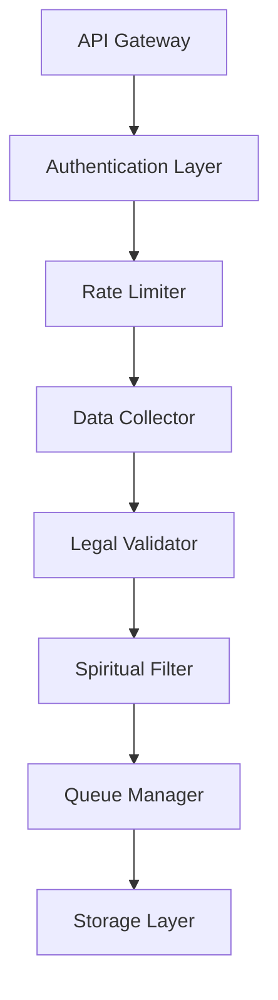
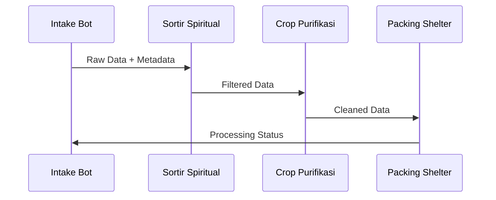

# Intake Bot Data: Sistem Otomatis Pengumpulan Data Spiritual

> **"In The Name of GOD"** - Mengumpulkan data dengan integritas dan keberkahan

## Pendahuluan

Intake Bot Data adalah komponen pertama dalam ekosistem ZeroLight yang bertanggung jawab untuk mengumpulkan, memverifikasi, dan menyaring data dari berbagai sumber eksternal dan internal. Bot ini dirancang dengan prinsip spiritual dan legalitas yang ketat, memastikan setiap data yang masuk memenuhi standar etika dan hukum yang berlaku.

## Arsitektur Intake Bot

### 1. Microservice Architecture

Intake bot diimplementasikan sebagai microservice yang berjalan 24/7 dengan karakteristik:

- **Containerized Deployment**: Docker/Kubernetes untuk skalabilitas
- **Cloud-Native**: AWS Lambda, Azure Functions, atau Google Cloud Functions
- **High Availability**: Multi-region deployment dengan failover otomatis
- **Resource Optimization**: Auto-scaling berdasarkan beban kerja

### 2. Komponen Utama



#### 2.1 API Gateway
- Endpoint tunggal untuk semua request intake
- Load balancing dan routing cerdas
- SSL/TLS termination
- Request/response logging

#### 2.2 Authentication Layer
- Multi-factor authentication untuk admin
- API key management untuk external sources
- JWT token validation
- Role-based access control (RBAC)

#### 2.3 Rate Limiter
- Dynamic rate limiting berdasarkan source
- DDoS protection
- Fair usage policy enforcement
- Burst handling capability

#### 2.4 Data Collector
- Multi-protocol support (HTTP/HTTPS, FTP, RSS, WebSocket)
- Scheduled batch processing
- Real-time streaming capability
- Error handling dan retry mechanism

## Strategi Pengumpulan Data

### 1. Sumber Data Legal

#### 1.1 Open Data Sources
- Government open data portals
- Academic research repositories
- Creative Commons licensed content
- Public domain materials

#### 1.2 API Partnerships
- Authorized API access dengan proper licensing
- Terms of Service compliance
- Attribution requirements fulfillment
- Usage quota monitoring

#### 1.3 RSS/Atom Feeds
- News aggregation dari sumber terpercaya
- Blog feeds dengan izin eksplisit
- Podcast transcriptions (dengan lisensi)
- Social media public feeds

### 2. Mekanisme Scraping Etis

#### 2.1 Robots.txt Compliance
```python
# Contoh implementasi robots.txt checker
def check_robots_txt(url):
    rp = urllib.robotparser.RobotFileParser()
    rp.set_url(f"{url}/robots.txt")
    rp.read()
    return rp.can_fetch("*", url)
```

#### 2.2 Respectful Crawling
- Delay antar request (minimum 1 detik)
- User-Agent identification yang jelas
- Respect untuk server load
- Graceful error handling

#### 2.3 Content Licensing Check
- Automatic license detection
- Copyright verification
- Fair use assessment
- Attribution tracking

## Filter Spiritual dan Legalitas

### 1. Spiritual Filtering Framework

#### 1.1 Parameter Spiritual
- **Kejujuran**: Verifikasi fakta dan akurasi
- **Manfaat**: Nilai edukatif dan konstruktif
- **Kasih**: Konten yang membangun, bukan merusak
- **Keadilan**: Representasi yang seimbang dan fair

#### 1.2 Scoring Algorithm
```python
def calculate_spiritual_score(content):
    scores = {
        'honesty': analyze_factual_accuracy(content),
        'benefit': assess_educational_value(content),
        'love': evaluate_constructive_nature(content),
        'justice': check_balanced_representation(content)
    }
    return sum(scores.values()) / len(scores)
```

### 2. Legal Compliance Framework

#### 2.1 Indonesian Law Compliance
- **UU ITE**: Informasi dan Transaksi Elektronik
- **UU PDP**: Perlindungan Data Pribadi
- **UU Hak Cipta**: Copyright protection
- **Peraturan KOMINFO**: Telecommunications regulations

#### 2.2 International Standards
- **GDPR**: General Data Protection Regulation
- **DMCA**: Digital Millennium Copyright Act
- **CCPA**: California Consumer Privacy Act
- **ISO 27001**: Information Security Management

## Implementasi Teknis

### 1. Technology Stack

#### 1.1 Backend Framework
- **Python**: FastAPI untuk high-performance API
- **Node.js**: Express.js untuk real-time processing
- **Go**: Untuk high-concurrency operations
- **Rust**: Untuk performance-critical components

#### 1.2 Database Layer
- **PostgreSQL**: Primary data storage
- **Redis**: Caching dan session management
- **MongoDB**: Document storage untuk unstructured data
- **InfluxDB**: Time-series data untuk monitoring

#### 1.3 Message Queue
- **Apache Kafka**: High-throughput message streaming
- **RabbitMQ**: Reliable message queuing
- **AWS SQS**: Cloud-native queuing
- **Redis Pub/Sub**: Real-time notifications

### 2. Configuration Management

#### 2.1 Environment Variables
```yaml
# config.yml
intake_bot:
  rate_limit:
    requests_per_minute: 60
    burst_capacity: 10
  sources:
    - name: "government_data"
      url: "https://data.go.id/api"
      auth_type: "api_key"
      rate_limit: 100
    - name: "academic_papers"
      url: "https://arxiv.org/api"
      auth_type: "none"
      rate_limit: 30
  filters:
    spiritual_threshold: 0.7
    legal_compliance: true
    content_types: ["text", "json", "xml"]
```

#### 2.2 Dynamic Configuration
- Hot-reload capability
- A/B testing support
- Feature flags
- Circuit breaker patterns

## Monitoring dan Audit

### 1. Real-time Monitoring

#### 1.1 Metrics Collection
- Request/response times
- Success/failure rates
- Data quality scores
- Resource utilization

#### 1.2 Alerting System
- Threshold-based alerts
- Anomaly detection
- Escalation procedures
- Incident response automation

### 2. Audit Trail

#### 2.1 Immutable Logging
```json
{
  "timestamp": "2025-01-27T10:30:00Z",
  "source": "government_data",
  "action": "data_intake",
  "content_hash": "sha256:abc123...",
  "spiritual_score": 0.85,
  "legal_status": "compliant",
  "user_id": "system",
  "ip_address": "10.0.1.100"
}
```

#### 2.2 Compliance Reporting
- Daily compliance reports
- Monthly audit summaries
- Annual legal reviews
- Stakeholder dashboards

## Keamanan dan Privasi

### 1. Data Protection

#### 1.1 Encryption
- **At Rest**: AES-256 encryption
- **In Transit**: TLS 1.3
- **In Processing**: Memory encryption
- **Backup**: Encrypted backups

#### 1.2 Access Control
- Zero-trust architecture
- Principle of least privilege
- Multi-factor authentication
- Regular access reviews

### 2. Privacy Compliance

#### 2.1 Data Minimization
- Collect only necessary data
- Automatic data expiration
- Anonymization techniques
- Pseudonymization where applicable

#### 2.2 User Rights
- Right to access
- Right to rectification
- Right to erasure
- Right to data portability

## Disaster Recovery

### 1. Backup Strategy

#### 1.1 Multi-tier Backup
- **Tier 1**: Real-time replication
- **Tier 2**: Daily incremental backups
- **Tier 3**: Weekly full backups
- **Tier 4**: Monthly archive backups

#### 1.2 Geographic Distribution
- Primary datacenter (Jakarta)
- Secondary datacenter (Singapore)
- Tertiary backup (AWS S3)
- Cold storage (Glacier)

### 2. Recovery Procedures

#### 2.1 RTO/RPO Targets
- **Recovery Time Objective**: 4 hours
- **Recovery Point Objective**: 1 hour
- **Mean Time to Recovery**: 2 hours
- **Availability Target**: 99.9%

## Integrasi dengan Ekosistem ZeroLight

### 1. Downstream Services

#### 1.1 Data Flow


#### 1.2 API Contracts
- RESTful API dengan OpenAPI specification
- GraphQL untuk complex queries
- WebSocket untuk real-time updates
- gRPC untuk internal communication

### 2. Event-Driven Architecture

#### 2.1 Event Types
- `data.intake.started`
- `data.intake.completed`
- `data.intake.failed`
- `data.quality.assessed`
- `legal.compliance.verified`

#### 2.2 Event Schema
```json
{
  "event_type": "data.intake.completed",
  "timestamp": "2025-01-27T10:30:00Z",
  "source": "intake-bot",
  "data": {
    "batch_id": "batch_20250127_001",
    "records_processed": 1500,
    "quality_score": 0.92,
    "compliance_status": "approved"
  }
}
```

## Pengembangan dan Maintenance

### 1. Development Lifecycle

#### 1.1 CI/CD Pipeline
- Automated testing (unit, integration, e2e)
- Code quality checks (SonarQube)
- Security scanning (OWASP ZAP)
- Performance testing (JMeter)

#### 1.2 Deployment Strategy
- Blue-green deployment
- Canary releases
- Feature toggles
- Rollback procedures

### 2. Long-term Sustainability

#### 2.1 Code Maintainability
- Clean code principles
- Comprehensive documentation
- Automated code generation
- Regular refactoring

#### 2.2 Technology Evolution
- Regular dependency updates
- Security patch management
- Performance optimization
- Scalability improvements

## Kesimpulan

Intake Bot Data merupakan fondasi yang kokoh untuk ekosistem ZeroLight, menggabungkan teknologi modern dengan nilai-nilai spiritual dan kepatuhan hukum yang ketat. Dengan arsitektur yang scalable, monitoring yang komprehensif, dan prinsip-prinsip etika yang kuat, sistem ini siap mendukung pertumbuhan platform spiritual digital untuk dekade mendatang.

---

> **"Segala sesuatu yang kamu lakukan, lakukanlah dengan segenap hatimu seperti untuk Tuhan"** - Kolose 3:23

*Dokumen ini merupakan bagian dari ekosistem ZeroLight dan dapat diperbarui sesuai dengan perkembangan teknologi dan kebutuhan spiritual komunitas.*