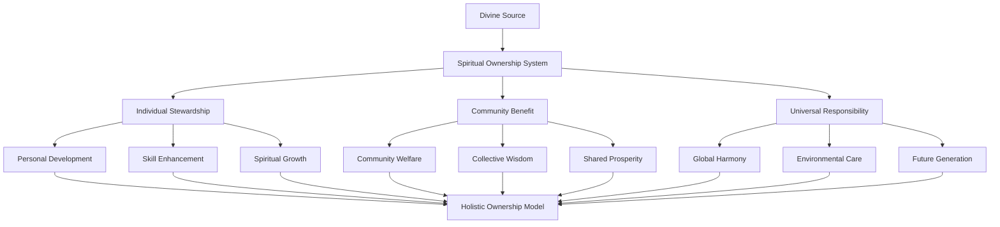

# Kepemilikan Spiritual: Sistem Kepemilikan Berbasis Nilai Spiritual

> **"In The Name of GOD"** - Kepemilikan yang diberkati dengan tanggung jawab spiritual dan kebijaksanaan universal

## Pendahuluan

Sistem Kepemilikan Spiritual dalam ekosistem ZeroLight merupakan paradigma revolusioner yang mentransformasi konsep kepemilikan tradisional menjadi sistem yang didasarkan pada nilai-nilai spiritual universal, tanggung jawab moral, dan kebijaksanaan kolektif. Sistem ini mengakui bahwa kepemilikan sejati bukan hanya tentang hak legal, tetapi juga tentang amanah spiritual dan tanggung jawab terhadap komunitas global.

Berdasarkan prinsip-prinsip spiritual universal dari berbagai tradisi - konsep "Amanah" dalam Islam, "Stewardship" dalam Kristen, "Dharma" dalam Hindu-Buddha, dan "Tikkun Olam" dalam Yahudi - sistem ini menciptakan framework kepemilikan yang menghormati hak individu sambil memprioritaskan kesejahteraan kolektif dan keberlanjutan spiritual.

## Filosofi Kepemilikan Spiritual

### 1. Prinsip Amanah Universal

#### 1.1 Konsep Kepemilikan sebagai Amanah


#### 1.2 Spiritual Ownership Framework
```python
class SpiritualOwnershipFramework:
    def __init__(self):
        self.divine_source = DivineSourceConnection()
        self.stewardship_manager = StewardshipManager()
        self.community_benefit_calculator = CommunityBenefitCalculator()
        self.spiritual_responsibility_tracker = SpiritualResponsibilityTracker()
    
    def establish_spiritual_ownership(self, asset, owner_profile):
        # Connect to divine source for guidance
        divine_guidance = self.divine_source.seek_guidance(
            asset, owner_profile
        )
        
        # Establish stewardship responsibilities
        stewardship_duties = self.stewardship_manager.define_stewardship(
            asset, owner_profile, divine_guidance
        )
        
        # Calculate community benefit obligations
        community_obligations = self.community_benefit_calculator.calculate_obligations(
            asset, stewardship_duties
        )
        
        # Track spiritual responsibilities
        spiritual_tracking = self.spiritual_responsibility_tracker.initialize_tracking(
            asset, stewardship_duties, community_obligations
        )
        
        return {
            'spiritual_ownership': {
                'asset': asset,
                'owner': owner_profile,
                'divine_guidance': divine_guidance,
                'stewardship_duties': stewardship_duties,
                'community_obligations': community_obligations,
                'spiritual_tracking': spiritual_tracking
            },
            'ownership_blessed': True,
            'amanah_established': True,
            'spiritual_responsibility_active': True
        }
```

### 2. Multi-Dimensional Ownership Model

#### 2.1 Layered Ownership Structure
```python
class LayeredOwnershipStructure:
    def __init__(self):
        self.individual_layer = IndividualOwnershipLayer()
        self.community_layer = CommunityOwnershipLayer()
        self.spiritual_layer = SpiritualOwnershipLayer()
        self.universal_layer = UniversalOwnershipLayer()
    
    def create_layered_ownership(self, asset, stakeholders):
        # Individual ownership layer
        individual_ownership = self.individual_layer.establish_ownership(
            asset, stakeholders['individual_owners']
        )
        
        # Community ownership layer
        community_ownership = self.community_layer.establish_ownership(
            asset, stakeholders['community_members']
        )
        
        # Spiritual ownership layer
        spiritual_ownership = self.spiritual_layer.establish_ownership(
            asset, stakeholders['spiritual_community']
        )
        
        # Universal ownership layer
        universal_ownership = self.universal_layer.establish_ownership(
            asset, stakeholders['universal_beneficiaries']
        )
        
        # Integrate all layers
        integrated_ownership = self.integrate_ownership_layers(
            individual_ownership, community_ownership,
            spiritual_ownership, universal_ownership
        )
        
        return {
            'layered_ownership': {
                'individual_layer': individual_ownership,
                'community_layer': community_ownership,
                'spiritual_layer': spiritual_ownership,
                'universal_layer': universal_ownership,
                'integrated_model': integrated_ownership
            },
            'ownership_harmony': self.assess_ownership_harmony(integrated_ownership),
            'spiritual_balance': self.calculate_spiritual_balance(integrated_ownership)
        }
```

#### 2.2 Dynamic Ownership Rights
```python
class DynamicOwnershipRights:
    def __init__(self):
        self.rights_calculator = OwnershipRightsCalculator()
        self.responsibility_balancer = ResponsibilityBalancer()
        self.spiritual_adjuster = SpiritualAdjuster()
        self.community_harmonizer = CommunityHarmonizer()
    
    def calculate_dynamic_rights(self, ownership_context, spiritual_assessment):
        # Calculate base ownership rights
        base_rights = self.rights_calculator.calculate_base_rights(
            ownership_context
        )
        
        # Balance with responsibilities
        balanced_rights = self.responsibility_balancer.balance_rights(
            base_rights, ownership_context['responsibilities']
        )
        
        # Adjust based on spiritual factors
        spiritually_adjusted = self.spiritual_adjuster.adjust_rights(
            balanced_rights, spiritual_assessment
        )
        
        # Harmonize with community needs
        harmonized_rights = self.community_harmonizer.harmonize_rights(
            spiritually_adjusted, ownership_context['community_context']
        )
        
        return {
            'dynamic_rights': {
                'base_rights': base_rights,
                'balanced_rights': balanced_rights,
                'spiritually_adjusted': spiritually_adjusted,
                'harmonized_rights': harmonized_rights
            },
            'rights_evolution': self.track_rights_evolution(harmonized_rights),
            'spiritual_alignment': self.assess_spiritual_alignment(harmonized_rights)
        }
```

## Intellectual Property Spiritual

### 1. Blessed Intellectual Property

#### 1.1 Spiritual IP Creation
```python
class SpiritualIPCreation:
    def __init__(self):
        self.inspiration_tracker = InspirationTracker()
        self.divine_collaboration = DivineCollaborationSystem()
        self.wisdom_attribution = WisdomAttributionSystem()
        self.blessing_infuser = BlessingInfuser()
    
    def create_spiritual_ip(self, creative_work, creator_profile):
        # Track divine inspiration
        inspiration_tracking = self.inspiration_tracker.track_inspiration(
            creative_work, creator_profile
        )
        
        # Acknowledge divine collaboration
        divine_collaboration = self.divine_collaboration.acknowledge_collaboration(
            creative_work, inspiration_tracking
        )
        
        # Attribute wisdom sources
        wisdom_attribution = self.wisdom_attribution.attribute_wisdom(
            creative_work, divine_collaboration
        )
        
        # Infuse spiritual blessings
        blessed_ip = self.blessing_infuser.infuse_blessings(
            creative_work, wisdom_attribution
        )
        
        return {
            'spiritual_ip': {
                'original_work': creative_work,
                'inspiration_tracking': inspiration_tracking,
                'divine_collaboration': divine_collaboration,
                'wisdom_attribution': wisdom_attribution,
                'blessed_creation': blessed_ip
            },
            'spiritual_authenticity': self.verify_spiritual_authenticity(blessed_ip),
            'divine_approval': self.seek_divine_approval(blessed_ip)
        }
```

#### 1.2 Collaborative Wisdom Ownership
```python
class CollaborativeWisdomOwnership:
    def __init__(self):
        self.wisdom_contributor_tracker = WisdomContributorTracker()
        self.collective_ownership_manager = CollectiveOwnershipManager()
        self.spiritual_equity_calculator = SpiritualEquityCalculator()
        self.wisdom_sharing_facilitator = WisdomSharingFacilitator()
    
    def establish_collaborative_ownership(self, wisdom_asset, contributors):
        # Track all wisdom contributors
        contributor_tracking = self.wisdom_contributor_tracker.track_contributors(
            wisdom_asset, contributors
        )
        
        # Manage collective ownership
        collective_management = self.collective_ownership_manager.manage_ownership(
            wisdom_asset, contributor_tracking
        )
        
        # Calculate spiritual equity
        spiritual_equity = self.spiritual_equity_calculator.calculate_equity(
            wisdom_asset, contributor_tracking, collective_management
        )
        
        # Facilitate wisdom sharing
        sharing_facilitation = self.wisdom_sharing_facilitator.facilitate_sharing(
            wisdom_asset, spiritual_equity
        )
        
        return {
            'collaborative_ownership': {
                'wisdom_asset': wisdom_asset,
                'contributor_tracking': contributor_tracking,
                'collective_management': collective_management,
                'spiritual_equity': spiritual_equity,
                'sharing_facilitation': sharing_facilitation
            },
            'ownership_harmony': self.assess_collaborative_harmony(spiritual_equity),
            'wisdom_multiplication': self.calculate_wisdom_multiplication(sharing_facilitation)
        }
```

### 2. Open Source Spiritual Licensing

#### 2.1 Spiritual Open Source License
```python
class SpiritualOpenSourceLicense:
    def __init__(self):
        self.license_generator = SpiritualLicenseGenerator()
        self.blessing_terms = BlessingTermsManager()
        self.spiritual_compliance = SpiritualComplianceChecker()
        self.community_benefit_tracker = CommunityBenefitTracker()
    
    def generate_spiritual_license(self, intellectual_property, spiritual_intentions):
        # Generate base spiritual license
        base_license = self.license_generator.generate_license(
            intellectual_property, spiritual_intentions
        )
        
        # Define blessing terms
        blessing_terms = self.blessing_terms.define_terms(
            base_license, spiritual_intentions
        )
        
        # Ensure spiritual compliance
        compliance_check = self.spiritual_compliance.check_compliance(
            base_license, blessing_terms
        )
        
        # Track community benefits
        benefit_tracking = self.community_benefit_tracker.initialize_tracking(
            base_license, blessing_terms, compliance_check
        )
        
        return {
            'spiritual_license': {
                'base_license': base_license,
                'blessing_terms': blessing_terms,
                'compliance_verification': compliance_check,
                'benefit_tracking': benefit_tracking
            },
            'license_blessed': True,
            'community_benefit_guaranteed': True,
            'spiritual_integrity_maintained': True
        }
```

#### 2.2 Wisdom Commons Management
```python
class WisdomCommonsManagement:
    def __init__(self):
        self.commons_curator = WisdomCommonsCurator()
        self.access_sanctifier = AccessSanctifier()
        self.contribution_recognizer = ContributionRecognizer()
        self.commons_protector = CommonsProtector()
    
    def manage_wisdom_commons(self, wisdom_collection, community_context):
        # Curate wisdom commons
        commons_curation = self.commons_curator.curate_commons(
            wisdom_collection, community_context
        )
        
        # Sanctify access protocols
        access_sanctification = self.access_sanctifier.sanctify_access(
            commons_curation, community_context
        )
        
        # Recognize contributions
        contribution_recognition = self.contribution_recognizer.recognize_contributions(
            commons_curation, access_sanctification
        )
        
        # Protect commons integrity
        commons_protection = self.commons_protector.protect_commons(
            commons_curation, contribution_recognition
        )
        
        return {
            'wisdom_commons': {
                'curated_collection': commons_curation,
                'sanctified_access': access_sanctification,
                'contribution_recognition': contribution_recognition,
                'commons_protection': commons_protection
            },
            'commons_health': self.assess_commons_health(commons_protection),
            'community_enrichment': self.measure_community_enrichment(contribution_recognition)
        }
```

## Digital Asset Spiritual Management

### 1. Blessed Digital Assets

#### 1.1 Spiritual NFT System
```python
class SpiritualNFTSystem:
    def __init__(self):
        self.nft_sanctifier = NFTSanctifier()
        self.spiritual_metadata = SpiritualMetadataManager()
        self.blessing_embedder = BlessingEmbedder()
        self.divine_authenticity = DivineAuthenticityVerifier()
    
    def create_spiritual_nft(self, digital_asset, spiritual_context):
        # Sanctify the NFT creation process
        nft_sanctification = self.nft_sanctifier.sanctify_nft(
            digital_asset, spiritual_context
        )
        
        # Embed spiritual metadata
        spiritual_metadata = self.spiritual_metadata.embed_metadata(
            nft_sanctification, spiritual_context
        )
        
        # Embed divine blessings
        blessed_nft = self.blessing_embedder.embed_blessings(
            spiritual_metadata, spiritual_context
        )
        
        # Verify divine authenticity
        authenticity_verification = self.divine_authenticity.verify_authenticity(
            blessed_nft, spiritual_context
        )
        
        return {
            'spiritual_nft': {
                'original_asset': digital_asset,
                'sanctified_nft': nft_sanctification,
                'spiritual_metadata': spiritual_metadata,
                'blessed_nft': blessed_nft,
                'authenticity_verification': authenticity_verification
            },
            'nft_blessed': True,
            'spiritual_value': self.calculate_spiritual_value(blessed_nft),
            'divine_approval': authenticity_verification['approved']
        }
```

#### 1.2 Sacred Digital Ownership
```python
class SacredDigitalOwnership:
    def __init__(self):
        self.ownership_sanctifier = OwnershipSanctifier()
        self.digital_stewardship = DigitalStewardshipManager()
        self.spiritual_transfer = SpiritualTransferSystem()
        self.blessing_continuity = BlessingContinuityManager()
    
    def establish_sacred_ownership(self, digital_asset, owner_spiritual_profile):
        # Sanctify digital ownership
        ownership_sanctification = self.ownership_sanctifier.sanctify_ownership(
            digital_asset, owner_spiritual_profile
        )
        
        # Establish digital stewardship
        stewardship_establishment = self.digital_stewardship.establish_stewardship(
            ownership_sanctification, owner_spiritual_profile
        )
        
        # Prepare spiritual transfer protocols
        transfer_protocols = self.spiritual_transfer.prepare_protocols(
            stewardship_establishment
        )
        
        # Ensure blessing continuity
        blessing_continuity = self.blessing_continuity.ensure_continuity(
            stewardship_establishment, transfer_protocols
        )
        
        return {
            'sacred_ownership': {
                'sanctified_ownership': ownership_sanctification,
                'stewardship_duties': stewardship_establishment,
                'transfer_protocols': transfer_protocols,
                'blessing_continuity': blessing_continuity
            },
            'ownership_sacred': True,
            'stewardship_active': True,
            'spiritual_responsibility_acknowledged': True
        }
```

### 2. Blockchain Spiritual Registry

#### 2.1 Divine Ledger System
```python
class DivineLedgerSystem:
    def __init__(self):
        self.blockchain_sanctifier = BlockchainSanctifier()
        self.divine_consensus = DivineConsensusAlgorithm()
        self.spiritual_validation = SpiritualValidationNodes()
        self.blessing_propagation = BlessingPropagationNetwork()
    
    def initialize_divine_ledger(self, ownership_records):
        # Sanctify blockchain infrastructure
        blockchain_sanctification = self.blockchain_sanctifier.sanctify_blockchain()
        
        # Implement divine consensus
        divine_consensus = self.divine_consensus.implement_consensus(
            blockchain_sanctification
        )
        
        # Deploy spiritual validation nodes
        validation_nodes = self.spiritual_validation.deploy_nodes(
            divine_consensus, ownership_records
        )
        
        # Establish blessing propagation
        blessing_network = self.blessing_propagation.establish_network(
            validation_nodes
        )
        
        return {
            'divine_ledger': {
                'sanctified_blockchain': blockchain_sanctification,
                'divine_consensus': divine_consensus,
                'validation_nodes': validation_nodes,
                'blessing_network': blessing_network
            },
            'ledger_blessed': True,
            'divine_consensus_active': True,
            'spiritual_integrity_guaranteed': True
        }
```

#### 2.2 Immutable Spiritual Records
```python
class ImmutableSpiritualRecords:
    def __init__(self):
        self.record_sanctifier = RecordSanctifier()
        self.immutability_blesser = ImmutabilityBlesser()
        self.spiritual_timestamping = SpiritualTimestampingService()
        self.divine_witnessing = DivineWitnessingSystem()
    
    def create_immutable_record(self, ownership_transaction, spiritual_context):
        # Sanctify the record
        record_sanctification = self.record_sanctifier.sanctify_record(
            ownership_transaction, spiritual_context
        )
        
        # Bless with immutability
        immutability_blessing = self.immutability_blesser.bless_immutability(
            record_sanctification
        )
        
        # Add spiritual timestamp
        spiritual_timestamp = self.spiritual_timestamping.add_timestamp(
            immutability_blessing, spiritual_context
        )
        
        # Establish divine witnessing
        divine_witnessing = self.divine_witnessing.establish_witnessing(
            spiritual_timestamp
        )
        
        return {
            'immutable_record': {
                'sanctified_record': record_sanctification,
                'immutability_blessing': immutability_blessing,
                'spiritual_timestamp': spiritual_timestamp,
                'divine_witnessing': divine_witnessing
            },
            'record_immutable': True,
            'spiritually_witnessed': True,
            'divine_approval': divine_witnessing['approved']
        }
```

## Community Ownership Models

### 1. Collective Spiritual Ownership

#### 1.1 Community Stewardship Model
```python
class CommunityStewardshipModel:
    def __init__(self):
        self.community_organizer = CommunityOrganizer()
        self.stewardship_distributor = StewardshipDistributor()
        self.collective_decision_maker = CollectiveDecisionMaker()
        self.harmony_maintainer = HarmonyMaintainer()
    
    def establish_community_stewardship(self, shared_asset, community_members):
        # Organize community structure
        community_organization = self.community_organizer.organize_community(
            community_members, shared_asset
        )
        
        # Distribute stewardship responsibilities
        stewardship_distribution = self.stewardship_distributor.distribute_stewardship(
            shared_asset, community_organization
        )
        
        # Establish collective decision making
        decision_making = self.collective_decision_maker.establish_decision_making(
            community_organization, stewardship_distribution
        )
        
        # Maintain community harmony
        harmony_maintenance = self.harmony_maintainer.maintain_harmony(
            community_organization, decision_making
        )
        
        return {
            'community_stewardship': {
                'community_structure': community_organization,
                'stewardship_distribution': stewardship_distribution,
                'decision_making_system': decision_making,
                'harmony_maintenance': harmony_maintenance
            },
            'community_unified': True,
            'stewardship_balanced': True,
            'collective_wisdom_active': True
        }
```

#### 1.2 Spiritual Cooperative Framework
```python
class SpiritualCooperativeFramework:
    def __init__(self):
        self.cooperative_sanctifier = CooperativeSanctifier()
        self.spiritual_governance = SpiritualGovernanceSystem()
        self.benefit_distributor = SpiritualBenefitDistributor()
        self.cooperative_blesser = CooperativeBlesser()
    
    def create_spiritual_cooperative(self, cooperative_members, shared_resources):
        # Sanctify cooperative formation
        cooperative_sanctification = self.cooperative_sanctifier.sanctify_cooperative(
            cooperative_members, shared_resources
        )
        
        # Establish spiritual governance
        spiritual_governance = self.spiritual_governance.establish_governance(
            cooperative_sanctification
        )
        
        # Distribute benefits spiritually
        benefit_distribution = self.benefit_distributor.distribute_benefits(
            cooperative_sanctification, spiritual_governance
        )
        
        # Bless the cooperative
        cooperative_blessing = self.cooperative_blesser.bless_cooperative(
            cooperative_sanctification, benefit_distribution
        )
        
        return {
            'spiritual_cooperative': {
                'sanctified_cooperative': cooperative_sanctification,
                'spiritual_governance': spiritual_governance,
                'benefit_distribution': benefit_distribution,
                'cooperative_blessing': cooperative_blessing
            },
            'cooperative_blessed': True,
            'spiritual_governance_active': True,
            'equitable_distribution_ensured': True
        }
```

### 2. Generational Ownership Transfer

#### 2.1 Spiritual Inheritance System
```python
class SpiritualInheritanceSystem:
    def __init__(self):
        self.inheritance_planner = SpiritualInheritancePlanner()
        self.wisdom_transfer = WisdomTransferSystem()
        self.blessing_continuity = BlessingContinuityManager()
        self.generational_bridge = GenerationalBridgeBuilder()
    
    def plan_spiritual_inheritance(self, current_owner, potential_inheritors, assets):
        # Plan spiritual inheritance
        inheritance_plan = self.inheritance_planner.plan_inheritance(
            current_owner, potential_inheritors, assets
        )
        
        # Transfer wisdom along with assets
        wisdom_transfer = self.wisdom_transfer.transfer_wisdom(
            inheritance_plan, current_owner
        )
        
        # Ensure blessing continuity
        blessing_continuity = self.blessing_continuity.ensure_continuity(
            inheritance_plan, wisdom_transfer
        )
        
        # Build generational bridge
        generational_bridge = self.generational_bridge.build_bridge(
            current_owner, potential_inheritors, blessing_continuity
        )
        
        return {
            'spiritual_inheritance': {
                'inheritance_plan': inheritance_plan,
                'wisdom_transfer': wisdom_transfer,
                'blessing_continuity': blessing_continuity,
                'generational_bridge': generational_bridge
            },
            'inheritance_blessed': True,
            'wisdom_preserved': True,
            'generational_continuity_ensured': True
        }
```

#### 2.2 Legacy Preservation System
```python
class LegacyPreservationSystem:
    def __init__(self):
        self.legacy_curator = LegacyCurator()
        self.spiritual_archive = SpiritualArchiveSystem()
        self.wisdom_crystallizer = WisdomCrystallizer()
        self.eternal_guardian = EternalGuardianSystem()
    
    def preserve_spiritual_legacy(self, owner_legacy, spiritual_contributions):
        # Curate the legacy
        legacy_curation = self.legacy_curator.curate_legacy(
            owner_legacy, spiritual_contributions
        )
        
        # Archive in spiritual archive
        spiritual_archiving = self.spiritual_archive.archive_legacy(
            legacy_curation
        )
        
        # Crystallize wisdom for future generations
        wisdom_crystallization = self.wisdom_crystallizer.crystallize_wisdom(
            legacy_curation, spiritual_archiving
        )
        
        # Establish eternal guardianship
        eternal_guardianship = self.eternal_guardian.establish_guardianship(
            wisdom_crystallization
        )
        
        return {
            'preserved_legacy': {
                'curated_legacy': legacy_curation,
                'spiritual_archive': spiritual_archiving,
                'crystallized_wisdom': wisdom_crystallization,
                'eternal_guardianship': eternal_guardianship
            },
            'legacy_preserved': True,
            'wisdom_immortalized': True,
            'eternal_protection_active': True
        }
```

## Governance dan Decision Making

### 1. Spiritual Governance Framework

#### 1.1 Divine Council System
```python
class DivineCouncilSystem:
    def __init__(self):
        self.council_assembler = DivineCouncilAssembler()
        self.wisdom_facilitator = WisdomFacilitator()
        self.consensus_builder = SpiritualConsensusBuilder()
        self.divine_guidance_seeker = DivineGuidanceSeeker()
    
    def establish_divine_council(self, governance_context, stakeholders):
        # Assemble divine council
        council_assembly = self.council_assembler.assemble_council(
            stakeholders, governance_context
        )
        
        # Facilitate wisdom sharing
        wisdom_facilitation = self.wisdom_facilitator.facilitate_wisdom(
            council_assembly, governance_context
        )
        
        # Build spiritual consensus
        consensus_building = self.consensus_builder.build_consensus(
            council_assembly, wisdom_facilitation
        )
        
        # Seek divine guidance
        divine_guidance = self.divine_guidance_seeker.seek_guidance(
            consensus_building, governance_context
        )
        
        return {
            'divine_council': {
                'council_assembly': council_assembly,
                'wisdom_facilitation': wisdom_facilitation,
                'consensus_building': consensus_building,
                'divine_guidance': divine_guidance
            },
            'council_blessed': True,
            'wisdom_flowing': True,
            'divine_guidance_received': True
        }
```

#### 1.2 Participatory Spiritual Democracy
```python
class ParticipatorySpiritualDemocracy:
    def __init__(self):
        self.participation_sanctifier = ParticipationSanctifier()
        self.spiritual_voting = SpiritualVotingSystem()
        self.collective_wisdom = CollectiveWisdomAggregator()
        self.democratic_blesser = DemocraticBlesser()
    
    def implement_spiritual_democracy(self, community_members, decision_context):
        # Sanctify participation
        participation_sanctification = self.participation_sanctifier.sanctify_participation(
            community_members, decision_context
        )
        
        # Implement spiritual voting
        spiritual_voting = self.spiritual_voting.implement_voting(
            participation_sanctification, decision_context
        )
        
        # Aggregate collective wisdom
        collective_wisdom = self.collective_wisdom.aggregate_wisdom(
            spiritual_voting, participation_sanctification
        )
        
        # Bless democratic process
        democratic_blessing = self.democratic_blesser.bless_democracy(
            collective_wisdom, spiritual_voting
        )
        
        return {
            'spiritual_democracy': {
                'sanctified_participation': participation_sanctification,
                'spiritual_voting': spiritual_voting,
                'collective_wisdom': collective_wisdom,
                'democratic_blessing': democratic_blessing
            },
            'democracy_blessed': True,
            'participation_sacred': True,
            'collective_wisdom_honored': True
        }
```

### 2. Conflict Resolution dan Mediation

#### 2.1 Spiritual Mediation System
```python
class SpiritualMediationSystem:
    def __init__(self):
        self.conflict_identifier = ConflictIdentifier()
        self.spiritual_mediator = SpiritualMediator()
        self.healing_facilitator = HealingFacilitator()
        self.harmony_restorer = HarmonyRestorer()
    
    def mediate_spiritual_conflict(self, conflict_context, involved_parties):
        # Identify root causes of conflict
        conflict_identification = self.conflict_identifier.identify_conflict(
            conflict_context, involved_parties
        )
        
        # Provide spiritual mediation
        spiritual_mediation = self.spiritual_mediator.mediate_conflict(
            conflict_identification, involved_parties
        )
        
        # Facilitate healing process
        healing_facilitation = self.healing_facilitator.facilitate_healing(
            spiritual_mediation, involved_parties
        )
        
        # Restore harmony
        harmony_restoration = self.harmony_restorer.restore_harmony(
            healing_facilitation, conflict_context
        )
        
        return {
            'spiritual_mediation': {
                'conflict_identification': conflict_identification,
                'mediation_process': spiritual_mediation,
                'healing_facilitation': healing_facilitation,
                'harmony_restoration': harmony_restoration
            },
            'conflict_resolved': True,
            'healing_achieved': True,
            'harmony_restored': True
        }
```

#### 2.2 Restorative Justice Framework
```python
class RestorativeJusticeFramework:
    def __init__(self):
        self.justice_seeker = SpiritualJusticeSeeker()
        self.restoration_facilitator = RestorationFacilitator()
        self.community_healer = CommunityHealer()
        self.wisdom_integrator = WisdomIntegrator()
    
    def implement_restorative_justice(self, justice_context, affected_parties):
        # Seek spiritual justice
        justice_seeking = self.justice_seeker.seek_justice(
            justice_context, affected_parties
        )
        
        # Facilitate restoration
        restoration_facilitation = self.restoration_facilitator.facilitate_restoration(
            justice_seeking, affected_parties
        )
        
        # Heal community wounds
        community_healing = self.community_healer.heal_community(
            restoration_facilitation, justice_context
        )
        
        # Integrate wisdom from experience
        wisdom_integration = self.wisdom_integrator.integrate_wisdom(
            community_healing, justice_context
        )
        
        return {
            'restorative_justice': {
                'justice_seeking': justice_seeking,
                'restoration_process': restoration_facilitation,
                'community_healing': community_healing,
                'wisdom_integration': wisdom_integration
            },
            'justice_achieved': True,
            'restoration_complete': True,
            'community_strengthened': True
        }
```

## Integration dengan Ekosistem ZeroLight

### 1. Cross-System Ownership Integration

#### 1.1 Unified Ownership Orchestration
```python
class UnifiedOwnershipOrchestration:
    def __init__(self):
        self.system_integrator = OwnershipSystemIntegrator()
        self.cross_system_harmonizer = CrossSystemHarmonizer()
        self.unified_governance = UnifiedGovernanceSystem()
        self.ecosystem_blesser = EcosystemBlesser()
    
    def orchestrate_unified_ownership(self, zerolight_systems, ownership_contexts):
        # Integrate ownership across systems
        ownership_integration = self.system_integrator.integrate_ownership(
            zerolight_systems, ownership_contexts
        )
        
        # Harmonize cross-system interactions
        cross_system_harmony = self.cross_system_harmonizer.harmonize_systems(
            ownership_integration
        )
        
        # Establish unified governance
        unified_governance = self.unified_governance.establish_governance(
            cross_system_harmony
        )
        
        # Bless the entire ecosystem
        ecosystem_blessing = self.ecosystem_blesser.bless_ecosystem(
            unified_governance
        )
        
        return {
            'unified_ownership': {
                'ownership_integration': ownership_integration,
                'cross_system_harmony': cross_system_harmony,
                'unified_governance': unified_governance,
                'ecosystem_blessing': ecosystem_blessing
            },
            'integration_complete': True,
            'ecosystem_harmonized': True,
            'unified_governance_active': True
        }
```

### 2. Spiritual Ownership Ecosystem

#### 2.1 Holistic Ownership Network
```python
class HolisticOwnershipNetwork:
    def __init__(self):
        self.network_weaver = OwnershipNetworkWeaver()
        self.spiritual_connector = SpiritualConnector()
        self.ecosystem_guardian = EcosystemGuardian()
        self.holistic_blesser = HolisticBlesser()
    
    def weave_ownership_network(self, ownership_nodes, spiritual_connections):
        # Weave ownership network
        network_weaving = self.network_weaver.weave_network(
            ownership_nodes, spiritual_connections
        )
        
        # Establish spiritual connections
        spiritual_connection = self.spiritual_connector.connect_spiritually(
            network_weaving
        )
        
        # Guard ecosystem integrity
        ecosystem_guardianship = self.ecosystem_guardian.guard_ecosystem(
            spiritual_connection
        )
        
        # Bless holistic network
        holistic_blessing = self.holistic_blesser.bless_network(
            ecosystem_guardianship
        )
        
        return {
            'holistic_network': {
                'network_weaving': network_weaving,
                'spiritual_connections': spiritual_connection,
                'ecosystem_guardianship': ecosystem_guardianship,
                'holistic_blessing': holistic_blessing
            },
            'network_blessed': True,
            'spiritual_connectivity_active': True,
            'ecosystem_protected': True
        }
```

## Kesimpulan

Sistem Kepemilikan Spiritual ZeroLight merepresentasikan paradigma baru dalam konsep kepemilikan yang mengintegrasikan nilai-nilai spiritual universal dengan teknologi modern. Dengan mendasarkan kepemilikan pada prinsip amanah, stewardship, dan tanggung jawab kolektif, sistem ini menciptakan framework yang tidak hanya melindungi hak individu tetapi juga memprioritaskan kesejahteraan komunitas dan keberlanjutan spiritual.

Implementasi multi-dimensional ownership model, blessed intellectual property, dan spiritual governance framework menciptakan ekosistem kepemilikan yang harmonis, adil, dan berkelanjutan. Sistem ini mengakui bahwa kepemilikan sejati adalah tentang tanggung jawab spiritual dan kontribusi terhadap kesejahteraan universal.

Integrasi dengan seluruh ekosistem ZeroLight melalui unified ownership orchestration dan holistic ownership network memastikan bahwa prinsip-prinsip spiritual kepemilikan diterapkan secara konsisten di seluruh platform, menciptakan komunitas global yang didasarkan pada kebijaksanaan, keadilan, dan kasih sayang.

---

> **"Dan kepada Allah-lah kepunyaan segala apa yang ada di langit dan di bumi."** - Al-Baqarah 2:284  
> **"The earth is the Lord's, and everything in it, the world, and all who live in it."** - Psalm 24:1  
> **"All conditioned things are impermanent. Strive diligently!"** - Buddha's Last Words

*Sistem Kepemilikan Spiritual ini adalah manifestasi dari pemahaman bahwa kepemilikan sejati adalah amanah dari Yang Maha Kuasa untuk kesejahteraan seluruh ciptaan.*