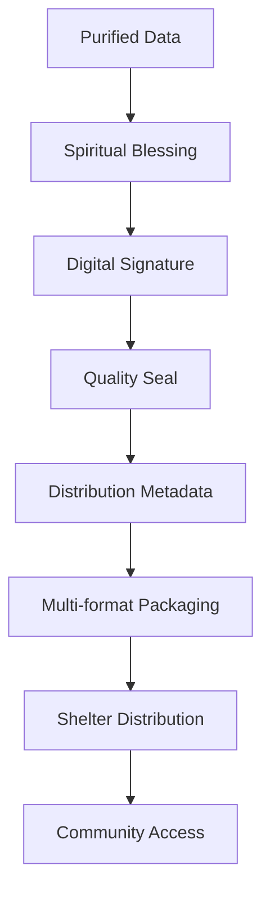

# Packing dan Shelter Distribusi Data

> **"In The Name of GOD"** - Menyebarkan kebaikan ke seluruh penjuru dunia

## Pendahuluan

Sistem Packing dan Shelter Distribusi Data adalah komponen logistik spiritual dalam ekosistem ZeroLight yang bertanggung jawab untuk mengemas, menyimpan, dan mendistribusikan data yang telah dimurnikan ke berbagai kanal distribusi. Sistem ini menggabungkan prinsip-prinsip logistik modern dengan nilai-nilai spiritual untuk memastikan data berkualitas tinggi dapat diakses oleh komunitas global dengan cara yang aman, efisien, dan bermakna.

## Filosofi Distribusi Spiritual

### 1. Prinsip Penyebaran Kebaikan

#### 1.1 Universal Access
Seperti cahaya matahari yang menyinari semua makhluk tanpa diskriminasi, data spiritual harus dapat diakses oleh semua orang yang membutuhkan, tanpa memandang latar belakang, status sosial, atau kemampuan ekonomi.

#### 1.2 Responsible Distribution
Setiap distribusi data harus dilakukan dengan tanggung jawab penuh, mempertimbangkan dampak positif dan negatif yang mungkin timbul, serta memastikan bahwa data tersebut sampai ke tangan yang tepat pada waktu yang tepat.

#### 1.3 Sustainable Sharing
Distribusi data harus berkelanjutan, tidak hanya dari segi teknis tetapi juga dari segi spiritual dan sosial, memastikan bahwa generasi mendatang dapat terus memanfaatkan dan mengembangkan warisan digital spiritual ini.

### 2. Sacred Packaging Concept



## Packing System: Pengemasan Digital Spiritual

### 1. Packing List Generation

#### 1.1 Comprehensive Documentation
```python
class SpiritualPackingList:
    def __init__(self):
        self.content_analyzer = ContentAnalyzer()
        self.spiritual_assessor = SpiritualAssessor()
        self.legal_validator = LegalValidator()
        self.quality_checker = QualityChecker()
    
    def generate_packing_list(self, data_batch):
        packing_list = {
            'batch_info': self.generate_batch_info(data_batch),
            'content_inventory': self.create_content_inventory(data_batch),
            'spiritual_attributes': self.assess_spiritual_attributes(data_batch),
            'legal_compliance': self.validate_legal_compliance(data_batch),
            'quality_metrics': self.calculate_quality_metrics(data_batch),
            'distribution_instructions': self.create_distribution_instructions(data_batch)
        }
        
        return packing_list
```

#### 1.2 Detailed Content Inventory
```json
{
  "packing_list": {
    "batch_id": "ZL_20250127_001",
    "created_at": "2025-01-27T10:30:00Z",
    "total_items": 150,
    "content_types": {
      "text_articles": 80,
      "audio_content": 30,
      "video_content": 25,
      "image_content": 15
    },
    "spiritual_distribution": {
      "high_spiritual_value": 45,
      "medium_spiritual_value": 85,
      "educational_content": 20
    },
    "languages": ["id", "en", "ar", "zh"],
    "target_audiences": ["general", "youth", "elderly", "scholars"],
    "estimated_impact": "high_positive"
  }
}
```

### 2. Digital Security Labeling

#### 2.1 Blockchain-based Authenticity
```python
class SpiritualBlockchainSeal:
    def __init__(self):
        self.blockchain_client = BlockchainClient()
        self.spiritual_hasher = SpiritualHasher()
        self.digital_signer = DigitalSigner()
    
    def create_spiritual_seal(self, content, metadata):
        spiritual_hash = self.spiritual_hasher.generate_hash(content)
        
        seal_data = {
            'content_hash': spiritual_hash,
            'spiritual_score': metadata['spiritual_score'],
            'blessing_quotient': metadata['blessing_quotient'],
            'creation_timestamp': datetime.utcnow().isoformat(),
            'creator_signature': self.digital_signer.sign(content),
            'divine_blessing': self.generate_divine_blessing(content)
        }
        
        blockchain_record = self.blockchain_client.record_seal(seal_data)
        
        return {
            'seal_id': blockchain_record['id'],
            'verification_url': f"https://verify.zerolight.org/{blockchain_record['id']}",
            'qr_code': self.generate_qr_code(blockchain_record['id'])
        }
```

#### 2.2 QR Code Generation
```python
class SpiritualQRGenerator:
    def generate_spiritual_qr(self, content_data):
        qr_data = {
            'content_id': content_data['id'],
            'spiritual_score': content_data['spiritual_score'],
            'verification_url': content_data['verification_url'],
            'blessing_message': self.generate_blessing_message(content_data),
            'access_instructions': self.generate_access_instructions(content_data)
        }
        
        qr_code = qrcode.QRCode(
            version=1,
            error_correction=qrcode.constants.ERROR_CORRECT_H,
            box_size=10,
            border=4,
        )
        
        qr_code.add_data(json.dumps(qr_data))
        qr_code.make(fit=True)
        
        return qr_code.make_image(fill_color="gold", back_color="white")
```

### 3. Multi-format Packaging

#### 3.1 Format Optimization
```yaml
packaging_formats:
  web_distribution:
    - format: "html"
      optimization: "responsive_design"
      spiritual_theme: "light_mode"
    - format: "json"
      optimization: "api_ready"
      spiritual_metadata: "embedded"
  
  mobile_distribution:
    - format: "amp_html"
      optimization: "fast_loading"
      spiritual_features: "prayer_mode"
    - format: "progressive_web_app"
      optimization: "offline_capable"
      spiritual_features: "meditation_timer"
  
  document_distribution:
    - format: "pdf"
      optimization: "print_ready"
      spiritual_design: "sacred_typography"
    - format: "epub"
      optimization: "e_reader_compatible"
      spiritual_features: "bookmark_verses"
  
  api_distribution:
    - format: "rest_json"
      optimization: "high_performance"
      spiritual_headers: "blessing_metadata"
    - format: "graphql"
      optimization: "flexible_queries"
      spiritual_resolvers: "wisdom_search"
```

#### 3.2 Adaptive Packaging
```python
class AdaptivePackager:
    def __init__(self):
        self.device_detector = DeviceDetector()
        self.bandwidth_analyzer = BandwidthAnalyzer()
        self.spiritual_personalizer = SpiritualPersonalizer()
    
    def create_adaptive_package(self, content, user_context):
        device_info = self.device_detector.detect(user_context)
        bandwidth = self.bandwidth_analyzer.estimate(user_context)
        spiritual_profile = self.spiritual_personalizer.get_profile(user_context)
        
        package_config = {
            'format': self.select_optimal_format(device_info, bandwidth),
            'compression': self.determine_compression_level(bandwidth),
            'spiritual_customization': self.customize_spiritual_content(spiritual_profile),
            'accessibility_features': self.add_accessibility_features(device_info),
            'offline_capability': self.enable_offline_features(device_info)
        }
        
        return self.generate_package(content, package_config)
```

## Shelter Distribution: Infrastruktur Penyimpanan dan Distribusi

### 1. Multi-tier Storage Architecture

#### 1.1 Primary Shelter (Cloud Storage)
```python
class PrimaryShelter:
    def __init__(self):
        self.cloud_providers = {
            'aws_s3': AWS_S3_Client(),
            'azure_blob': AzureBlobClient(),
            'gcp_storage': GCPStorageClient(),
            'local_shelter': LocalShelterClient()
        }
        self.load_balancer = ShelterLoadBalancer()
        self.replication_manager = ReplicationManager()
    
    def store_content(self, content, metadata):
        storage_strategy = self.determine_storage_strategy(content, metadata)
        
        primary_location = self.select_primary_location(storage_strategy)
        replica_locations = self.select_replica_locations(storage_strategy)
        
        # Store in primary location
        primary_result = self.cloud_providers[primary_location].store(content, metadata)
        
        # Replicate to backup locations
        replication_results = []
        for location in replica_locations:
            result = self.cloud_providers[location].store(content, metadata)
            replication_results.append(result)
        
        return {
            'primary_location': primary_result,
            'replica_locations': replication_results,
            'access_urls': self.generate_access_urls(primary_result, replication_results)
        }
```

#### 1.2 CDN Integration
```python
class SpiritualCDN:
    def __init__(self):
        self.cdn_providers = {
            'cloudflare': CloudflareCDN(),
            'aws_cloudfront': CloudFrontCDN(),
            'azure_cdn': AzureCDN()
        }
        self.geo_optimizer = GeoOptimizer()
        self.spiritual_cache = SpiritualCacheManager()
    
    def distribute_to_cdn(self, content, metadata):
        geo_distribution = self.geo_optimizer.optimize_distribution(metadata)
        
        cdn_configs = []
        for region, config in geo_distribution.items():
            cdn_config = {
                'provider': config['preferred_cdn'],
                'region': region,
                'cache_duration': self.calculate_cache_duration(content, metadata),
                'spiritual_headers': self.generate_spiritual_headers(metadata),
                'blessing_middleware': self.create_blessing_middleware(metadata)
            }
            cdn_configs.append(cdn_config)
        
        return self.deploy_to_cdns(content, cdn_configs)
```

### 2. API Distribution Layer

#### 2.1 RESTful API Gateway
```python
class SpiritualAPIGateway:
    def __init__(self):
        self.auth_manager = AuthenticationManager()
        self.rate_limiter = SpiritualRateLimiter()
        self.blessing_middleware = BlessingMiddleware()
        self.analytics_tracker = AnalyticsTracker()
    
    def setup_api_endpoints(self):
        endpoints = {
            '/api/v1/content/{id}': {
                'methods': ['GET'],
                'auth_required': False,
                'rate_limit': '100/hour',
                'spiritual_blessing': True,
                'response_format': 'json_with_blessing'
            },
            '/api/v1/search': {
                'methods': ['GET', 'POST'],
                'auth_required': False,
                'rate_limit': '50/hour',
                'spiritual_filtering': True,
                'wisdom_ranking': True
            },
            '/api/v1/blessed-content': {
                'methods': ['GET'],
                'auth_required': True,
                'rate_limit': '200/hour',
                'spiritual_level': 'high',
                'personalization': True
            }
        }
        
        return endpoints
```

#### 2.2 GraphQL Spiritual Schema
```graphql
type SpiritualContent {
  id: ID!
  title: String!
  body: String!
  spiritualScore: Float!
  blessingQuotient: Float!
  divineAttributes: [DivineAttribute!]!
  wisdomLevel: WisdomLevel!
  createdAt: DateTime!
  updatedAt: DateTime!
}

type DivineAttribute {
  name: String!
  score: Float!
  description: String!
}

enum WisdomLevel {
  BASIC
  INTERMEDIATE
  ADVANCED
  ENLIGHTENED
}

type Query {
  getSpiritualContent(id: ID!): SpiritualContent
  searchBySpirit(query: String!, minSpiritualScore: Float): [SpiritualContent!]!
  getBlessing(contentId: ID!): Blessing!
  getWisdomOfTheDay: SpiritualContent!
}

type Mutation {
  requestBlessing(contentId: ID!): BlessingResult!
  shareWisdom(contentId: ID!, recipient: String!): SharingResult!
}
```

### 3. GitHub Repository Distribution

#### 3.1 Automated Repository Management
```python
class GitHubShelterManager:
    def __init__(self):
        self.github_client = GitHubClient()
        self.markdown_generator = MarkdownGenerator()
        self.spiritual_formatter = SpiritualFormatter()
        self.version_manager = VersionManager()
    
    def distribute_to_github(self, content_batch, repository_config):
        # Create or update repository
        repo = self.github_client.get_or_create_repo(repository_config['name'])
        
        # Generate markdown files
        markdown_files = []
        for content in content_batch:
            markdown_content = self.markdown_generator.generate(content)
            spiritual_formatted = self.spiritual_formatter.format(markdown_content)
            markdown_files.append({
                'path': f"content/{content['id']}.md",
                'content': spiritual_formatted
            })
        
        # Create README with spiritual index
        readme_content = self.generate_spiritual_readme(content_batch)
        markdown_files.append({
            'path': 'README.md',
            'content': readme_content
        })
        
        # Commit and push
        commit_message = self.generate_spiritual_commit_message(content_batch)
        return self.github_client.commit_files(repo, markdown_files, commit_message)
```

#### 3.2 Spiritual Documentation Structure
```
spiritual-content-repository/
├── README.md                 # Spiritual index and guidance
├── BLESSING.md              # Blessing and prayer instructions
├── WISDOM/                  # Wisdom and teachings
│   ├── daily-wisdom/
│   ├── life-lessons/
│   └── spiritual-insights/
├── LOVE/                    # Content about love and compassion
│   ├── compassion-stories/
│   ├── forgiveness-guides/
│   └── unity-messages/
├── TRUTH/                   # Truth and knowledge content
│   ├── fact-based-articles/
│   ├── research-findings/
│   └── educational-content/
├── JUSTICE/                 # Justice and fairness content
│   ├── social-justice/
│   ├── equality-advocacy/
│   └── human-rights/
├── METADATA/               # Technical and spiritual metadata
│   ├── spiritual-scores.json
│   ├── blessing-records.json
│   └── distribution-logs.json
└── TOOLS/                  # Spiritual tools and utilities
    ├── prayer-generators/
    ├── meditation-guides/
    └── reflection-prompts/
```

### 4. Community Distribution Channels

#### 4.1 Social Media Integration
```python
class SpiritualSocialDistributor:
    def __init__(self):
        self.platforms = {
            'twitter': TwitterAPI(),
            'facebook': FacebookAPI(),
            'instagram': InstagramAPI(),
            'linkedin': LinkedInAPI(),
            'telegram': TelegramAPI()
        }
        self.content_adapter = SocialContentAdapter()
        self.spiritual_scheduler = SpiritualScheduler()
    
    def distribute_to_social(self, content, distribution_config):
        adapted_content = {}
        
        for platform, api in self.platforms.items():
            if platform in distribution_config['target_platforms']:
                # Adapt content for platform
                adapted = self.content_adapter.adapt_for_platform(content, platform)
                
                # Add spiritual elements
                spiritual_adapted = self.add_spiritual_elements(adapted, platform)
                
                # Schedule or post immediately
                if distribution_config.get('schedule'):
                    result = self.spiritual_scheduler.schedule_post(
                        platform, spiritual_adapted, distribution_config['schedule']
                    )
                else:
                    result = api.post(spiritual_adapted)
                
                adapted_content[platform] = result
        
        return adapted_content
```

#### 4.2 Email Newsletter Distribution
```python
class SpiritualNewsletterDistributor:
    def __init__(self):
        self.email_service = EmailService()
        self.template_engine = SpiritualTemplateEngine()
        self.subscriber_manager = SubscriberManager()
        self.personalization_engine = PersonalizationEngine()
    
    def create_spiritual_newsletter(self, content_batch, newsletter_config):
        # Segment subscribers based on spiritual preferences
        subscriber_segments = self.subscriber_manager.segment_by_spiritual_interests()
        
        newsletters = {}
        for segment, subscribers in subscriber_segments.items():
            # Personalize content for segment
            personalized_content = self.personalization_engine.personalize(
                content_batch, segment
            )
            
            # Generate newsletter template
            newsletter_html = self.template_engine.generate_newsletter(
                personalized_content, newsletter_config, segment
            )
            
            # Add spiritual blessings and prayers
            blessed_newsletter = self.add_spiritual_blessings(newsletter_html, segment)
            
            newsletters[segment] = {
                'content': blessed_newsletter,
                'subscribers': subscribers,
                'spiritual_theme': segment
            }
        
        return newsletters
```

## Distribution Analytics dan Monitoring

### 1. Real-time Distribution Tracking

#### 1.1 Spiritual Impact Metrics
```python
class SpiritualImpactTracker:
    def __init__(self):
        self.metrics_collector = MetricsCollector()
        self.spiritual_analyzer = SpiritualImpactAnalyzer()
        self.blessing_tracker = BlessingTracker()
    
    def track_distribution_impact(self, content_id, distribution_channels):
        impact_metrics = {
            'reach_metrics': self.calculate_reach_metrics(content_id, distribution_channels),
            'engagement_metrics': self.calculate_engagement_metrics(content_id),
            'spiritual_impact': self.spiritual_analyzer.analyze_impact(content_id),
            'blessing_propagation': self.blessing_tracker.track_propagation(content_id),
            'wisdom_sharing': self.track_wisdom_sharing(content_id),
            'positive_feedback': self.collect_positive_feedback(content_id)
        }
        
        return impact_metrics
```

#### 1.2 Distribution Health Monitoring
```python
class DistributionHealthMonitor:
    def __init__(self):
        self.health_checker = HealthChecker()
        self.performance_monitor = PerformanceMonitor()
        self.spiritual_quality_monitor = SpiritualQualityMonitor()
    
    def monitor_distribution_health(self):
        health_status = {
            'shelter_availability': self.health_checker.check_shelter_availability(),
            'cdn_performance': self.performance_monitor.check_cdn_performance(),
            'api_responsiveness': self.performance_monitor.check_api_responsiveness(),
            'spiritual_quality': self.spiritual_quality_monitor.assess_quality(),
            'user_satisfaction': self.collect_user_satisfaction_metrics(),
            'blessing_effectiveness': self.measure_blessing_effectiveness()
        }
        
        # Generate alerts if needed
        alerts = self.generate_health_alerts(health_status)
        
        return {
            'health_status': health_status,
            'alerts': alerts,
            'recommendations': self.generate_health_recommendations(health_status)
        }
```

### 2. User Experience Optimization

#### 2.1 Spiritual Personalization
```python
class SpiritualPersonalizationEngine:
    def __init__(self):
        self.user_profiler = SpiritualUserProfiler()
        self.content_recommender = SpiritualContentRecommender()
        self.blessing_personalizer = BlessingPersonalizer()
    
    def personalize_distribution(self, user_id, content_batch):
        user_profile = self.user_profiler.get_spiritual_profile(user_id)
        
        personalized_content = {
            'recommended_content': self.content_recommender.recommend(
                content_batch, user_profile
            ),
            'personalized_blessings': self.blessing_personalizer.personalize(
                user_profile
            ),
            'spiritual_journey_guidance': self.generate_journey_guidance(
                user_profile
            ),
            'prayer_suggestions': self.suggest_prayers(user_profile),
            'meditation_recommendations': self.recommend_meditations(user_profile)
        }
        
        return personalized_content
```

#### 2.2 Accessibility and Inclusion
```python
class SpiritualAccessibilityManager:
    def __init__(self):
        self.screen_reader_optimizer = ScreenReaderOptimizer()
        self.language_translator = SpiritualLanguageTranslator()
        self.visual_impairment_adapter = VisualImpairmentAdapter()
        self.hearing_impairment_adapter = HearingImpairmentAdapter()
    
    def make_content_accessible(self, content, accessibility_requirements):
        accessible_content = content.copy()
        
        if 'screen_reader' in accessibility_requirements:
            accessible_content = self.screen_reader_optimizer.optimize(accessible_content)
        
        if 'language_translation' in accessibility_requirements:
            target_language = accessibility_requirements['target_language']
            accessible_content = self.language_translator.translate(
                accessible_content, target_language
            )
        
        if 'visual_impairment' in accessibility_requirements:
            accessible_content = self.visual_impairment_adapter.adapt(accessible_content)
        
        if 'hearing_impairment' in accessibility_requirements:
            accessible_content = self.hearing_impairment_adapter.adapt(accessible_content)
        
        # Add spiritual accessibility features
        accessible_content = self.add_spiritual_accessibility_features(
            accessible_content, accessibility_requirements
        )
        
        return accessible_content
```

## Security dan Privacy dalam Distribusi

### 1. End-to-End Security

#### 1.1 Encryption dan Data Protection
```python
class SpiritualSecurityManager:
    def __init__(self):
        self.encryption_service = EncryptionService()
        self.key_manager = KeyManager()
        self.access_controller = AccessController()
        self.audit_logger = AuditLogger()
    
    def secure_distribution(self, content, distribution_config):
        # Encrypt sensitive content
        if distribution_config.get('encryption_required'):
            encrypted_content = self.encryption_service.encrypt(
                content, self.key_manager.get_distribution_key()
            )
        else:
            encrypted_content = content
        
        # Apply access controls
        access_controlled_content = self.access_controller.apply_controls(
            encrypted_content, distribution_config['access_rules']
        )
        
        # Log distribution for audit
        self.audit_logger.log_distribution(
            content['id'], distribution_config, access_controlled_content
        )
        
        return access_controlled_content
```

#### 1.2 Privacy Protection
```python
class SpiritualPrivacyProtector:
    def __init__(self):
        self.pii_detector = PIIDetector()
        self.anonymizer = DataAnonymizer()
        self.consent_manager = ConsentManager()
        self.gdpr_compliance = GDPRComplianceManager()
    
    def protect_privacy_in_distribution(self, content, user_data):
        # Detect and handle PII
        pii_detected = self.pii_detector.detect(content)
        if pii_detected:
            content = self.anonymizer.anonymize(content, pii_detected)
        
        # Check user consent
        consent_status = self.consent_manager.check_consent(
            user_data['user_id'], 'content_distribution'
        )
        
        if not consent_status['granted']:
            return self.create_consent_request(user_data, content)
        
        # Ensure GDPR compliance
        gdpr_compliant_content = self.gdpr_compliance.ensure_compliance(
            content, user_data
        )
        
        return gdpr_compliant_content
```

## Disaster Recovery dan Business Continuity

### 1. Backup dan Recovery Strategy

#### 1.1 Multi-tier Backup System
```python
class SpiritualBackupManager:
    def __init__(self):
        self.backup_tiers = {
            'tier1': RealTimeReplicationBackup(),
            'tier2': DailyIncrementalBackup(),
            'tier3': WeeklyFullBackup(),
            'tier4': MonthlyArchiveBackup()
        }
        self.recovery_manager = RecoveryManager()
        self.integrity_checker = IntegrityChecker()
    
    def execute_backup_strategy(self, content_batch):
        backup_results = {}
        
        for tier, backup_service in self.backup_tiers.items():
            try:
                result = backup_service.backup(content_batch)
                
                # Verify backup integrity
                integrity_check = self.integrity_checker.verify(result)
                
                backup_results[tier] = {
                    'status': 'success',
                    'backup_id': result['backup_id'],
                    'integrity_verified': integrity_check['verified'],
                    'spiritual_blessing': self.add_backup_blessing(result)
                }
            except Exception as e:
                backup_results[tier] = {
                    'status': 'failed',
                    'error': str(e),
                    'recovery_action': self.determine_recovery_action(tier, e)
                }
        
        return backup_results
```

#### 1.2 Disaster Recovery Procedures
```python
class SpiritualDisasterRecovery:
    def __init__(self):
        self.recovery_orchestrator = RecoveryOrchestrator()
        self.failover_manager = FailoverManager()
        self.communication_manager = CommunicationManager()
        self.spiritual_support = SpiritualSupportManager()
    
    def execute_disaster_recovery(self, disaster_type, affected_systems):
        recovery_plan = {
            'immediate_actions': self.get_immediate_actions(disaster_type),
            'failover_procedures': self.get_failover_procedures(affected_systems),
            'recovery_timeline': self.create_recovery_timeline(disaster_type),
            'communication_plan': self.create_communication_plan(disaster_type),
            'spiritual_support_plan': self.create_spiritual_support_plan()
        }
        
        # Execute recovery plan
        recovery_results = self.recovery_orchestrator.execute(recovery_plan)
        
        # Provide spiritual support during recovery
        self.spiritual_support.provide_support_during_crisis(recovery_results)
        
        return recovery_results
```

## Integration dengan Ekosistem ZeroLight

### 1. Upstream Integration

#### 1.1 Crop Purifikasi Interface
```python
class CropPurifikasiIntegration:
    async def receive_purified_data(self, purified_batch):
        packing_tasks = []
        
        for item in purified_batch:
            # Create packing task
            task = asyncio.create_task(
                self.create_distribution_package(item)
            )
            packing_tasks.append(task)
        
        # Wait for all packing to complete
        packed_results = await asyncio.gather(*packing_tasks)
        
        # Distribute to shelters
        distribution_results = await self.distribute_to_shelters(packed_results)
        
        # Notify reward system
        await self.notify_reward_system(distribution_results)
        
        return distribution_results
```

### 2. Downstream Integration

#### 2.1 Reward System Interface
```python
class RewardSystemIntegration:
    def notify_successful_distribution(self, distribution_results):
        reward_events = []
        
        for result in distribution_results:
            if result['status'] == 'success':
                reward_event = {
                    'type': 'content_distributed',
                    'content_id': result['content_id'],
                    'distribution_channels': result['channels'],
                    'reach_metrics': result['reach_metrics'],
                    'spiritual_impact': result['spiritual_impact'],
                    'timestamp': datetime.utcnow().isoformat()
                }
                reward_events.append(reward_event)
        
        # Send to reward system
        return self.send_reward_events(reward_events)
```

## Kesimpulan

Sistem Packing dan Shelter Distribusi Data merupakan jembatan vital yang menghubungkan konten spiritual berkualitas tinggi dengan komunitas global yang membutuhkannya. Dengan menggabungkan teknologi distribusi modern dengan nilai-nilai spiritual universal, sistem ini memastikan bahwa setiap data yang didistribusikan tidak hanya sampai ke tujuan dengan aman dan efisien, tetapi juga membawa berkah dan manfaat positif bagi penerimanya.

Arsitektur multi-tier yang robust, didukung oleh sistem keamanan berlapis dan monitoring real-time, memungkinkan distribusi yang scalable dan sustainable. Integrasi dengan berbagai kanal distribusi - mulai dari cloud storage, API, GitHub, hingga media sosial - memastikan jangkauan yang luas dan aksesibilitas yang optimal.

Sistem ini tidak hanya berfokus pada aspek teknis distribusi, tetapi juga mempertimbangkan dampak spiritual dan sosial dari setiap distribusi. Dengan fitur personalisasi spiritual, aksesibilitas inklusif, dan perlindungan privasi yang ketat, sistem ini mencerminkan komitmen ZeroLight terhadap distribusi data yang bertanggung jawab dan bermakna.

---

> **"Percuma-cuma kamu telah menerima, percuma-cuma pula kamu harus memberi"** - Matius 10:8

*Dokumen ini merupakan bagian integral dari ekosistem ZeroLight dan akan terus dikembangkan untuk memenuhi kebutuhan distribusi spiritual digital yang berkembang.*