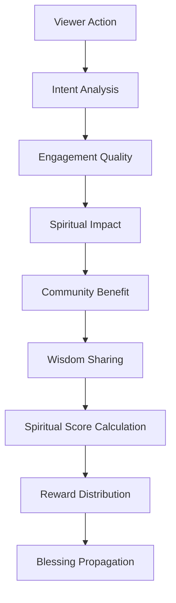

# Reward Viewer: Sistem Penghargaan Berbasis Keadilan Spiritual

> **"In The Name of GOD"** - Keadilan dan keberkahan untuk setiap kontribusi

## Pendahuluan

Sistem Reward Viewer adalah komponen inti dalam ekosistem ZeroLight yang menerapkan prinsip keadilan spiritual dalam memberikan penghargaan kepada para viewer dan kontributor. Sistem ini tidak hanya mengukur partisipasi kuantitatif, tetapi juga mengevaluasi kualitas spiritual, niat, dan dampak positif dari setiap interaksi dalam komunitas.

Berbeda dengan sistem reward konvensional yang hanya berfokus pada metrik engagement, sistem ini mengintegrasikan nilai-nilai spiritual universal untuk menciptakan ekosistem yang mendorong pertumbuhan spiritual, berbagi kebijaksanaan, dan kontribusi yang bermakna bagi kemanusiaan.

## Filosofi Reward Spiritual

### 1. Prinsip Keadilan Ilahi

#### 1.1 Niat sebagai Fondasi (Niyyah)
Setiap reward diberikan berdasarkan niat baik di balik setiap tindakan. Sistem ini menggunakan AI spiritual untuk mendeteksi dan mengevaluasi kualitas niat melalui pola interaksi, konsistensi kontribusi, dan dampak positif yang dihasilkan.

#### 1.2 Keseimbangan Duniawi dan Ukhrawi
Reward tidak hanya berupa materi atau poin digital, tetapi juga mencakup pengakuan spiritual, doa keberkahan, dan peningkatan status spiritual dalam komunitas.

#### 1.3 Redistribusi Keberkahan
Seperti prinsip zakat dalam Islam, sistem ini menerapkan mekanisme redistribusi di mana kontributor dengan reward tinggi secara otomatis berkontribusi untuk membantu anggota komunitas yang membutuhkan.

### 2. Dimensi Penilaian Spiritual



## Algoritma Reward Spiritual

### 1. Multi-Dimensional Scoring System

#### 1.1 Intent Quality Assessment
```python
class SpiritualIntentAnalyzer:
    def __init__(self):
        self.nlp_processor = SpiritualNLPProcessor()
        self.behavior_analyzer = BehaviorAnalyzer()
        self.consistency_tracker = ConsistencyTracker()
        self.impact_assessor = ImpactAssessor()
    
    def analyze_intent_quality(self, user_actions, context):
        intent_metrics = {
            'sincerity_score': self.calculate_sincerity(user_actions),
            'consistency_score': self.consistency_tracker.evaluate(user_actions),
            'selflessness_score': self.assess_selflessness(user_actions, context),
            'wisdom_seeking_score': self.evaluate_wisdom_seeking(user_actions),
            'community_focus_score': self.assess_community_focus(user_actions)
        }
        
        # Weighted calculation based on spiritual principles
        intent_quality = (
            intent_metrics['sincerity_score'] * 0.25 +
            intent_metrics['consistency_score'] * 0.20 +
            intent_metrics['selflessness_score'] * 0.25 +
            intent_metrics['wisdom_seeking_score'] * 0.15 +
            intent_metrics['community_focus_score'] * 0.15
        )
        
        return {
            'intent_quality': intent_quality,
            'detailed_metrics': intent_metrics,
            'spiritual_insights': self.generate_spiritual_insights(intent_metrics)
        }
```

#### 1.2 Engagement Quality Metrics
```python
class EngagementQualityCalculator:
    def __init__(self):
        self.depth_analyzer = ContentDepthAnalyzer()
        self.time_quality_assessor = TimeQualityAssessor()
        self.interaction_quality_evaluator = InteractionQualityEvaluator()
    
    def calculate_engagement_quality(self, user_session):
        quality_metrics = {
            'content_depth_engagement': self.depth_analyzer.analyze(user_session),
            'mindful_time_spent': self.time_quality_assessor.assess(user_session),
            'meaningful_interactions': self.interaction_quality_evaluator.evaluate(user_session),
            'spiritual_content_preference': self.assess_spiritual_preference(user_session),
            'knowledge_retention': self.measure_knowledge_retention(user_session)
        }
        
        # Calculate weighted engagement quality
        engagement_quality = self.calculate_weighted_quality(quality_metrics)
        
        return {
            'engagement_quality': engagement_quality,
            'quality_breakdown': quality_metrics,
            'improvement_suggestions': self.generate_improvement_suggestions(quality_metrics)
        }
```

#### 1.3 Spiritual Impact Assessment
```python
class SpiritualImpactAssessor:
    def __init__(self):
        self.wisdom_propagation_tracker = WisdomPropagationTracker()
        self.positive_influence_measurer = PositiveInfluenceMeasurer()
        self.spiritual_growth_monitor = SpiritualGrowthMonitor()
        self.community_harmony_assessor = CommunityHarmonyAssessor()
    
    def assess_spiritual_impact(self, user_id, time_period):
        impact_metrics = {
            'wisdom_shared': self.wisdom_propagation_tracker.track_sharing(user_id, time_period),
            'positive_influence': self.positive_influence_measurer.measure(user_id, time_period),
            'personal_growth': self.spiritual_growth_monitor.monitor_growth(user_id, time_period),
            'community_harmony_contribution': self.community_harmony_assessor.assess(user_id, time_period),
            'prayer_and_blessing_impact': self.assess_prayer_impact(user_id, time_period)
        }
        
        # Calculate overall spiritual impact
        spiritual_impact = self.calculate_spiritual_impact_score(impact_metrics)
        
        return {
            'spiritual_impact_score': spiritual_impact,
            'impact_details': impact_metrics,
            'spiritual_achievements': self.identify_spiritual_achievements(impact_metrics),
            'divine_recognition': self.generate_divine_recognition(spiritual_impact)
        }
```

### 2. Dynamic Reward Calculation

#### 2.1 Comprehensive Reward Formula
```python
class SpiritualRewardCalculator:
    def __init__(self):
        self.intent_analyzer = SpiritualIntentAnalyzer()
        self.engagement_calculator = EngagementQualityCalculator()
        self.impact_assessor = SpiritualImpactAssessor()
        self.blessing_multiplier = BlessingMultiplierCalculator()
    
    def calculate_comprehensive_reward(self, user_id, actions, context):
        # Base calculations
        intent_analysis = self.intent_analyzer.analyze_intent_quality(actions, context)
        engagement_quality = self.engagement_calculator.calculate_engagement_quality(actions)
        spiritual_impact = self.impact_assessor.assess_spiritual_impact(user_id, context['time_period'])
        
        # Base reward calculation
        base_reward = (
            intent_analysis['intent_quality'] * 0.35 +
            engagement_quality['engagement_quality'] * 0.30 +
            spiritual_impact['spiritual_impact_score'] * 0.35
        )
        
        # Apply spiritual multipliers
        blessing_multiplier = self.blessing_multiplier.calculate(user_id, context)
        consistency_bonus = self.calculate_consistency_bonus(user_id, context)
        community_service_bonus = self.calculate_community_service_bonus(user_id, context)
        
        # Final reward calculation
        final_reward = base_reward * blessing_multiplier + consistency_bonus + community_service_bonus
        
        return {
            'final_reward_score': final_reward,
            'base_reward': base_reward,
            'multipliers': {
                'blessing_multiplier': blessing_multiplier,
                'consistency_bonus': consistency_bonus,
                'community_service_bonus': community_service_bonus
            },
            'component_scores': {
                'intent_quality': intent_analysis['intent_quality'],
                'engagement_quality': engagement_quality['engagement_quality'],
                'spiritual_impact': spiritual_impact['spiritual_impact_score']
            },
            'spiritual_insights': self.generate_comprehensive_insights(
                intent_analysis, engagement_quality, spiritual_impact
            )
        }
```

#### 2.2 Time-based Reward Adjustment
```python
class TimeBasedRewardAdjuster:
    def __init__(self):
        self.spiritual_calendar = SpiritualCalendar()
        self.lunar_calculator = LunarCalculator()
        self.sacred_time_detector = SacredTimeDetector()
    
    def adjust_reward_for_time(self, base_reward, timestamp):
        time_adjustments = {
            'sacred_time_multiplier': self.sacred_time_detector.get_multiplier(timestamp),
            'lunar_phase_bonus': self.lunar_calculator.get_lunar_bonus(timestamp),
            'spiritual_season_adjustment': self.spiritual_calendar.get_season_adjustment(timestamp),
            'prayer_time_bonus': self.calculate_prayer_time_bonus(timestamp),
            'fasting_period_bonus': self.calculate_fasting_bonus(timestamp)
        }
        
        # Apply time-based adjustments
        adjusted_reward = base_reward
        for adjustment_type, multiplier in time_adjustments.items():
            adjusted_reward *= multiplier
        
        return {
            'adjusted_reward': adjusted_reward,
            'time_adjustments': time_adjustments,
            'spiritual_timing_insights': self.generate_timing_insights(time_adjustments)
        }
```

## Jenis-jenis Reward Spiritual

### 1. Material Rewards

#### 1.1 ZeroLight Orbit Merchandise
```python
class SpiritualMerchandiseRewards:
    def __init__(self):
        self.merchandise_catalog = SpiritualMerchandiseCatalog()
        self.customization_engine = CustomizationEngine()
        self.blessing_inscriber = BlessingInscriber()
    
    def generate_merchandise_rewards(self, user_profile, reward_score):
        available_items = self.merchandise_catalog.get_items_for_score(reward_score)
        
        personalized_items = []
        for item in available_items:
            # Customize based on user's spiritual journey
            customized_item = self.customization_engine.customize(item, user_profile)
            
            # Add spiritual blessings
            blessed_item = self.blessing_inscriber.add_blessing(customized_item, user_profile)
            
            personalized_items.append(blessed_item)
        
        return {
            'available_merchandise': personalized_items,
            'spiritual_customizations': self.get_customization_options(user_profile),
            'blessing_options': self.get_blessing_options(user_profile)
        }
```

#### 1.2 Digital Assets dan NFTs Spiritual
```python
class SpiritualDigitalAssets:
    def __init__(self):
        self.nft_creator = SpiritualNFTCreator()
        self.blockchain_recorder = BlockchainRecorder()
        self.spiritual_metadata_generator = SpiritualMetadataGenerator()
    
    def create_spiritual_nft_reward(self, user_achievement, reward_context):
        # Generate unique spiritual artwork
        spiritual_artwork = self.nft_creator.create_artwork(user_achievement)
        
        # Create spiritual metadata
        spiritual_metadata = self.spiritual_metadata_generator.generate(
            user_achievement, reward_context
        )
        
        # Record on blockchain with spiritual blessing
        nft_record = self.blockchain_recorder.record_with_blessing(
            spiritual_artwork, spiritual_metadata
        )
        
        return {
            'nft_id': nft_record['id'],
            'spiritual_artwork': spiritual_artwork,
            'metadata': spiritual_metadata,
            'blockchain_record': nft_record,
            'spiritual_significance': self.explain_spiritual_significance(user_achievement)
        }
```

### 2. Spiritual Rewards

#### 2.1 Doa dan Berkah Khusus
```python
class SpiritualBlessingRewards:
    def __init__(self):
        self.prayer_generator = PersonalizedPrayerGenerator()
        self.blessing_composer = BlessingComposer()
        self.spiritual_mentor_connector = SpiritualMentorConnector()
    
    def generate_spiritual_blessings(self, user_profile, achievement_context):
        blessings = {
            'personalized_prayers': self.prayer_generator.generate_prayers(
                user_profile, achievement_context
            ),
            'divine_blessings': self.blessing_composer.compose_blessings(
                user_profile, achievement_context
            ),
            'spiritual_guidance': self.generate_spiritual_guidance(
                user_profile, achievement_context
            ),
            'mentor_connection': self.spiritual_mentor_connector.connect_mentor(
                user_profile
            )
        }
        
        return blessings
```

#### 2.2 Status dan Pengakuan Spiritual
```python
class SpiritualStatusRewards:
    def __init__(self):
        self.status_hierarchy = SpiritualStatusHierarchy()
        self.badge_creator = SpiritualBadgeCreator()
        self.community_announcer = CommunityAnnouncer()
    
    def award_spiritual_status(self, user_id, achievement_data):
        current_status = self.status_hierarchy.get_current_status(user_id)
        new_status = self.status_hierarchy.calculate_new_status(
            current_status, achievement_data
        )
        
        if new_status['level'] > current_status['level']:
            # Create spiritual badge
            spiritual_badge = self.badge_creator.create_badge(new_status)
            
            # Announce to community
            community_announcement = self.community_announcer.create_announcement(
                user_id, new_status, spiritual_badge
            )
            
            return {
                'status_upgrade': True,
                'new_status': new_status,
                'spiritual_badge': spiritual_badge,
                'community_announcement': community_announcement,
                'privileges': self.get_status_privileges(new_status)
            }
        
        return {'status_upgrade': False, 'current_status': current_status}
```

### 3. Community Rewards

#### 3.1 Akses Eksklusif ke Konten Spiritual
```python
class ExclusiveContentRewards:
    def __init__(self):
        self.content_curator = SpiritualContentCurator()
        self.access_manager = ExclusiveAccessManager()
        self.wisdom_library = WisdomLibrary()
    
    def grant_exclusive_access(self, user_id, reward_level):
        exclusive_content = {
            'premium_spiritual_content': self.content_curator.get_premium_content(reward_level),
            'wisdom_library_access': self.wisdom_library.grant_access(user_id, reward_level),
            'private_spiritual_sessions': self.get_private_sessions(user_id, reward_level),
            'mentor_consultations': self.arrange_mentor_consultations(user_id, reward_level)
        }
        
        # Grant access
        access_grants = self.access_manager.grant_access(user_id, exclusive_content)
        
        return {
            'exclusive_access_granted': access_grants,
            'content_preview': self.generate_content_preview(exclusive_content),
            'access_duration': self.calculate_access_duration(reward_level)
        }
```

#### 3.2 Peran Kepemimpinan Komunitas
```python
class CommunityLeadershipRewards:
    def __init__(self):
        self.leadership_evaluator = LeadershipEvaluator()
        self.role_assigner = CommunityRoleAssigner()
        self.responsibility_manager = ResponsibilityManager()
    
    def evaluate_for_leadership(self, user_id, community_contributions):
        leadership_assessment = self.leadership_evaluator.evaluate(
            user_id, community_contributions
        )
        
        if leadership_assessment['qualified']:
            available_roles = self.role_assigner.get_available_roles(
                leadership_assessment['leadership_level']
            )
            
            return {
                'leadership_qualified': True,
                'available_roles': available_roles,
                'leadership_assessment': leadership_assessment,
                'responsibilities': self.responsibility_manager.get_responsibilities(available_roles)
            }
        
        return {
            'leadership_qualified': False,
            'development_areas': leadership_assessment['development_areas'],
            'improvement_path': self.generate_improvement_path(leadership_assessment)
        }
```

## Sistem Audit dan Transparansi Reward

### 1. Blockchain-based Reward Tracking

#### 1.1 Immutable Reward Records
```python
class RewardBlockchainTracker:
    def __init__(self):
        self.blockchain_client = BlockchainClient()
        self.reward_hasher = RewardHasher()
        self.transparency_manager = TransparencyManager()
    
    def record_reward_transaction(self, user_id, reward_data, calculation_details):
        # Create immutable record
        reward_record = {
            'user_id': user_id,
            'reward_amount': reward_data['final_reward_score'],
            'calculation_hash': self.reward_hasher.hash_calculation(calculation_details),
            'timestamp': datetime.utcnow().isoformat(),
            'spiritual_components': reward_data['component_scores'],
            'verification_data': self.create_verification_data(reward_data)
        }
        
        # Record on blockchain
        blockchain_record = self.blockchain_client.record_transaction(reward_record)
        
        # Make transparent to community
        transparency_record = self.transparency_manager.create_transparency_record(
            reward_record, blockchain_record
        )
        
        return {
            'blockchain_record': blockchain_record,
            'transparency_record': transparency_record,
            'verification_url': f"https://verify.zerolight.org/reward/{blockchain_record['id']}"
        }
```

#### 1.2 Community Audit System
```python
class CommunityRewardAudit:
    def __init__(self):
        self.audit_committee = CommunityAuditCommittee()
        self.dispute_resolver = DisputeResolver()
        self.fairness_evaluator = FairnessEvaluator()
    
    def initiate_community_audit(self, reward_period):
        # Select audit committee
        audit_committee = self.audit_committee.select_committee(reward_period)
        
        # Gather reward data for audit
        reward_data = self.gather_reward_data(reward_period)
        
        # Conduct fairness evaluation
        fairness_assessment = self.fairness_evaluator.evaluate(reward_data)
        
        # Generate audit report
        audit_report = self.generate_audit_report(
            reward_data, fairness_assessment, audit_committee
        )
        
        return {
            'audit_report': audit_report,
            'fairness_score': fairness_assessment['overall_fairness'],
            'recommendations': fairness_assessment['recommendations'],
            'community_feedback_period': self.initiate_feedback_period(audit_report)
        }
```

### 2. Real-time Transparency Dashboard

#### 2.1 Public Reward Statistics
```python
class RewardTransparencyDashboard:
    def __init__(self):
        self.statistics_calculator = RewardStatisticsCalculator()
        self.anonymizer = DataAnonymizer()
        self.visualization_generator = VisualizationGenerator()
    
    def generate_public_dashboard(self):
        # Calculate aggregate statistics
        reward_statistics = self.statistics_calculator.calculate_aggregate_stats()
        
        # Anonymize sensitive data
        anonymized_stats = self.anonymizer.anonymize_reward_data(reward_statistics)
        
        # Generate visualizations
        visualizations = self.visualization_generator.generate_charts(anonymized_stats)
        
        dashboard_data = {
            'total_rewards_distributed': anonymized_stats['total_distributed'],
            'average_reward_per_user': anonymized_stats['average_reward'],
            'reward_distribution_fairness': anonymized_stats['fairness_index'],
            'spiritual_impact_metrics': anonymized_stats['spiritual_metrics'],
            'community_growth_indicators': anonymized_stats['growth_indicators'],
            'visualizations': visualizations
        }
        
        return dashboard_data
```

#### 2.2 Individual Reward History
```python
class PersonalRewardHistory:
    def __init__(self):
        self.history_manager = RewardHistoryManager()
        self.growth_tracker = SpiritualGrowthTracker()
        self.achievement_analyzer = AchievementAnalyzer()
    
    def generate_personal_history(self, user_id):
        # Get complete reward history
        reward_history = self.history_manager.get_user_history(user_id)
        
        # Track spiritual growth over time
        growth_analysis = self.growth_tracker.analyze_growth(user_id, reward_history)
        
        # Identify achievements and milestones
        achievements = self.achievement_analyzer.identify_achievements(reward_history)
        
        personal_report = {
            'reward_timeline': reward_history,
            'spiritual_growth_journey': growth_analysis,
            'achievements_unlocked': achievements,
            'current_spiritual_level': growth_analysis['current_level'],
            'next_milestones': self.identify_next_milestones(user_id, growth_analysis),
            'personalized_guidance': self.generate_personalized_guidance(growth_analysis)
        }
        
        return personal_report
```

## Anti-Gaming dan Fair Play

### 1. Gaming Detection System

#### 1.1 Behavioral Pattern Analysis
```python
class GamingDetectionSystem:
    def __init__(self):
        self.pattern_analyzer = BehaviorPatternAnalyzer()
        self.anomaly_detector = AnomalyDetector()
        self.authenticity_verifier = AuthenticityVerifier()
        self.spiritual_sincerity_assessor = SpiritualSincerityAssessor()
    
    def detect_gaming_attempts(self, user_id, recent_activities):
        detection_results = {
            'behavioral_anomalies': self.anomaly_detector.detect_anomalies(recent_activities),
            'pattern_inconsistencies': self.pattern_analyzer.find_inconsistencies(recent_activities),
            'authenticity_score': self.authenticity_verifier.verify_authenticity(recent_activities),
            'spiritual_sincerity': self.spiritual_sincerity_assessor.assess_sincerity(recent_activities)
        }
        
        # Calculate overall gaming risk score
        gaming_risk_score = self.calculate_gaming_risk(detection_results)
        
        if gaming_risk_score > 0.7:  # High risk threshold
            return {
                'gaming_detected': True,
                'risk_score': gaming_risk_score,
                'detection_details': detection_results,
                'recommended_actions': self.recommend_actions(detection_results)
            }
        
        return {
            'gaming_detected': False,
            'risk_score': gaming_risk_score,
            'authenticity_confirmed': True
        }
```

#### 1.2 Spiritual Authenticity Verification
```python
class SpiritualAuthenticityVerifier:
    def __init__(self):
        self.consistency_checker = ConsistencyChecker()
        self.depth_analyzer = SpiritualDepthAnalyzer()
        self.community_validator = CommunityValidator()
    
    def verify_spiritual_authenticity(self, user_actions, user_profile):
        authenticity_metrics = {
            'consistency_over_time': self.consistency_checker.check_consistency(
                user_actions, user_profile
            ),
            'spiritual_depth': self.depth_analyzer.analyze_depth(user_actions),
            'community_validation': self.community_validator.validate_with_community(
                user_actions, user_profile
            ),
            'genuine_engagement': self.assess_genuine_engagement(user_actions),
            'wisdom_demonstration': self.assess_wisdom_demonstration(user_actions)
        }
        
        # Calculate overall authenticity score
        authenticity_score = self.calculate_authenticity_score(authenticity_metrics)
        
        return {
            'authenticity_score': authenticity_score,
            'authenticity_details': authenticity_metrics,
            'verification_status': 'verified' if authenticity_score > 0.8 else 'needs_review'
        }
```

### 2. Fair Distribution Mechanisms

#### 2.1 Wealth Distribution Balance
```python
class WealthDistributionBalancer:
    def __init__(self):
        self.distribution_analyzer = DistributionAnalyzer()
        self.equity_calculator = EquityCalculator()
        self.redistribution_manager = RedistributionManager()
    
    def balance_reward_distribution(self, reward_pool, community_data):
        # Analyze current distribution
        distribution_analysis = self.distribution_analyzer.analyze_distribution(community_data)
        
        # Calculate equity adjustments
        equity_adjustments = self.equity_calculator.calculate_adjustments(
            distribution_analysis, reward_pool
        )
        
        # Apply redistribution if needed
        if equity_adjustments['redistribution_needed']:
            redistribution_plan = self.redistribution_manager.create_plan(
                equity_adjustments, community_data
            )
            
            return {
                'redistribution_applied': True,
                'redistribution_plan': redistribution_plan,
                'equity_improvement': equity_adjustments['expected_improvement']
            }
        
        return {
            'redistribution_applied': False,
            'current_equity_score': distribution_analysis['equity_score']
        }
```

#### 2.2 Progressive Reward Scaling
```python
class ProgressiveRewardScaler:
    def __init__(self):
        self.scaling_calculator = ScalingCalculator()
        self.diminishing_returns_manager = DiminishingReturnsManager()
        self.newcomer_booster = NewcomerBooster()
    
    def apply_progressive_scaling(self, base_reward, user_profile, community_context):
        scaling_factors = {
            'diminishing_returns': self.diminishing_returns_manager.calculate_factor(
                user_profile['total_rewards_received']
            ),
            'newcomer_boost': self.newcomer_booster.calculate_boost(
                user_profile['join_date'], user_profile['activity_level']
            ),
            'community_balance': self.calculate_community_balance_factor(
                user_profile, community_context
            )
        }
        
        # Apply progressive scaling
        scaled_reward = self.scaling_calculator.apply_scaling(base_reward, scaling_factors)
        
        return {
            'scaled_reward': scaled_reward,
            'scaling_factors': scaling_factors,
            'scaling_explanation': self.generate_scaling_explanation(scaling_factors)
        }
```

## Integration dengan Ekosistem ZeroLight

### 1. Data Flow Integration

#### 1.1 Upstream Data Reception
```python
class UpstreamDataIntegration:
    async def receive_distribution_data(self, distribution_results):
        reward_calculations = []
        
        for result in distribution_results:
            if result['status'] == 'success':
                # Calculate rewards for content creators
                creator_reward = await self.calculate_creator_reward(result)
                
                # Calculate rewards for distributors
                distributor_reward = await self.calculate_distributor_reward(result)
                
                # Calculate rewards for viewers/consumers
                viewer_rewards = await self.calculate_viewer_rewards(result)
                
                reward_calculations.extend([creator_reward, distributor_reward] + viewer_rewards)
        
        # Process all reward calculations
        processed_rewards = await self.process_reward_calculations(reward_calculations)
        
        return processed_rewards
```

### 2. Downstream Integration

#### 2.1 Audit System Notification
```python
class AuditSystemIntegration:
    def notify_audit_system(self, reward_transactions):
        audit_notifications = []
        
        for transaction in reward_transactions:
            audit_notification = {
                'transaction_id': transaction['id'],
                'user_id': transaction['user_id'],
                'reward_amount': transaction['reward_amount'],
                'calculation_method': transaction['calculation_method'],
                'spiritual_components': transaction['spiritual_components'],
                'timestamp': transaction['timestamp'],
                'verification_required': transaction.get('verification_required', False)
            }
            audit_notifications.append(audit_notification)
        
        return self.send_to_audit_system(audit_notifications)
```

## Kesimpulan

Sistem Reward Viewer ZeroLight merepresentasikan evolusi baru dalam sistem penghargaan digital yang mengintegrasikan nilai-nilai spiritual universal dengan teknologi blockchain dan AI. Dengan menggabungkan penilaian niat, kualitas engagement, dan dampak spiritual, sistem ini menciptakan ekosistem yang mendorong pertumbuhan spiritual autentik dan kontribusi bermakna.

Transparansi penuh melalui blockchain, audit komunitas, dan mekanisme anti-gaming memastikan bahwa setiap reward diberikan secara adil dan sesuai dengan prinsip keadilan ilahi. Sistem ini tidak hanya memberikan penghargaan material, tetapi juga pengakuan spiritual dan peluang pertumbuhan yang berkelanjutan.

Dengan integrasi yang seamless dengan seluruh ekosistem ZeroLight, sistem reward ini menjadi katalisator untuk menciptakan komunitas global yang berfokus pada kebijaksanaan, kebaikan, dan pertumbuhan spiritual bersama.

---

> **"Dan barangsiapa yang mengerjakan amal saleh, baik laki-laki maupun perempuan dalam keadaan beriman, maka sesungguhnya akan Kami berikan kepadanya kehidupan yang baik dan sesungguhnya akan Kami beri balasan kepada mereka dengan pahala yang lebih baik dari apa yang telah mereka kerjakan."** - Al-Nahl 16:97

*Dokumen ini merupakan bagian integral dari ekosistem ZeroLight dan akan terus dikembangkan untuk memenuhi kebutuhan spiritual dan teknologi yang berkembang.*