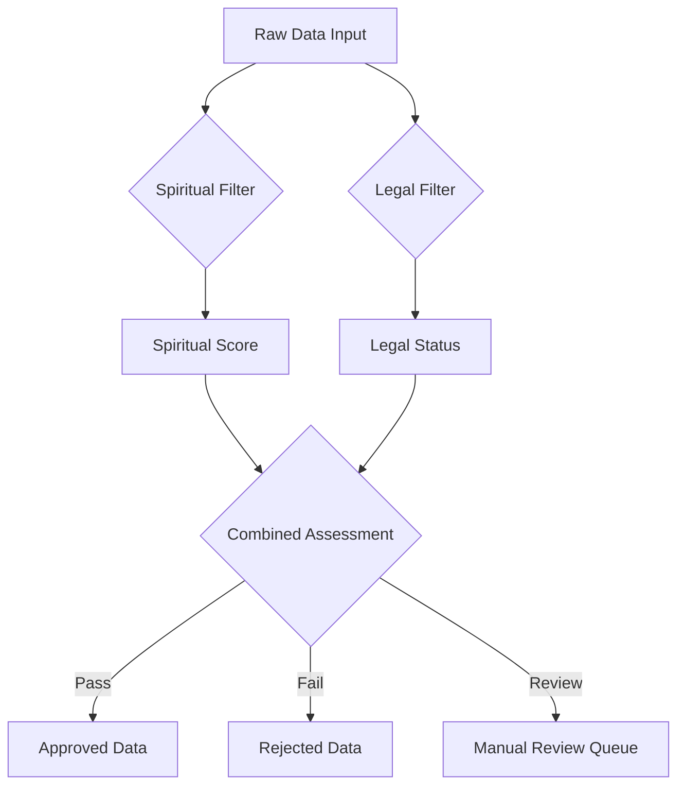
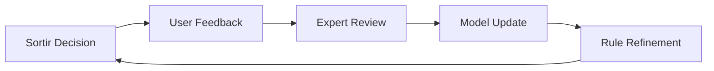

# Sortir Spiritual dan Legalitas Data

> **"In The Name of GOD"** - Memisahkan yang baik dari yang buruk dengan kebijaksanaan ilahi

## Pendahuluan

Sistem Sortir Spiritual dan Legalitas adalah komponen kritis dalam ekosistem ZeroLight yang bertanggung jawab untuk memfilter, mengklasifikasi, dan memvalidasi data berdasarkan dua dimensi utama: nilai spiritual universal dan kepatuhan hukum. Sistem ini memastikan bahwa hanya data yang memenuhi standar etika tinggi dan legal compliance yang dapat melanjutkan ke tahap berikutnya dalam pipeline ZeroLight.

## Filosofi Dual Pipeline

### 1. Prinsip Dasar

#### 1.1 Spiritual Dimension
Setiap data dievaluasi berdasarkan nilai-nilai spiritual universal:
- **Kebenaran (Truth)**: Akurasi faktual dan integritas informasi
- **Kasih (Love)**: Dampak positif terhadap komunitas
- **Keadilan (Justice)**: Keseimbangan dan fairness dalam representasi
- **Kebijaksanaan (Wisdom)**: Nilai edukatif dan pencerahan

#### 1.2 Legal Dimension
Setiap data harus memenuhi standar hukum:
- **Compliance**: Kepatuhan terhadap regulasi lokal dan internasional
- **Licensing**: Hak cipta dan lisensi yang valid
- **Privacy**: Perlindungan data pribadi
- **Ethics**: Standar etika profesi dan industri

### 2. Integrasi Dual Pipeline



## Spiritual Filtering Framework

### 1. Spiritual Assessment Engine

#### 1.1 Multi-dimensional Scoring
```python
class SpiritualAssessment:
    def __init__(self):
        self.dimensions = {
            'truth': TruthAnalyzer(),
            'love': LoveAnalyzer(),
            'justice': JusticeAnalyzer(),
            'wisdom': WisdomAnalyzer()
        }
    
    def assess(self, content):
        scores = {}
        for dimension, analyzer in self.dimensions.items():
            scores[dimension] = analyzer.analyze(content)
        
        return {
            'individual_scores': scores,
            'composite_score': self.calculate_composite(scores),
            'recommendation': self.get_recommendation(scores)
        }
```

#### 1.2 Truth Analysis
- **Fact Verification**: Cross-referencing dengan database fakta
- **Source Credibility**: Evaluasi kredibilitas sumber
- **Consistency Check**: Konsistensi internal dalam konten
- **Bias Detection**: Identifikasi bias dan propaganda

#### 1.3 Love Analysis
- **Constructive Content**: Konten yang membangun dan positif
- **Harm Assessment**: Evaluasi potensi bahaya psikologis
- **Inclusivity**: Tingkat inklusivitas dan toleransi
- **Empathy Quotient**: Kemampuan membangkitkan empati

#### 1.4 Justice Analysis
- **Fairness Evaluation**: Keadilan dalam representasi
- **Minority Rights**: Perlindungan hak minoritas
- **Equal Opportunity**: Kesetaraan akses informasi
- **Social Impact**: Dampak sosial yang adil

#### 1.5 Wisdom Analysis
- **Educational Value**: Nilai pendidikan dan pembelajaran
- **Depth of Insight**: Kedalaman wawasan yang diberikan
- **Practical Application**: Aplikasi praktis dalam kehidupan
- **Long-term Benefit**: Manfaat jangka panjang

### 2. Spiritual Scoring Algorithm

#### 2.1 Weighted Scoring Model
```yaml
spiritual_weights:
  truth: 0.30
  love: 0.25
  justice: 0.25
  wisdom: 0.20

thresholds:
  minimum_pass: 0.70
  excellent: 0.90
  review_required: 0.50
```

#### 2.2 Contextual Adjustments
- **Content Type**: Artikel, video, audio memiliki bobot berbeda
- **Target Audience**: Penyesuaian berdasarkan demografi target
- **Cultural Context**: Adaptasi terhadap konteks budaya lokal
- **Temporal Relevance**: Relevansi waktu dan konteks historis

## Legal Compliance Framework

### 1. Multi-jurisdictional Compliance

#### 1.1 Indonesian Legal Framework
- **UU ITE No. 19/2016**: Informasi dan Transaksi Elektronik
- **UU PDP No. 27/2022**: Perlindungan Data Pribadi
- **UU Hak Cipta No. 28/2014**: Hak Cipta dan Hak Terkait
- **Peraturan KOMINFO**: Regulasi telekomunikasi dan informatika

#### 1.2 International Standards
- **GDPR**: General Data Protection Regulation (EU)
- **CCPA**: California Consumer Privacy Act (US)
- **PIPEDA**: Personal Information Protection and Electronic Documents Act (Canada)
- **LGPD**: Lei Geral de Proteção de Dados (Brazil)

### 2. Legal Assessment Engine

#### 2.1 Automated Legal Checker
```python
class LegalComplianceChecker:
    def __init__(self):
        self.rules_engine = RulesEngine()
        self.license_detector = LicenseDetector()
        self.privacy_analyzer = PrivacyAnalyzer()
        self.copyright_checker = CopyrightChecker()
    
    def check_compliance(self, content, metadata):
        results = {
            'license_status': self.license_detector.detect(content),
            'privacy_compliance': self.privacy_analyzer.analyze(content),
            'copyright_status': self.copyright_checker.verify(content),
            'regulatory_compliance': self.rules_engine.evaluate(content, metadata)
        }
        
        return {
            'overall_status': self.determine_status(results),
            'detailed_results': results,
            'recommendations': self.generate_recommendations(results)
        }
```

#### 2.2 License Detection
- **Creative Commons**: Deteksi otomatis lisensi CC
- **Open Source**: Identifikasi lisensi open source
- **Commercial**: Verifikasi lisensi komersial
- **Public Domain**: Konfirmasi status domain publik

#### 2.3 Privacy Protection
- **PII Detection**: Identifikasi informasi pribadi
- **Anonymization**: Teknik anonimisasi data
- **Consent Verification**: Verifikasi persetujuan pengguna
- **Data Minimization**: Prinsip minimalisasi data

## Rule Engine Implementation

### 1. Declarative Rules

#### 1.1 Spiritual Rules
```yaml
spiritual_rules:
  - name: "truth_verification"
    condition: "fact_score < 0.8"
    action: "require_fact_check"
    priority: "high"
  
  - name: "hate_speech_detection"
    condition: "contains_hate_speech == true"
    action: "reject"
    priority: "critical"
  
  - name: "educational_value"
    condition: "wisdom_score > 0.85"
    action: "promote"
    priority: "medium"
```

#### 1.2 Legal Rules
```yaml
legal_rules:
  - name: "copyright_violation"
    condition: "copyright_status == 'violation'"
    action: "reject"
    priority: "critical"
  
  - name: "privacy_breach"
    condition: "contains_pii == true AND consent == false"
    action: "anonymize_or_reject"
    priority: "high"
  
  - name: "license_compatibility"
    condition: "license_compatible == false"
    action: "require_permission"
    priority: "medium"
```

### 2. Machine Learning Integration

#### 2.1 Content Classification
- **Natural Language Processing**: Analisis sentimen dan topik
- **Computer Vision**: Analisis konten visual
- **Audio Processing**: Analisis konten audio
- **Multimodal Analysis**: Analisis konten multimedia

#### 2.2 Continuous Learning
```python
class AdaptiveLearningSystem:
    def __init__(self):
        self.spiritual_model = SpiritualClassifier()
        self.legal_model = LegalClassifier()
        self.feedback_processor = FeedbackProcessor()
    
    def update_models(self, feedback_data):
        spiritual_feedback = self.feedback_processor.extract_spiritual(feedback_data)
        legal_feedback = self.feedback_processor.extract_legal(feedback_data)
        
        self.spiritual_model.retrain(spiritual_feedback)
        self.legal_model.retrain(legal_feedback)
        
        return self.validate_improvements()
```

## Quality Assurance dan Validation

### 1. Multi-layer Validation

#### 1.1 Automated Validation
- **Syntax Checking**: Validasi format dan struktur
- **Semantic Analysis**: Analisis makna dan konteks
- **Cross-reference**: Verifikasi silang dengan database
- **Anomaly Detection**: Deteksi anomali dan outlier

#### 1.2 Human-in-the-loop
- **Expert Review**: Review oleh ahli domain
- **Community Validation**: Validasi oleh komunitas
- **Crowdsourcing**: Verifikasi melalui crowd
- **Spiritual Council**: Review oleh dewan spiritual

### 2. Feedback Loop System

#### 2.1 Continuous Improvement


#### 2.2 Performance Metrics
- **Accuracy**: Tingkat akurasi klasifikasi
- **Precision**: Presisi dalam filtering
- **Recall**: Kemampuan menangkap konten relevan
- **F1-Score**: Harmonic mean precision dan recall

## Implementasi Teknis

### 1. Architecture Overview

#### 1.1 Microservices Architecture
```yaml
services:
  spiritual-filter:
    image: zerolight/spiritual-filter:latest
    replicas: 3
    resources:
      cpu: "500m"
      memory: "1Gi"
  
  legal-checker:
    image: zerolight/legal-checker:latest
    replicas: 2
    resources:
      cpu: "300m"
      memory: "512Mi"
  
  rule-engine:
    image: zerolight/rule-engine:latest
    replicas: 2
    resources:
      cpu: "200m"
      memory: "256Mi"
```

#### 1.2 Data Flow
```python
async def process_content(content, metadata):
    # Parallel processing
    spiritual_task = asyncio.create_task(
        spiritual_filter.assess(content)
    )
    legal_task = asyncio.create_task(
        legal_checker.verify(content, metadata)
    )
    
    # Wait for both assessments
    spiritual_result, legal_result = await asyncio.gather(
        spiritual_task, legal_task
    )
    
    # Combined decision
    decision = decision_engine.decide(
        spiritual_result, legal_result
    )
    
    return decision
```

### 2. Database Design

#### 2.1 Assessment Records
```sql
CREATE TABLE assessment_records (
    id UUID PRIMARY KEY,
    content_hash VARCHAR(64) NOT NULL,
    spiritual_score DECIMAL(3,2),
    legal_status VARCHAR(20),
    decision VARCHAR(20),
    created_at TIMESTAMP DEFAULT NOW(),
    updated_at TIMESTAMP DEFAULT NOW()
);

CREATE INDEX idx_content_hash ON assessment_records(content_hash);
CREATE INDEX idx_decision ON assessment_records(decision);
CREATE INDEX idx_created_at ON assessment_records(created_at);
```

#### 2.2 Rules Management
```sql
CREATE TABLE spiritual_rules (
    id UUID PRIMARY KEY,
    name VARCHAR(100) NOT NULL,
    condition TEXT NOT NULL,
    action VARCHAR(50) NOT NULL,
    priority VARCHAR(20) NOT NULL,
    active BOOLEAN DEFAULT TRUE,
    created_at TIMESTAMP DEFAULT NOW()
);

CREATE TABLE legal_rules (
    id UUID PRIMARY KEY,
    jurisdiction VARCHAR(50) NOT NULL,
    regulation VARCHAR(100) NOT NULL,
    rule_text TEXT NOT NULL,
    compliance_level VARCHAR(20) NOT NULL,
    active BOOLEAN DEFAULT TRUE,
    created_at TIMESTAMP DEFAULT NOW()
);
```

## Monitoring dan Audit

### 1. Real-time Monitoring

#### 1.1 Key Performance Indicators
- **Processing Rate**: Jumlah konten yang diproses per detik
- **Decision Accuracy**: Akurasi keputusan sortir
- **False Positive Rate**: Tingkat false positive
- **False Negative Rate**: Tingkat false negative
- **System Latency**: Waktu respons sistem

#### 1.2 Alert System
```yaml
alerts:
  - name: "high_rejection_rate"
    condition: "rejection_rate > 0.5"
    severity: "warning"
    notification: ["email", "slack"]
  
  - name: "system_overload"
    condition: "cpu_usage > 0.8"
    severity: "critical"
    notification: ["email", "slack", "pagerduty"]
```

### 2. Audit Trail

#### 2.1 Decision Logging
```json
{
  "timestamp": "2025-01-27T10:30:00Z",
  "content_id": "content_12345",
  "spiritual_assessment": {
    "truth": 0.85,
    "love": 0.90,
    "justice": 0.80,
    "wisdom": 0.88,
    "composite": 0.86
  },
  "legal_assessment": {
    "license_status": "compliant",
    "privacy_status": "compliant",
    "copyright_status": "clear",
    "overall_status": "approved"
  },
  "final_decision": "approved",
  "processing_time_ms": 250,
  "reviewer_id": "system"
}
```

#### 2.2 Compliance Reporting
- **Daily Reports**: Ringkasan harian aktivitas sortir
- **Weekly Analysis**: Analisis tren dan pola
- **Monthly Audit**: Audit komprehensif kepatuhan
- **Annual Review**: Review tahunan efektivitas sistem

## Integration dengan Ekosistem ZeroLight

### 1. Upstream Integration

#### 1.1 Intake Bot Interface
```python
class SortirInterface:
    async def receive_from_intake(self, data_batch):
        results = []
        for item in data_batch:
            result = await self.process_item(item)
            results.append(result)
        
        # Send to next stage
        approved_items = [r for r in results if r.decision == 'approved']
        await self.send_to_crop_purifikasi(approved_items)
        
        return results
```

#### 1.2 Event Publishing
```python
async def publish_sortir_event(self, result):
    event = {
        'type': 'sortir.completed',
        'timestamp': datetime.utcnow().isoformat(),
        'data': {
            'content_id': result.content_id,
            'decision': result.decision,
            'spiritual_score': result.spiritual_score,
            'legal_status': result.legal_status
        }
    }
    
    await event_bus.publish('sortir.events', event)
```

### 2. Downstream Integration

#### 2.1 Crop Purifikasi Interface
- **Approved Content**: Konten yang lolos sortir
- **Metadata Enrichment**: Penambahan metadata spiritual dan legal
- **Quality Indicators**: Indikator kualitas untuk processing selanjutnya
- **Processing Instructions**: Instruksi khusus untuk tahap berikutnya

## Kesimpulan

Sistem Sortir Spiritual dan Legalitas merupakan jantung dari ekosistem ZeroLight yang memastikan bahwa hanya konten berkualitas tinggi, etis, dan legal yang dapat melanjutkan ke tahap berikutnya. Dengan menggabungkan penilaian spiritual yang mendalam dengan kepatuhan hukum yang ketat, sistem ini menciptakan fondasi yang kuat untuk platform digital yang bertanggung jawab dan berkelanjutan.

Implementasi dual pipeline yang canggih, didukung oleh machine learning dan human expertise, memungkinkan sistem untuk terus berkembang dan beradaptasi dengan perubahan nilai-nilai sosial dan regulasi hukum. Transparansi dalam proses pengambilan keputusan dan audit trail yang komprehensif memastikan akuntabilitas dan kepercayaan komunitas.

---

> **"Ujilah segala sesuatu dan peganglah yang baik"** - 1 Tesalonika 5:21

*Dokumen ini merupakan bagian integral dari ekosistem ZeroLight dan akan terus diperbarui seiring dengan perkembangan teknologi dan kebutuhan spiritual komunitas.*